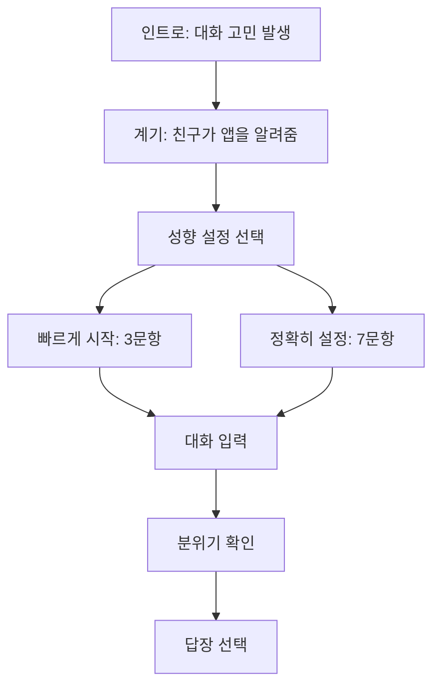

# 플러팅지옥 앱 디자인 리뉴얼 v2 — 스켈레톤 UI 규격

## 상태

- 작성일: 2026-04-26
- 범위: 색상, 일러스트, 그림자, 최종 모션 이전의 화면 구조 규격
- 목표: 사용자가 첫 화면부터 `무엇을 해야 하는지`, `지금 어느 단계인지`, `결과에서 무엇을 선택해야 하는지`를 3초 안에 이해하게 만든다.

## 왜 스켈레톤부터 하는가

현재 문제는 색상보다 구조 문제에 가깝다. 색을 먼저 입히면 화면의 정보 우선순위, 전환, CTA 위치가 검증되지 않은 상태에서 “예뻐 보이는 장식”으로 판단이 흐려진다.

스켈레톤 단계에서는 다음만 검증한다.

1. 화면마다 하나의 주 행동이 있는가?
2. 단계 전환이 누적 화면이 아니라 명확한 화면 교체로 느껴지는가?
3. 모바일 390px 기준에서 입력창, CTA, 결과 카드가 잘리지 않는가?
4. 카톡/DM 대화라는 사용 맥락이 즉시 이해되는가?
5. 결과 화면에서 추천 답장이 가장 크게 보이는가?

## 외부 근거

- [NN/g Paper Prototyping](https://www.nngroup.com/articles/paper-prototyping/): 낮은 충실도의 초기 프로토타입도 사용자의 이해 방식과 정보 구조 문제를 빠르게 드러낸다.
- [NN/g Skeleton Screens](https://www.nngroup.com/articles/skeleton-screens/): 회색 박스 구조는 최종 페이지의 정보 계층을 미리 보여주고, 빈 프레임만 보여주는 방식은 피해야 한다.
- [Android Window Size Classes](https://developer.android.com/develop/ui/views/layout/use-window-size-classes): 화면 폭 기준으로 레이아웃 결정을 분리해야 하며, 기기 종류가 아니라 실제 사용 가능한 폭을 기준으로 설계해야 한다.
- [WCAG 2.2 Reflow](https://www.w3.org/TR/WCAG22/#reflow): 320 CSS px 폭에서도 정보와 기능 손실이 없어야 한다.
- [WCAG 2.2 Target Size Minimum](https://www.w3.org/TR/WCAG22/#target-size-minimum): 포인터 입력 대상은 기본적으로 최소 24×24 CSS px 이상이어야 한다.

## 디자인 금지선

스켈레톤 승인 전에는 다음을 하지 않는다.

- 컬러 팔레트 적용
- rose/coral 포인트 적용
- 그라데이션, 3D 카드, 유리 효과
- 장식 아이콘, 캐릭터, 일러스트
- Final Cut, REC, 스캔, 뷰파인더, 콘솔 등 AI/SF 메타포
- 외부 앱 화면의 픽셀 복제

## 화면 공통 구조

모든 주요 화면은 아래 5개 영역으로 구성한다.

```text
Top Bar
Step / Context
Main Action Area
Support Info
Bottom Action
```

| 영역 | 역할 | 규칙 |
| --- | --- | --- |
| `Top Bar` | 브랜드, 남은 분석권, 이전/건너뛰기 | 높이 48–60px, 핵심 행동을 가리지 않는다. |
| `Step / Context` | 지금 단계와 사용 이유 | 한 줄 진행 표시 또는 짧은 문장만 사용한다. |
| `Main Action Area` | 사용자가 실제로 조작하는 핵심 영역 | 화면당 1개만 가장 크게 둔다. |
| `Support Info` | 개인정보 안내, 선택 이유, 위험한 말 | 메인 행동보다 작고 아래에 둔다. |
| `Bottom Action` | 다음으로 가는 CTA | 모바일에서 엄지 영역에 고정하거나 첫 스크롤 안에 둔다. |

## 핵심 사용자 흐름



## 화면별 스켈레톤

### 1. 인트로

목표: 사용자가 “내가 보내도 되는 말인지 고민하는 상황”에 바로 감정 이입하고, 그 다음 플러팅지옥이 무엇을 도와주는 앱인지 이해한다.

구조:

- 상단: 상대 이름과 대화방 헤더
- 본문: 5회 내외의 대화 말풍선
- 하단: 사용자가 쓰다가 지우는 입력창 상태
- 감정 레이어: 사용자가 실제로 하는 걱정을 짧은 독백 카드로 보여준다.
  - `00이는 나에게 마음이 있는 걸까?`
  - `어떻게 해야 계속 대화를 이어갈 수 있을까?`
  - `어떤 사람을 좋아할까?`
- 전환 계기: 친구가 `그런 거 물어보면 되지~`라고 말하고, 아래에 `열어보기` CTA가 있는 앱 카드가 등장한다.
- 기능 안내: 플러팅지옥이 도와주는 일을 문제 해결 순서로 보여준다.
  - 상대방의 마음을 확인하는 방법
  - 지금 대화에서 이어갈 답장 설계
  - 상대가 부담스럽지 않게 약속을 잡는 전략
  - 피해야 할 말과 타이밍 경고

검증 기준:

- 광고 화면처럼 보이지 않아야 한다.
- 채팅 맥락이 먼저 보이고, 앱 소개는 고민 이후에 등장해야 한다.
- 기능 안내는 조작/공략이 아니라 `확인`, `답장`, `약속`, `경고`의 코칭 언어로 표현한다.

### 2. 성향 설정 선택

목표: 사용자가 부담 없이 시작하되, 더 정확한 설정도 선택할 수 있다.

구조:

- 상단: `나에게 맞는 답장을 만들기 전에`
- 메인: 두 개의 큰 선택 카드
  - `빠르게 시작`: 3문항, 30초
  - `정확히 설정`: 7문항, 2분
- 보조: `나중에 설정하기`
- 하단 CTA: 선택한 방식으로 시작

검증 기준:

- 사용자는 바로 시작할 수 있어야 한다.
- “성향 설정을 안 하면 못 쓴다”는 느낌을 주면 안 된다.

### 3. 성향 문항

목표: 답장 추천에 필요한 최소 맥락만 수집한다.

빠른 3문항:

1. 내 말투: 담백함 / 다정함 / 장난기 / 직진
2. 원하는 관계 속도: 천천히 / 자연스럽게 / 적극적으로
3. 가이드 수위: 약한 힌트 / 균형 조언 / 솔직한 경고

정확한 7문항:

1. 내 말투
2. 선호하는 상대 스타일
3. 내가 불편한 표현
4. 원하는 관계 속도
5. 고백/만남 제안에 대한 거리감
6. 조언 수위
7. 답장 길이

검증 기준:

- 선택지는 버튼처럼 보여야 한다.
- 한 화면에 문항을 너무 많이 쌓지 않는다.
- 진행률을 보여주되 설문 서비스처럼 무겁게 만들지 않는다.

### 4. 대화 입력

목표: 사용자가 대화를 붙여넣고 분석을 시작한다.

구조:

- 상단: `대화 붙여넣기`
- 메인: 큰 입력 영역
- 보조 칩: `내 말투 반영`, `상대 온도 확인`, `부담 표현 제외`
- 개인정보 안내: 이름, 전화번호, 주소 삭제 권장
- 하단 CTA: `분위기 확인하기`

검증 기준:

- 입력 영역이 화면의 주인공이어야 한다.
- 개인정보 안내는 보여야 하지만 겁주는 문구가 되면 안 된다.

### 5. 분위기 확인

목표: 사용자가 “입력한 대화가 답장 후보로 변환되는 중”임을 이해한다.

구조:

- 상단: 진행 단계 `2 분위기 확인`
- 메인: 말풍선 2–3개가 정리되는 구조
- 보조: 확인 중인 항목 3개
  - 상대가 편하게 답할 수 있는지
  - 내 말투와 어색하지 않은지
  - 부담스럽거나 재촉하는 말은 없는지
- 하단: 짧은 진행 상태

검증 기준:

- 스캐너/콘솔처럼 보이면 실패다.
- 10초 이상 걸리는 실제 분석에는 진행률 또는 설명형 상태가 필요하다.

### 6. 답장 선택

목표: 추천 답장을 가장 크게 보여주고, 이유와 다른 톤은 보조로 둔다.

구조:

- 상단: `답장 준비 완료`
- 메인: 추천 답장 카드 1개
  - 답장 문장
  - 왜 이 말이 자연스러운지
  - 복사 CTA
- 보조 카드:
  - 현재 분위기
  - 피해야 할 말
  - 다른 톤 보기
- 하단: `다시 만들기`, `새 대화 분석`

검증 기준:

- 추천 답장보다 분석 설명이 더 크게 보이면 실패다.
- 위험 경고는 강하지만 사용자의 연애를 금지하는 판정처럼 보이면 안 된다.

## 레이아웃 수치 기준

| 항목 | 기준 |
| --- | --- |
| 모바일 기준 폭 | 390px |
| 최소 검증 폭 | 320px |
| 데스크톱 표시 | 중앙 모바일 앱 프레임 |
| 화면 내부 좌우 여백 | 20–24px |
| 카드 간격 | 12–20px |
| CTA 높이 | 52–60px |
| 최소 터치 대상 | 24×24px 이상, 주요 CTA는 48px 이상 |
| 화면당 메인 카드 | 1개 |
| 보조 카드 | 최대 2개 우선 노출 |

## 전환 규칙

- 인트로는 첫 방문 또는 `인트로 보기`에서만 노출한다.
- 성향 설정은 건너뛸 수 있다.
- 입력, 확인, 결과는 누적 화면이 아니라 단계별 화면 전환으로 보여준다.
- 뒤로 가기는 이전 단계로 돌아가되 입력값은 유지한다.
- 결과 화면에서 `다시 만들기`는 같은 입력값을 유지한 채 답장 후보만 갱신한다.

## 승인 체크리스트

- [ ] 색 없이도 각 화면의 목적이 구분된다.
- [ ] 첫 화면에서 무엇을 해야 하는지 3초 안에 이해된다.
- [ ] 390px 폭에서 CTA, 입력창, 추천 답장 카드가 잘리지 않는다.
- [ ] 답장 선택 화면에서 추천 답장이 가장 큰 시각 무게를 가진다.
- [ ] 인트로는 앱 광고보다 대화 고민을 먼저 보여준다.
- [ ] 성향 설정은 필수가 아니라 추천 설정처럼 느껴진다.
- [ ] `AI`, `스캔`, `REC`, `콘솔`, `뷰파인더` 같은 표현이 없다.

## 다음 단계

1. 이 스켈레톤 구조를 브라우저 와이어프레임으로 검토한다.
2. 구조가 승인되면 `DESIGN.md`의 색상 토큰을 white base + restrained rose accent 기준으로 재정리한다.
3. 이후 실제 React 화면을 스켈레톤 구조에 맞춰 재배치한다.
