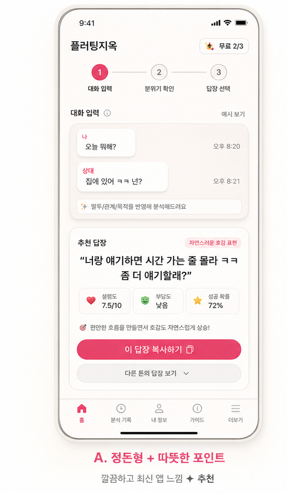
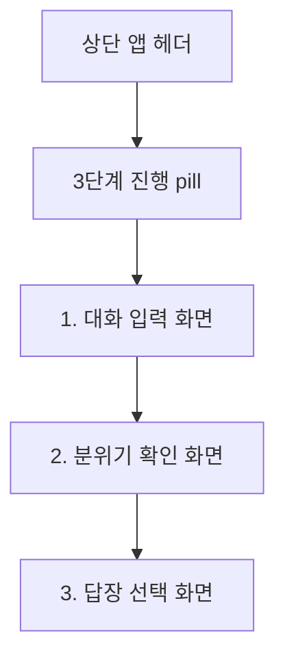

# 플러팅지옥 앱 디자인 리뉴얼 v2 — 와이어프레임

## 기준 시안

## 전체 구조

## 1. 대화 입력 화면

- 상단: `FLIRTING HELL`, 앱명, 무료 분석 잔여량, `인트로 보기`
- 진행: `1 대화 입력 / 2 분위기 확인 / 3 답장 선택`
- 메인 카드:
  - 제목: `마지막 대화를 붙여넣으세요`
  - 짧은 가이드 칩: `내 말투 반영`, `상대 온도 확인`, `부담되는 말 제외`
  - 큰 대화 입력창
  - 분석 조건 접힘 영역
  - 개인정보 안내
  - CTA: `답장 추천받기`

## 2. 분위기 확인 화면

- 입력 화면은 사라지고 별도 화면으로 전환한다.
- 말풍선 2개와 `답장 준비 중` pill로 대화가 답장으로 바뀌는 느낌을 준다.
- 문구는 생활형 언어를 사용한다.
  - `분위기 확인 중`
  - `대화의 온도를 보고 있어요.`
  - `상대가 편하게 답할 수 있는지 확인`
  - `내 말투와 어색하지 않은지 맞춤`
  - `부담스럽거나 재촉하는 표현 제외`

## 3. 답장 선택 화면

- 상단 결과 카드:
  - `답장 준비 완료`
  - `지금은 이렇게 보내는 게 가장 자연스럽습니다.`
- 보조 정보:
  - 현재 분위기
  - 안전 경고가 있으면 rose/warning 카드
- 메인 답장 카드:
  - 가장 큰 시각 무게를 가진다.
  - 추천 답장 문장, 이유, 상황, 말투, 복사 CTA 포함
- 하단:
  - 다른 톤 보기
  - 보내면 위험한 말
  - 분석 자세히 보기

## 구현 메모

- 모바일 390px 기준에서 CTA와 추천 답장 카드가 첫 스크롤 안에 자연스럽게 보여야 한다.
- 데스크톱에서는 앱을 중앙 모바일 프레임처럼 보이게 유지한다.
- 외부 앱 이미지 파일은 보관하지 않는다.
