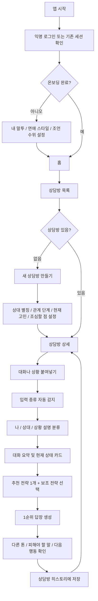

# 플러팅지옥 앱 유저 플로우 시나리오

## 목적

앱은 사용자가 전략을 먼저 고르는 구조가 아니라, 상대별 상담방 안에서 대화나 상황을 붙여넣고 앱이 먼저 흐름을 정리한 뒤 필요한 전략과 답장을 제안하는 구조로 간다.

## 핵심 플로우

## 화면별 역할

| 화면 | 역할 | 보여주지 말아야 할 것 |
| --- | --- | --- |
| 스플래시 | 앱이 해결하는 순간을 짧게 설명 | 긴 기능 목록 |
| 인증 | 익명 시작으로 진입 장벽 낮추기 | 기술 설명 과다 노출 |
| 온보딩 | 내 답장 기준 설정 | 필수처럼 보이는 긴 설문 |
| 홈 | 최근 상담방과 새 분석 시작 지점 | 전략/결과 카드 전체 노출 |
| 상담방 목록 | 상대별 상담방 선택 | 한 탭에 상세/전략/결과 몰아넣기 |
| 새 상담방 | 상대별 기본 맥락 설정 | 원문 대화 저장 유도 |
| 상담방 상세 | 입력, 인사이트, 답장 히스토리 | 카카오톡 원본 복제 UI |
| 저장 | 상담방별 답장 재확인 | 원문 전문 장기 보관처럼 보이는 문구 |
| 내 정보 | 전역 말투/연애 스타일 관리 | 상대별 설정과 혼합 |
| 분석권 | 사용량/패키지/리워드 구조 | 홈 화면의 과한 결제 노출 |

## 저장 원칙

- 원문 전문은 장기 저장하지 않는 UX로 표현한다.
- 상담방 히스토리에는 요약, 현재 상태, 추천 전략, 추천 답장, 선택 이유, 피해야 할 말을 남긴다.
- 개인정보 삭제 안내는 붙여넣기 입력 단계에 항상 표시한다.
