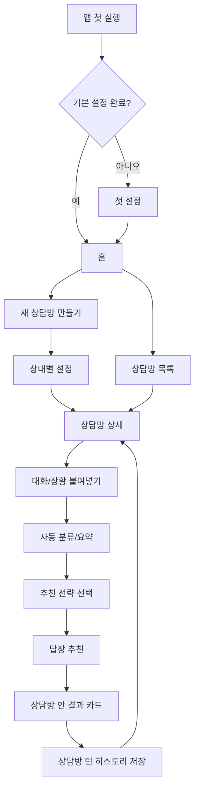

# 플러팅지옥 앱 흐름 V2

## 목적

이 문서는 기능을 한 화면에 몰아넣지 않고, 사용자가 어느 순간에 어떤 설정을 하는지 정의한다.

V2 UX의 기준은 `상대별 상담방`이다. 사용자는 상담방을 만들고, 그 안에서 대화나 상황을 먼저 붙여넣고, 앱이 분류/요약한 뒤 필요한 전략과 답장을 고른다.

## 핵심 원칙

- 홈은 진입점이지 작업 화면이 아니다.
- 상담방 목록은 여러 상대를 고르는 화면이다.
- 상담방 상세는 히스토리와 입력 진입을 보는 화면이다.
- 전략 선택은 붙여넣은 내용의 분류/요약 이후에 한다.
- 전역 설정과 상대별 설정은 분리한다.
- 원본 대화 전문은 기본 저장하지 않는다.

## 전체 흐름

## 설정이 나오는 순간

| 순간 | 설정 범위 | 화면 | 이유 |
|---|---|---|---|
| 첫 실행 | 전역 설정 | 첫 설정 | 모든 상담방에 적용되는 최소 기준을 만든다. |
| 새 상담방 생성 | 상대별 설정 | 새 상담방 만들기 | 상대와의 관계/상황이 답장 전략에 영향을 준다. |
| 대화/상황 붙여넣기 | 이번 턴 입력 | 붙여넣기 화면 | 카톡, DM, 문자, 상황 설명을 먼저 받아야 전략을 제대로 추천할 수 있다. |
| 자동 분류 후 | 이번 턴 전략 | 인사이트 카드 | 같은 상대라도 입력된 맥락에 따라 필요한 전략이 달라진다. |
| 답장 추천 후 | 답장 피드백 | 결과 화면 | 다음 추천 품질을 높인다. |
| 언제든 | 전역/상대별 수정 | 설정 또는 상담방 설정 | 이상형과 연애 스타일은 바뀔 수 있다. |

## 1. 첫 설정

처음 앱을 열었을 때 길게 물어보지 않는다. 30초 안에 끝나는 최소 설정만 받는다.

입력:

- 내 말투: `자동`, `다정하게`, `장난스럽게`, `담백하게`
- 원하는 연애 스타일: `편안한`, `표현 많은`, `천천히`, `확실한`
- 조언 수위: `응원 위주`, `균형 조언`, `현실 체크`

원칙:

- 건너뛰기를 허용한다.
- 이후 `내 정보`에서 수정할 수 있다.
- 이 설정은 모든 상담방의 기본값으로만 쓴다.

## 2. 홈

홈은 오늘 이어갈 작업만 보여준다.

구성:

- 최근 상담방 3개
- 남은 무료 분석 수
- 새 상담방 만들기
- 저장된 답장 바로가기

홈에서 하지 않는 것:

- 전략 선택
- 긴 분석 결과 표시
- 많은 설명 카드

## 3. 상담방 목록

상대별 상담방을 선택하는 화면이다.

구성:

- 상대 표시명
- 관계 상태
- 마지막 요약
- 마지막 분석 시간
- 저장된 답장 수
- 새 상담방 CTA

사용자는 여기서 특정 상담방으로 들어간다.

## 4. 새 상담방 만들기

상대별 설정은 상담방을 만들 때만 묻는다.

입력:

- 상대 표시명 또는 별칭
- 현재 관계: `짝사랑`, `썸`, `소개팅`, `연인`, `재회 고민`, `기타`
- 현재 고민: `마음 확인`, `대화 이어가기`, `약속 잡기`, `속도 조절`
- 이 상대에게 조심할 점: 자유 입력 또는 선택형

저장 원칙:

- 상대의 실명, 연락처, 계정 정보는 저장하지 않는다.
- 별칭만 사용한다.
- 상대별 설정은 해당 상담방 안에서만 쓴다.

## 5. 상담방 상세

상담방 상세는 메신저 복제가 아니라 폰 앱의 작업 화면처럼 구성한다. 사용자가 상담방에 들어왔을 때 바로 전략 카드가 보이면 대시보드처럼 느껴지므로, 상대 상태와 저장된 입력/답장 기록을 먼저 보여준다.

구성:

- 앱형 상단 바: 뒤로가기, 관계 상태, 설정 진입
- 상대 상태 카드
- 현재 조심할 점
- 저장된 입력 목록
- 저장된 답장 미리보기
- `대화나 상황 붙여넣기` CTA

여기서 전략을 바로 고르지 않는다. 상담방 상세는 상태 확인 화면이고, CTA를 누른 뒤 대화/상황 붙여넣기로 이동한다.

## 6. 대화/상황 붙여넣기

이번 턴 분석에 필요한 최신 대화나 상황 설명을 먼저 붙여넣는다.

입력 가능:

- 카톡 대화
- DM 대화
- 텔레그램 대화
- 문자 대화
- 사용자가 처한 상황 설명

구성:

- 큰 텍스트 입력창
- 자동 감지 상태: `카톡으로 보여요`, `DM으로 보여요`, `상황 설명으로 보여요`, `발화자 구분이 애매해요`
- 개인정보 삭제 안내
- 이전에 붙여넣은 내용 목록
- 분류하고 요약하기 CTA

저장 원칙:

- 붙여넣은 원본 전문은 장기 저장처럼 보이지 않게 한다.
- 화면에는 입력 제목, 자동 감지 라벨, 요약만 저장된 카드로 남긴다.
- 저장된 입력 카드를 누르면 다시 불러와 수정할 수 있다.

입력 검증:

- 너무 짧으면 추가 맥락을 요청한다.
- 실명, 전화번호, 주소로 보이는 값은 삭제 안내를 보여준다.
- 발화자 구분이 없으면 상황 설명으로 보고, 발화자 수정이 필요할 수 있음을 안내한다.

## 7. 자동 분류/요약과 전략 선택

붙여넣은 내용을 먼저 나누고, 그 결과를 상담방 안의 인사이트 카드로 보여준다.

인사이트 카드:

- 입력 종류
- 나/상대/상황 설명 분류
- 대화 요약
- 현재 상태
- 주의 신호

전략 선택은 인사이트 카드 다음에 나온다. 앱이 추천 전략 1개를 가장 크게 보여주고, 사용자는 필요하면 다른 전략으로 바꿀 수 있다.

초기 전략:

- `연애로 발전`: 호감 표현을 한 단계 올린다.
- `여친/남친 여부 확인`: 애인 여부를 부담 없이 확인한다.
- `약속 잡기`: 자연스럽게 만남을 제안한다.
- `결혼 가치관`: 장기 관계 기준을 가볍게 탐색한다.
- `속도 조절`: 부담을 줄이고 대화를 유지한다.

## 8. 답장 추천

결과 화면은 별도 대시보드가 아니라 상담방 안에 이어지는 답장 카드다.

구성:

- 추천 답장 1순위
- 다른 톤 2개
- 왜 이 답장이 맞는지
- 위험한 말
- 다음 행동
- 저장/복사/다시 생성

결과 저장:

- 저장 위치는 항상 현재 상담방이다.
- `turn_id`
- 선택한 전략
- 대화 요약
- 추천 답장
- 선택한 답장
- 위험한 말
- 다음 행동

원본 대화 전문은 기본 저장하지 않는다.
같은 답장 문장이라도 다른 분석 턴에서 저장하면 별도 턴으로 남긴다.

## 하단 탭 구조

하단 탭은 `홈`, `상담방 목록`, `상담방 상세`, `저장`, `내 정보`, `분석권`처럼 탐색 성격이 강한 화면에만 보인다. `대화/상황 붙여넣기`, `자동 분류/요약`, `답장 추천`처럼 한 턴을 처리하는 집중 화면에서는 하단 탭을 숨겨 CTA와 입력 영역이 잘리지 않게 한다.

`저장` 탭은 전체 답장을 한 리스트로 섞지 않는다. 상담방별 그룹을 먼저 보여주고, 각 그룹 안에 해당 상대에게 저장한 답장과 선택 이유를 보관한다.

| 탭 | 역할 |
|---|---|
| `홈` | 오늘 이어갈 상담방과 빠른 진입 |
| `상담방` | 상대별 상담방 목록 |
| `저장` | 저장한 답장/추천 이유 |
| `내 정보` | 전역 말투/연애 스타일/조언 수위 |
| `분석권` | 무료 사용량/분석권 패키지 |

## 구현 우선순위

1. 홈을 미니멀하게 유지한다.
2. 상담방 목록과 상담방 상세를 분리한다.
3. 상담방 상세는 메신저 복제 대신 폰 앱 작업 화면으로 보여주고, CTA로 대화/상황 붙여넣기에 들어간다.
4. 대화/상황 붙여넣기 후 자동 분류/요약 인사이트 카드를 보여준다.
5. 결과는 상담방 턴 히스토리에 저장되는 구조로 표현한다.

## 현재 구현 메모

- 화면 전환은 `AppViewId` 상태로 관리한다.
- 하단 탭은 `홈`, `상담방`, `저장`, `내 정보`, `분석권`만 유지한다.
- `상담방` 탭 내부 단계는 `상담방 목록 → 상담방 상세 → 대화/상황 붙여넣기 → 분석 중 → 인사이트/전략 선택 → 답장 추천`으로 이동한다.
- 현재 단계는 mock 데이터 기반 UX 검증이며 API, D1 schema, 결제 로직은 변경하지 않는다.
