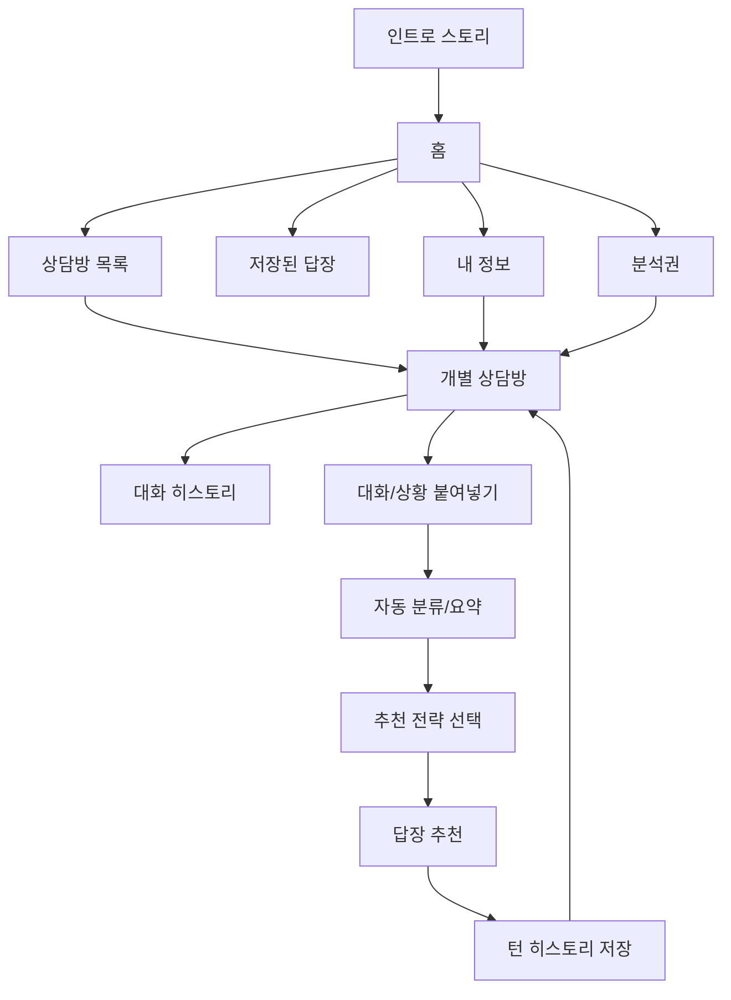

# 플러팅지옥 앱 정보구조

## 목적

이 문서는 인트로 스토리보드 이후 사용자가 실제로 쓰는 앱의 기본 화면 구조를 확정한다.

현재 MVP는 `홈 → 상담방 목록 → 상담방 상세 → 대화/상황 붙여넣기 → 자동 분류/요약 → 추천 전략 선택 → 답장 추천 → 상담방 히스토리 저장` 흐름으로 간다. 인트로는 사용 장면을 이해시키는 온보딩이고, 실제 사용 UI는 메신저 복제가 아니라 폰 앱의 상담 작업 구조를 따른다.

## 핵심 원칙

- 사용자는 매번 기능 설명을 읽는 것이 아니라 `상담방`을 열어 대화를 이어간다.
- 추천 답장은 분석 1회 단위가 아니라 대화 턴별로 보관한다.
- 원본 카톡/DM/텔레그램/문자 전문은 기본 장기 저장하지 않는다.
- 저장 기본값은 `턴 요약`, `추천 답장`, `선택 이유`, `주의할 말`이다.
- 홈, 내 정보, 분석권은 앱 사용을 방해하지 않는 보조 화면이다.

## 앱 화면 맵

## 하단 탭

| 탭 | 역할 | MVP 포함 이유 |
|---|---|---|
| `홈` | 오늘 이어갈 상담과 사용량을 보여준다. | 사용자가 앱에 들어오자마자 다음 행동을 고르게 한다. |
| `상담방` | 여러 상대와의 상담방 목록과 개별 히스토리를 보여준다. | 상담은 분석 1회가 아니라 상대별 대화 흐름으로 이어지기 때문이다. |
| `저장` | 고유 턴별 추천 답장을 다시 본다. | 답장을 왜 골랐는지 복기할 수 있어야 한다. |
| `내 정보` | 말투, 관계 기준, 조언 수위를 관리한다. | 답장이 사용자 스타일에 맞아야 한다. |
| `분석권` | 무료 사용량과 분석권 패키지를 보여준다. | 초기 유료화 모델이 분석권 패키지이기 때문이다. |

하단 탭은 탐색 화면에서만 유지한다. 대화/상황 붙여넣기부터 답장 추천까지는 한 번의 분석 턴에 집중해야 하므로 하단 탭을 숨기고, 상단 뒤로가기와 현재 화면 CTA만 남긴다.

## 화면별 책임

### 1. 홈

홈은 마케팅 랜딩이 아니라 앱 대시보드다.

구성:

- 남은 무료 분석 횟수
- 최근 상담방 3개 이상
- 저장된 답장 수
- 새 상담 시작 CTA
- 내 말투 설정 진입

홈에서 설명형 카드가 많아지면 앱이 아니라 소개 페이지처럼 보인다. 홈은 `지금 무엇을 이어갈지`만 보여준다.

### 2. 상담방 목록

상담방 목록은 여러 상대와의 대화 흐름을 한 번에 확인하는 화면이다.

구성:

- 상대 표시명
- 관계 상태
- 마지막 대화 요약
- 마지막 업데이트 시간
- 저장된 답장 수
- 새 상담 시작 CTA

상담방 row는 작고 밀도 있게 구성한다. 홈보다 자세하지만, 카드형 대시보드처럼 커지면 안 된다.

### 3. 개별 상담방

개별 상담방은 특정 메신저를 복제하지 않고, 폰 앱의 작업 화면처럼 상대 상태와 저장된 입력/답장 기록을 보여주는 화면이다. 전략 선택과 결과 카드를 먼저 노출하지 않고, 사용자가 다시 이어갈 자료를 먼저 찾게 한다.

구성:

- 앱형 상단 바와 상대 상태
- 현재 조심할 점
- 저장된 입력 목록
- 저장된 답장 미리보기
- 대화/상황 붙여넣기 CTA

원본 대화 전문은 기본 저장하지 않고, 화면에서는 입력 제목과 요약 중심으로 보여준다.

### 4. 대화/상황 붙여넣기

사용자가 카톡, DM, 텔레그램, 문자, 상황 설명을 구분하지 않고 붙여넣는 화면이다.

구성:

- 큰 텍스트 입력
- 자동 감지 상태
- 개인정보 삭제 안내
- 이전에 붙여넣은 내용 목록
- 분류하고 요약하기 CTA

검증:

- 너무 짧은 입력은 추가 맥락을 요청한다.
- 전화번호, 주소, 실명처럼 보이는 값은 삭제 안내를 먼저 보여준다.
- 발화자 구분이 없으면 상황 설명으로 보고, 수정 필요 가능성을 안내한다.
- 저장된 입력 카드를 누르면 다시 불러와 수정할 수 있다.

### 5. 자동 분류/요약과 전략 선택

전략 선택은 붙여넣은 내용을 요약한 뒤 나온다. 같은 대화라도 상태가 다르면 답장이 달라져야 하므로, 앱이 먼저 입력 종류와 나/상대/상황 설명을 분류한다.

인사이트 카드:

- 입력 종류
- 나/상대/상황 설명 분류
- 대화 요약
- 현재 상태
- 주의 신호

전략은 추천 1개를 크게 보여주고, 나머지는 보조 선택지로 둔다.

초기 전략:

- `연애로 발전`: 호감 표현을 한 단계만 올린다.
- `여친/남친 여부 확인`: 애인 여부를 부담 없이 확인한다.
- `약속 잡기`: 대화 흐름에서 자연스럽게 만남을 제안한다.
- `결혼 가치관`: 결혼 단어를 바로 던지지 않고 장기 가치관을 탐색한다.
- `속도 조절`: 부담을 낮추고 대화를 유지한다.

전략 원칙:

- 상대를 떠보거나 압박하지 않는다.
- 민감한 질문은 직접 추궁보다 생활/가치관 질문으로 우회한다.
- 사용자가 원하는 결론을 강요하지 않고, 확인할 다음 질문을 제안한다.

### 6. 상담방 히스토리

분석 결과는 메신저형 상담방 안에서 턴별로 쌓인다.

보관 단위:

- `turn_id`
- 사용자가 붙여넣은 대화의 요약
- 상대 반응 요약
- 추천 답장
- 사용자가 선택한 답장
- 위험한 말
- 다음 행동 제안

원본 대화 전문은 기본 저장하지 않는다. 사용자가 명시적으로 저장을 켠 경우에만 별도 정책 검토 후 저장한다.

### 7. 저장된 답장

사용자가 복사했거나 마음에 든 답장을 대화방별로 다시 보는 화면이다.

구성:

- 상담방별 그룹
- 상담방 이름
- 턴 번호
- 추천 답장
- 추천 이유
- 다시 복사하기
- 이어서 상담하기

원칙:

- 저장된 답장은 반드시 `room_id`를 가진다.
- 같은 문장이어도 다른 분석 턴에서 저장하면 별도 `turn_id`로 보관한다.
- 전체 저장 탭에서도 상담방별로 먼저 묶어서 보여준다.
- 개별 상담방 상세에서는 해당 상담방에 속한 저장 답장만 미리보기로 보여준다.

### 8. 내 정보

답장 추천의 개인화 기준을 관리한다.

구성:

- 내 말투
- 원하는 연애 스타일
- 선호 상대 스타일
- 어려워하는 상대 스타일
- 끌림 이유
- 조언 수위

중요한 정책:

- 이상형과 실제 끌림은 다를 수 있다.
- 앱은 `만나라/만나지 마라`를 결정하지 않는다.
- 앱은 경고와 확인 질문을 제공하고, 사용자의 연애를 존중한다.

### 9. 분석권

MVP 유료화는 구독이 아니라 분석권 패키지로 시작한다.

구성:

- 무료 사용량
- 보유 분석권
- 패키지 목록
- 결제 상태
- 결제 실패/환불 안내

## 구현 매핑

| 문서 화면 | 현재 React 구현 |
|---|---|
| 홈 | `apps/web/src/pages/AnalysisPage.tsx`의 `HomeSection` |
| 상담방 목록 | `AnalysisPage.tsx`의 `RoomsListSection` |
| 새 상담방 만들기 | `AnalysisPage.tsx`의 `NewRoomSection` |
| 상담방 상세 | `AnalysisPage.tsx`의 `RoomDetailSection` |
| 상대별 설정 | `AnalysisPage.tsx`의 `RoomSettingsSection` |
| 자동 분류/요약과 전략 선택 | `AnalysisPage.tsx`의 `TurnInsightSection` |
| 대화 붙여넣기 | `AnalysisPage.tsx`의 `TurnInputSection` |
| 답장 추천 | `AnalysisPage.tsx`의 `TurnResultSection` |
| 저장된 답장 | `AnalysisPage.tsx`의 `SavedRepliesSection` |
| 내 정보 | `AnalysisPage.tsx`의 `ProfileSection` |
| 분석권 | `AnalysisPage.tsx`의 `BillingSection` |
| 하단 탭 | `AnalysisPage.tsx`의 `AppBottomNav` |

현재는 빠른 와이어프레임 검증을 위해 한 파일에서 섹션을 나눈다. 상태는 `AppViewId`로 관리하고, 다음 구현 단계에서 `pages/` 또는 `features/` 단위로 분리한다.
