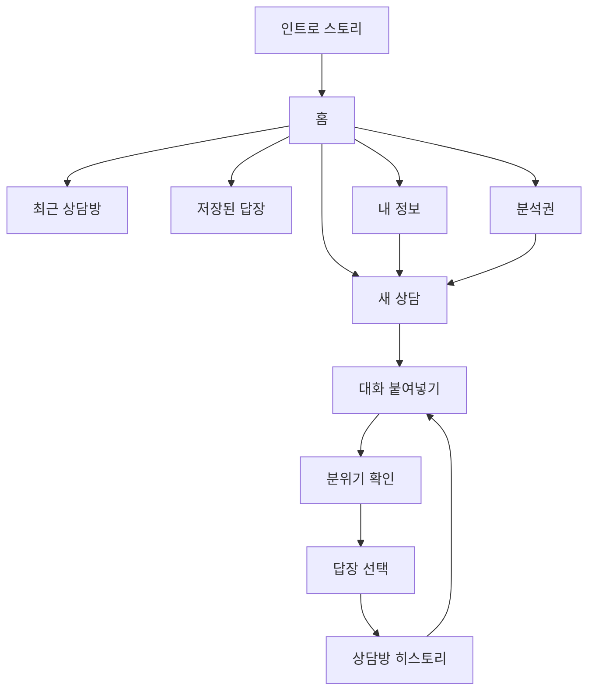

# 플러팅지옥 앱 정보구조

## 목적

이 문서는 인트로 스토리보드 이후 사용자가 실제로 쓰는 앱의 기본 화면 구조를 확정한다.

현재 MVP는 `홈 → 새 상담 → 결과 확인 → 답장 저장 → 내 정보/분석권 관리` 흐름으로 간다. 인트로는 사용 장면을 이해시키는 온보딩이고, 실제 사용 UI는 카카오톡처럼 익숙한 상담방 구조를 따른다.

## 핵심 원칙

- 사용자는 매번 기능 설명을 읽는 것이 아니라 `상담방`을 열어 대화를 이어간다.
- 추천 답장은 분석 1회 단위가 아니라 대화 턴별로 보관한다.
- 원본 카카오톡/DM 전문은 기본 장기 저장하지 않는다.
- 저장 기본값은 `턴 요약`, `추천 답장`, `선택 이유`, `주의할 말`이다.
- 홈, 내 정보, 분석권은 앱 사용을 방해하지 않는 보조 화면이다.

## 앱 화면 맵

## 하단 탭

| 탭 | 역할 | MVP 포함 이유 |
|---|---|---|
| `홈` | 오늘 이어갈 상담과 사용량을 보여준다. | 사용자가 앱에 들어오자마자 다음 행동을 고르게 한다. |
| `상담` | 대화를 붙여넣고 분석을 시작한다. | MVP의 핵심 기능이다. |
| `저장` | 고유 턴별 추천 답장을 다시 본다. | 답장을 왜 골랐는지 복기할 수 있어야 한다. |
| `내 정보` | 말투, 관계 기준, 조언 수위를 관리한다. | 답장이 사용자 스타일에 맞아야 한다. |
| `분석권` | 무료 사용량과 분석권 패키지를 보여준다. | 초기 유료화 모델이 분석권 패키지이기 때문이다. |

## 화면별 책임

### 1. 홈

홈은 마케팅 랜딩이 아니라 앱 대시보드다.

구성:

- 남은 무료 분석 횟수
- 최근 상담방
- 저장된 답장 수
- 새 상담 시작 CTA
- 내 말투 설정 진입

홈에서 설명형 카드가 많아지면 앱이 아니라 소개 페이지처럼 보인다. 홈은 `지금 무엇을 이어갈지`만 보여준다.

### 2. 새 상담

사용자가 카카오톡, DM, 문자 내용을 붙여넣는 화면이다.

구성:

- 대화 입력
- 관계 단계
- 대화 목표
- 답장 강도
- 조언 수위
- 말투 반영 방식
- 개인정보 삭제 안내

검증:

- 너무 짧은 입력은 추가 맥락을 요청한다.
- 전화번호, 주소, 실명처럼 보이는 값은 삭제 안내를 먼저 보여준다.
- 발화자 구분이 없으면 `나:` / `상대:` 형식을 안내한다.

### 3. 상담방 히스토리

분석 결과는 카카오톡형 상담방 안에서 턴별로 쌓인다.

보관 단위:

- `turn_id`
- 사용자가 붙여넣은 대화의 요약
- 상대 반응 요약
- 추천 답장
- 사용자가 선택한 답장
- 위험한 말
- 다음 행동 제안

원본 대화 전문은 기본 저장하지 않는다. 사용자가 명시적으로 저장을 켠 경우에만 별도 정책 검토 후 저장한다.

### 4. 저장된 답장

사용자가 복사했거나 마음에 든 답장을 대화방별로 다시 보는 화면이다.

구성:

- 상담방 이름
- 턴 번호
- 추천 답장
- 추천 이유
- 다시 복사하기
- 이어서 상담하기

### 5. 내 정보

답장 추천의 개인화 기준을 관리한다.

구성:

- 내 말투
- 원하는 연애 스타일
- 선호 상대 스타일
- 어려워하는 상대 스타일
- 끌림 이유
- 조언 수위

중요한 정책:

- 이상형과 실제 끌림은 다를 수 있다.
- 앱은 `만나라/만나지 마라`를 결정하지 않는다.
- 앱은 경고와 확인 질문을 제공하고, 사용자의 연애를 존중한다.

### 6. 분석권

MVP 유료화는 구독이 아니라 분석권 패키지로 시작한다.

구성:

- 무료 사용량
- 보유 분석권
- 패키지 목록
- 결제 상태
- 결제 실패/환불 안내

## 구현 매핑

| 문서 화면 | 현재 React 구현 |
|---|---|
| 홈 | `apps/web/src/pages/AnalysisPage.tsx`의 `HomeSection` |
| 새 상담 | `AnalysisPage.tsx`의 `analysis` 섹션 + `AnalysisForm` |
| 저장된 답장 | `AnalysisPage.tsx`의 `SavedRepliesSection` |
| 내 정보 | `AnalysisPage.tsx`의 `ProfileSection` |
| 분석권 | `AnalysisPage.tsx`의 `BillingSection` |
| 하단 탭 | `AnalysisPage.tsx`의 `AppBottomNav` |

현재는 빠른 와이어프레임 검증을 위해 한 파일에서 섹션을 나눈다. 다음 구현 단계에서 `pages/` 또는 `features/` 단위로 분리한다.
