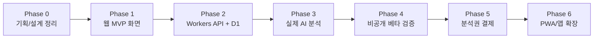

# 플러팅지옥 개발 페이즈

## 목적

이 문서는 플러팅지옥을 어떤 순서로 만들지 정의한다.

각 페이즈는 `목표`, `포함 범위`, `완료 조건`, `다음으로 넘어가기 전 확인할 지표`를 가진다. 기능 목록을 많이 쌓는 것이 아니라, 각 단계에서 검증해야 할 가정을 명확히 하는 것이 목적이다.

## 전체 페이즈 요약

## Phase 0. 기획/설계 정리

### 목표

제품 방향, 기술 스택, 데이터 구조, 화면 흐름을 확정한다.

### 포함 범위

- 브랜드/포지셔닝 문서
- MVP 제품 스펙
- 화면 흐름
- AI 응답 스키마
- React 컴포넌트 아키텍처
- 시스템 아키텍처
- API 명세
- D1 데이터 모델
- ERD

### 완료 조건

- MVP가 무엇을 하는지 한 문장으로 설명할 수 있다.
- 어떤 기능을 V1에서 제외하는지 명확하다.
- 프론트엔드, API, DB, AI, 결제의 책임 경계가 나뉘어 있다.
- ERD와 API 명세가 서로 충돌하지 않는다.

### 현재 상태

대부분 완료. 페이즈 문서와 페이즈별 스펙 문서를 추가해 설계 공백을 보완한다.

## Phase 1. 웹 MVP 화면

### 목표

사용자가 모바일 웹에서 메시지를 붙여넣고, 분석 결과 화면을 볼 수 있게 한다.

### 포함 범위

- React Vite 앱
- 모바일 우선 UI
- 메시지 입력
- 관계 단계/목적/답장 강도/조언 수위 선택
- 이상형/연애 스타일 선택
- mock AI 결과 표시
- 답장 복사 버튼
- 무료 분석 잔여 횟수 표시 UI

### 제외 범위

- 실제 LLM 호출
- 실제 결제
- 로그인
- 상대별 히스토리 저장

### 완료 조건

- `npm run build`가 성공한다.
- 첫 화면에서 분석 요청을 보낼 수 있다.
- mock 결과가 실제 AI 응답 스키마와 같은 구조로 표시된다.
- 모바일 너비에서 주요 버튼과 입력 영역이 사용 가능하다.

### 확인 지표

- 첫 화면 진입 후 분석 버튼 클릭까지 막힘이 없는지
- 답장 후보 3개가 화면에서 쉽게 비교되는지
- 개인정보 삭제 안내가 입력 근처에 보이는지

## Phase 2. Workers API + D1

### 목표

Cloudflare Workers API와 D1을 연결해 무료 분석 3회 제한과 이벤트 로그를 실제로 동작시킨다.

### 포함 범위

- D1 데이터베이스 생성
- D1 migration 적용
- `/api/health`
- `/api/usage`
- `/api/analyses`
- `/api/events`
- 익명 사용자 ID 기반 사용량 추적
- `analysis_started`, `analysis_completed`, `free_limit_reached`, `reply_copied` 이벤트 저장

### 제외 범위

- 실제 LLM 호출
- 결제 크레딧 차감
- 관리자 화면

### 완료 조건

- Workers 배포가 성공한다.
- `/api/health`가 운영 URL에서 `ok`를 반환한다.
- 하루 3회까지 분석이 허용된다.
- 4번째 분석 요청은 `LIMIT_REACHED`를 반환한다.
- D1에 usage/event row가 생성된다.

### 확인 지표

- `analysis_started` 대비 `analysis_completed` 비율
- `free_limit_reached` 발생 수
- `reply_copied` 발생 수

## Phase 3. 실제 AI 분석

### 목표

mock AI를 제거하고, AI Gateway를 통해 실제 LLM 분석 결과를 반환한다.

### 포함 범위

- AI Gateway 연결
- 외부 LLM API 호출
- 시스템 프롬프트 작성
- 안전 정책 프롬프트 작성
- JSON 응답 스키마 검증
- 실패 시 재시도 또는 fallback 메시지
- 원문 대화 미저장 정책 유지

### 제외 범위

- 모델 자동 라우팅 고도화
- 사용자별 장기 메모리
- 상대별 대화 히스토리

### 완료 조건

- 실제 대화 입력에 대해 AI 결과가 반환된다.
- 응답 JSON이 프론트엔드 표시 스키마와 맞는다.
- 안전하지 않은 요청은 답장 추천 대신 안전 안내를 반환한다.
- API 키는 브라우저에 노출되지 않는다.

### 확인 지표

- AI JSON 파싱 성공률
- AI 응답 실패율
- 평균 응답 시간
- 답장 복사율
- `도움 됨` 비율

## Phase 4. 비공개 베타 검증

### 목표

소수 사용자에게 실제로 사용하게 하고, 답장 품질과 사용 흐름을 검증한다.

### 포함 범위

- Cloudflare Pages 운영 배포
- Workers 운영 배포
- 이벤트 로그 기반 사용 분석
- 피드백 수집
- 답장 품질 개선
- 개인정보 안내 개선

### 제외 범위

- 대규모 마케팅
- 유료 결제
- 네이티브 앱 출시

### 완료 조건

- 10명 이상이 실제 대화로 분석을 사용한다.
- 사용자가 답장을 복사하는 행동이 기록된다.
- 피드백에서 반복되는 불만이 정리된다.
- 위험한 답장 추천 케이스가 별도 이슈로 정리된다.

### 확인 지표

- 분석 완료율
- 답장 복사율
- 재방문율
- `도움 됨` 비율
- 개인정보 경고 후 이탈률

## Phase 5. 분석권 결제

### 목표

무료 사용량 이후에도 계속 쓰고 싶은 사용자를 위해 분석권 패키지를 판매한다.

### 포함 범위

- Polar Checkout 생성
- Polar webhook 수신
- 주문/크레딧 ledger 테이블 추가
- 분석권 잔액 표시
- 무료 횟수 초과 시 분석권 구매 안내
- 결제 완료 후 분석권 지급

### 제외 범위

- 구독 결제
- 앱스토어 인앱결제
- 쿠폰/프로모션 고도화

### 완료 조건

- 결제 성공 webhook이 중복 수신되어도 크레딧이 중복 지급되지 않는다.
- 분석권 구매 후 잔액이 증가한다.
- 유료 분석 1회 사용 시 잔액이 1 차감된다.
- 결제 실패/취소 상태가 화면에 안내된다.

### 확인 지표

- 무료 한도 도달 후 결제 클릭률
- 결제 시작 대비 완료율
- 구매 후 분석 재사용률
- 반복 구매율

## Phase 6. PWA/앱 확장

### 목표

웹 MVP가 검증된 뒤 설치형 앱 경험으로 확장한다.

### 포함 범위

- PWA manifest
- 앱 아이콘
- 홈 화면 추가 안내
- 기본 오프라인 fallback
- 필요 시 Capacitor 패키징 검토

### 제외 범위

- Flutter 전면 전환
- React Native/Expo 전면 전환
- 앱스토어 결제 정책 대응 전 유료 앱 출시

### 완료 조건

- 모바일 브라우저에서 홈 화면 추가가 가능하다.
- PWA 아이콘과 앱 이름이 정상 표시된다.
- 앱스토어 출시가 필요할 만큼 모바일 사용량이 확인된다.

### 확인 지표

- 모바일 사용 비중
- 재방문율
- 홈 화면 추가 전환율
- 앱스토어 요구가 실제로 있는지

## 페이즈 진행 원칙

- Phase 1~3은 제품 가치 검증을 위한 필수 단계다.
- Phase 5 결제는 AI 답장 품질과 복사율이 확인된 뒤 진행한다.
- Phase 6 앱 확장은 웹/PWA 사용 지표가 나온 뒤 판단한다.
- 각 페이즈 완료 전에는 다음 페이즈 기능을 섞어 넣지 않는다.

## 중단 기준

다음 조건이면 해당 페이즈를 멈추고 범위를 줄인다.

- 구현이 1주 이상 지연되는데 검증 가치가 낮은 기능이 원인인 경우
- 사용자가 분석 결과를 복사하지 않는 경우
- AI 답장이 사용자의 말투와 계속 어긋나는 경우
- 개인정보 저장 리스크가 기능 가치보다 커지는 경우
- 결제 전에 무료 사용에서도 반복 사용 신호가 없는 경우
