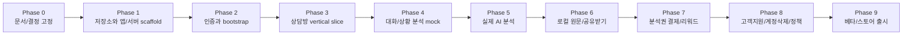

# 플러팅지옥 앱 전용 개발 페이즈

## 목적

이 문서는 플러팅지옥을 Flutter 앱 + Spring Boot + PostgreSQL 기준으로 구현할 때의 개발 순서와 완료 조건을 정의한다.

상위 문서:

- `docs/decisions/0005-native-app-spring-stack.md`
- `docs/technical/native-app-architecture.md`
- `docs/technical/flutter-app-tech-spec.md`
- `docs/technical/spring-backend-tech-spec.md`
- `docs/technical/app-api-spec-v2.md`
- `docs/technical/data-model-v2.md`

기존 React 웹 MVP는 앱 UX 레퍼런스, 랜딩, 정책, 고객지원, 운영 화면으로 유지한다. 최종 사용자 제품은 Flutter 앱을 기준으로 만든다.

## 개발 전략

기본 전략은 `세로 슬라이스 개발`이다.

```text
하나의 사용자 기능
→ Flutter 화면
→ Spring API
→ PostgreSQL 저장
→ 테스트
→ 수동 앱 확인
```

이유:

- 프론트만 많이 만들면 실제 인증, 저장, 결제, 분석권 정책에서 다시 흔들린다.
- 백엔드만 먼저 만들면 앱 UX에서 필요한 계약이 맞지 않을 수 있다.
- 플러팅지옥은 상담방, 분석, 저장, 결제 ledger가 서로 연결되므로 기능 단위로 끝까지 연결해야 한다.

예외:

- 디자인 시스템, 라우팅, 인증, DB migration처럼 모든 기능의 기반이 되는 것은 먼저 만든다.
- RevenueCat, AdMob, ChannelTalk처럼 외부 심사가 필요한 기능은 mock → sandbox → production 순서로 붙인다.

## 전체 페이즈 요약



## Phase 0. 문서와 결정 고정

### 목표

앱 전용 제품의 기술 방향, API, DB, 개발 순서를 코드 작성 전에 고정한다.

### 포함 범위

- Flutter/Spring/PostgreSQL 전환 결정
- DDD 백엔드 패키지 구조
- Flutter 앱 기술 스펙
- API v2 계약
- PostgreSQL 데이터 모델
- 수익화 방식: RevenueCat 인앱결제, AdMob 리워드 광고
- 원문 대화 비저장 원칙

### 제외 범위

- 실제 Flutter scaffold
- 실제 Spring scaffold
- 외부 서비스 계정 생성

### 완료 조건

- `docs/decisions/0005-native-app-spring-stack.md`가 있다.
- `docs/technical/native-app-architecture.md`가 있다.
- `docs/technical/flutter-app-tech-spec.md`가 있다.
- `docs/technical/spring-backend-tech-spec.md`가 있다.
- `docs/technical/app-api-spec-v2.md`가 있다.
- `docs/technical/data-model-v2.md`가 있다.

### 현재 상태

완료.

## Phase 1. 저장소와 앱/서버 scaffold

### 목표

앱과 백엔드가 같은 저장소에서 독립적으로 실행되는 기본 구조를 만든다.

### 포함 범위

- `apps/mobile` Flutter 프로젝트 생성
- `apps/backend` Spring Boot 프로젝트 생성
- `contracts` OpenAPI 또는 API 계약 폴더 생성
- Gradle, Flutter, root 개발 스크립트 정리
- Spring health endpoint
- Flutter 앱 shell, theme, router skeleton
- React 웹은 기존 `apps/web` 유지

### 제외 범위

- 실제 로그인
- 실제 DB 연결
- 실제 AI 호출
- 결제/광고/고객지원 연동

### 완료 조건

- Flutter 앱이 iOS simulator 또는 Android emulator에서 빈 shell로 실행된다.
- Spring Boot가 로컬에서 실행되고 `/actuator/health` 또는 `/api/health`가 응답한다.
- root에서 각 앱 실행 방법이 README에 정리된다.
- 기존 React 웹 빌드가 깨지지 않는다.

### 검증 명령

```bash
npm run typecheck
npm run build
cd apps/backend && ./gradlew test
cd apps/mobile && flutter test
```

## Phase 2. 인증과 bootstrap

### 목표

로그인한 사용자가 앱에 진입하면 서버 사용자, 전역 profile, 분석권 상태, 최근 상담방을 받을 수 있게 한다.

### 포함 범위

- Firebase Auth 설정
- Apple/Google 로그인 기본 연결
- Kakao 로그인 exchange API
- Spring Firebase token 검증 filter
- `app_users`, `linked_auth_providers`, `user_profiles`, `usage_days` migration
- `GET /api/me/bootstrap`
- `PATCH /api/me/profile`
- Flutter auth flow, splash, onboarding, profile provider

### 제외 범위

- 상담방 상세 기능
- 분석 요청
- 결제/광고

### 완료 조건

- 로그인 후 `GET /api/me/bootstrap`이 성공한다.
- 신규 사용자는 서버에 `app_user`와 기본 `user_profile`이 생성된다.
- 토큰 만료 시 Flutter Dio interceptor가 refresh 후 1회 재시도한다.
- 로그아웃 후 보호 화면 접근이 막힌다.

### 테스트

- Spring: 인증 없는 요청 401
- Spring: 유효 token 요청 200
- Flutter: 로그인 전/후 route guard
- 수동: Apple/Google/Kakao 로그인

## Phase 3. 상담방 vertical slice

### 목표

상대별 상담방을 만들고, 목록/상세/설정을 서버와 앱이 실제로 주고받게 한다.

### 포함 범위

- `consultation_rooms` migration
- `GET /api/rooms`
- `POST /api/rooms`
- `GET /api/rooms/{roomId}`
- `PATCH /api/rooms/{roomId}`
- Flutter Rooms tab
- 상담방 생성 화면
- 상담방 상세 화면
- 상대별 설정 수정

### 제외 범위

- 분석 실행
- 답장 저장
- 공유받기

### 완료 조건

- 상담방을 생성하면 목록과 상세에 반영된다.
- 다른 사용자 상담방 접근은 403 또는 404로 막힌다.
- 390px 모바일 폭에서 목록과 상세가 잘리지 않는다.
- 앱 재시작 후 서버 상담방이 다시 보인다.

### 테스트

- Spring integration: 상담방 CRUD
- Spring security: 소유권 검사
- Flutter widget: 목록 empty/loading/error/success
- Flutter integration: 상담방 생성 → 상세 진입

## Phase 4. 대화/상황 분석 mock

### 목표

실제 LLM 없이도 `붙여넣기 → 분류/요약/전략 추천 → 답장 후보 → 저장` 흐름을 끝까지 검증한다.

### 포함 범위

- `analysis_attempts`, `analysis_turns`, `reply_recommendations`, `saved_replies` migration
- `credit_ledger` 기본 migration
- `POST /api/rooms/{roomId}/analyses`
- `POST /api/rooms/{roomId}/analyses/{turnId}/reply-recommendations`
- `POST /api/rooms/{roomId}/reply-turns`
- `GET /api/saved-replies`
- mock AI adapter
- Flutter intake 화면
- Flutter analysis insight 화면
- Flutter reply result 화면
- 저장 답장 탭

### 제외 범위

- 실제 LLM 호출
- 공유 extension
- 인앱결제

### 완료 조건

- 사용자가 대화/상황을 붙여넣고 mock 분석 결과를 받는다.
- 전략 선택 후 답장 후보가 생성된다.
- 1순위 답장을 상담방에 저장할 수 있다.
- 저장 탭에서 상담방별 저장 답장을 확인할 수 있다.
- 원문 전문이 PostgreSQL에 저장되지 않는다.

### 테스트

- Spring: 분석 성공 시 `analysis_turn` 저장
- Spring: `raw_text`, `conversation_text`, `messages` 테이블/컬럼 부재 확인
- Spring: idempotency key 중복 요청 처리
- Flutter: intake → insight → reply → save flow

## Phase 5. 실제 AI 분석

### 목표

mock AI adapter를 실제 LLM adapter로 교체하고, 안전 정책과 응답 검증을 붙인다.

### 포함 범위

- AI provider adapter
- prompt version 관리
- AI request/response schema validation
- timeout/retry 정책
- `AI_TIMEOUT`, `AI_INVALID_RESPONSE`, `SAFETY_BLOCKED`
- 분석 실패 시 credit refund ledger
- 원문 로그 금지 검증

### 제외 범위

- Python FastAPI 분리
- 벡터 검색
- 장기 대화 원문 저장

### 완료 조건

- 실제 대화/상황 입력에 대해 구조화 결과가 생성된다.
- AI 응답이 schema에 맞지 않으면 저장하지 않고 오류 처리한다.
- 서버/AI 실패 시 분석권이 복구된다.
- 안전 정책 위반 요청은 답장을 생성하지 않는다.
- 로그에 원문이 남지 않는다.

### 테스트

- AI adapter contract test
- schema validation 실패 테스트
- timeout/refund 테스트
- safety blocked 테스트
- 로그 redaction 점검

## Phase 6. 로컬 원문 저장과 공유받기

### 목표

카톡/DM/문자/상황 설명을 앱으로 가져오는 네이티브 UX를 만든다.

### 포함 범위

- Flutter Drift + SQLite
- `local_rooms`, `local_intake_drafts`, `local_turns`, `local_saved_replies`
- Android `ACTION_SEND` 텍스트 공유
- iOS Share Extension
- `/import/share` route
- 공유받은 텍스트 미리보기
- 상담방 선택 또는 새 상담방 생성
- 개인정보 삭제 안내 확인 후 분석 시작

### 제외 범위

- 자동 메시지 발송
- 연락처 동기화
- 카카오톡 계정 직접 연동

### 완료 조건

- 카톡/DM/문자에서 텍스트를 공유하면 플러팅지옥이 열린다.
- 공유 텍스트는 자동 분석되지 않고, 사용자가 상담방과 개인정보 안내를 확인해야 분석된다.
- 원문은 Flutter 로컬 DB에만 저장되고 서버에는 요약만 남는다.
- 계정 삭제 또는 로컬 데이터 삭제 시 로컬 원문이 삭제된다.

### 테스트

- Android 실제 기기 공유 intent
- iOS 실제 기기 Share Extension
- Drift DAO 저장/삭제
- 로컬 원문과 서버 `turnId` 연결

## Phase 7. 분석권 결제와 리워드 광고

### 목표

분석권 패키지와 리워드 광고로 수익화를 시작한다.

### 포함 범위

- RevenueCat SDK
- App Store / Google Play 상품: `analysis_10`, `analysis_30`, `analysis_100`
- `purchase_events`, `reward_events`, `usage_days` migration
- RevenueCat webhook
- `GET /api/billing/products`
- `POST /api/billing/revenuecat/sync`
- AdMob rewarded ad
- `POST /api/rewards/admob`
- 분석권 부족 UX

### 제외 범위

- 구독
- 웹 결제
- 배너/전면 광고
- Polar 앱 내부 결제

### 완료 조건

- sandbox 구매 후 서버 `credit_ledger`에 분석권이 적립된다.
- 같은 RevenueCat event가 재전송되어도 중복 적립되지 않는다.
- 리워드 광고 완료 후 분석권 +1이 지급된다.
- 일일 리워드 한도를 넘으면 `RATE_LIMITED`가 반환된다.
- 앱은 RevenueCat `CustomerInfo`가 아니라 Spring bootstrap의 잔액을 최종 기준으로 보여준다.

### 테스트

- RevenueCat sandbox purchase
- webhook idempotency integration test
- AdMob test reward ad
- reward duplicate claim test
- credit balance calculation test

## Phase 8. 고객지원, 계정삭제, 정책 페이지

### 목표

스토어 심사와 실제 운영에 필요한 지원/삭제/정책 흐름을 갖춘다.

### 포함 범위

- ChannelTalk SDK
- `POST /api/channel/member-hash`
- `support_member_events`
- `DELETE /api/me`
- `deletion_requests`
- 앱 로컬 데이터 삭제
- React 웹 약관/개인정보처리방침/고객지원 페이지
- 앱 내 개인정보 안내
- 앱 내 신고/차단 또는 상담 안내 문구

### 제외 범위

- 복잡한 관리자 CRM
- 자동 moderation dashboard

### 완료 조건

- 로그인 사용자 기준 ChannelTalk 상담이 열린다.
- ChannelTalk profile에 원문 상담 내용이 들어가지 않는다.
- 앱에서 계정 삭제 요청을 할 수 있다.
- 계정 삭제 후 서버 요약 데이터와 로컬 DB 삭제 흐름이 검증된다.
- 웹 정책 페이지 URL이 앱스토어 제출에 사용할 수 있다.

### 테스트

- ChannelTalk memberHash HMAC 검증
- 계정 삭제 integration test
- 로컬 DB 삭제 확인
- 정책 페이지 접근 확인

## Phase 9. 베타와 스토어 출시

### 목표

제한된 사용자에게 앱을 배포하고, 실제 사용성과 결제/광고/분석 안정성을 검증한다.

### 포함 범위

- TestFlight
- Google Play Internal testing
- production Firebase project
- production RevenueCat entitlement
- production AdMob app/ad unit
- production API 배포
- Cloudflare DNS/WAF/SSL 연결
- crash/error monitoring
- 앱스토어 스크린샷/설명/개인정보 라벨
- 베타 피드백 수집

### 제외 범위

- 대규모 마케팅
- 구독 모델
- Python AI 서비스 분리
- 관리자 고도화

### 완료 조건

- TestFlight와 Play Internal testing 배포가 가능하다.
- production API health check가 성공한다.
- 로그인, 상담방, 분석, 저장, 결제 sandbox/production test가 통과한다.
- 앱스토어 개인정보 라벨과 실제 데이터 수집 항목이 일치한다.
- 심사 반려 리스크가 높은 기능이 제거되어 있다.

### 베타 확인 지표

- 첫 분석 완료율
- 분석 요청 실패율
- 평균 AI 응답 시간
- 답장 저장률
- 분석권 부족 도달률
- 구매 전환률
- 리워드 광고 완료율
- 계정 삭제/불만 문의 수

## 구현 우선순위

1. `Phase 1`: scaffold
2. `Phase 2`: 인증과 bootstrap
3. `Phase 3`: 상담방
4. `Phase 4`: mock 분석 vertical slice
5. `Phase 5`: 실제 AI
6. `Phase 6`: 공유받기
7. `Phase 7`: 결제/리워드
8. `Phase 8`: 운영/정책
9. `Phase 9`: 베타/출시

## 지금 바로 시작할 작업

다음 실제 구현 작업은 Phase 1이다.

작업 단위:

1. `apps/backend` Spring Boot scaffold
2. `apps/mobile` Flutter scaffold
3. root README 또는 개발 문서에 실행 명령 추가
4. Spring health endpoint 추가
5. Flutter app shell 추가
6. 최소 테스트와 빌드 확인

## 완료 전 공통 검증

각 페이즈가 끝날 때 아래를 확인한다.

- 앱/서버 build 또는 test가 통과한다.
- API 계약과 실제 응답이 어긋나지 않는다.
- 원문 대화가 서버 DB와 로그에 남지 않는다.
- 결제/광고/분석권 관련 기능은 idempotency가 있다.
- 390px 모바일 폭에서 핵심 CTA가 잘리지 않는다.
- 다음 페이즈로 넘어갈 blocker를 문서에 남긴다.
