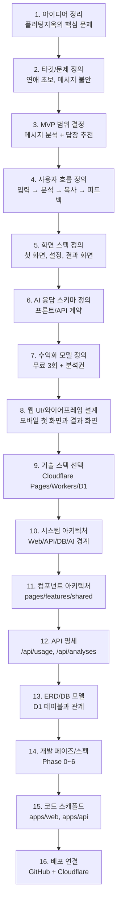

# 플러팅지옥 개발 전 기획 순서

## 목적

이 문서는 실제 개발을 시작하기 전에 어떤 순서로 기획과 설계를 끝내야 하는지 정의한다.

이전 문서들은 제품 스펙, 기술 스택, ERD, API를 각각 설명하지만, `무엇을 먼저 결정하고 다음에 무엇을 해야 하는지`를 한 번에 보여주는 문서가 부족했다. 이 문서는 그 공백을 채운다.

## 결론

개발 전 순서는 다음처럼 잡는다.

```text
아이디어 정리
→ 문제/타깃 정의
→ MVP 범위 결정
→ 사용자 흐름/화면 정의
→ AI 응답 스키마 정의
→ 수익화 모델 정의
→ 웹 UI/와이어프레임 설계
→ 기술 스택 선택
→ 시스템 아키텍처 정의
→ React 컴포넌트 아키텍처 정의
→ API 명세 정의
→ ERD/DB 모델 정의
→ 개발 페이즈/스펙 정의
→ 코드 스캐폴드
→ 배포 연결
```

## 전체 순서 시각화



## 단계별 산출물

| 순서 | 단계 | 결정할 것 | 산출 문서 |
|---:|---|---|---|
| 1 | 아이디어 정리 | 어떤 앱인가 | `product/product-brief.md` |
| 2 | 문제/타깃 정의 | 누구의 어떤 문제인가 | `product/product-brief.md` |
| 3 | MVP 범위 결정 | V1에 넣을 것/뺄 것 | `product/mvp-spec.md`, `decisions/0001-v1-scope.md` |
| 4 | 사용자 흐름 정의 | 사용자가 어떤 순서로 쓰는가 | `product/screen-flow.md` |
| 5 | 화면 스펙 정의 | 첫 화면/결과 화면 구성 | `product/mvp-spec.md`, `product/screen-flow.md` |
| 6 | AI 응답 스키마 | AI가 어떤 JSON을 반환하는가 | `product/ai-response-schema.md` |
| 7 | 수익화 모델 | 무료/유료 기준 | `product/monetization-metrics.md`, `decisions/0002-monetization-model.md` |
| 8 | 웹 UI/와이어프레임 설계 | 첫 화면, 설정, 결과 화면의 배치 | `product/wireframes.md`, `product/screen-flow.md` |
| 9 | 기술 스택 선택 | Cloudflare/Vercel/Supabase, React Vite/Next.js 등 | `technical/tech-stack.md`, `technical/cloudflare-stack-option.md`, `decisions/0004-cloudflare-stack.md` |
| 10 | 시스템 아키텍처 | Web/API/DB/AI/결제 경계 | `technical/mvp-architecture.md` |
| 11 | 컴포넌트 아키텍처 | React 폴더/컴포넌트 관리 방식 | `technical/react-component-architecture.md` |
| 12 | API 명세 | endpoint, request, response | `technical/api-spec.md` |
| 13 | ERD/DB 모델 | 테이블과 관계 | `technical/erd.md`, `technical/data-model.md` |
| 14 | 개발 페이즈/스펙 | 어떤 순서로 구현할지 | `product/development-phases.md`, `product/phase-specs.md` |
| 15 | 코드 스캐폴드 | 실제 프로젝트 구조 | `apps/web`, `apps/api`, `packages/shared` |
| 16 | 배포 연결 | GitHub/Cloudflare 설정 | `technical/github-cloudflare-setup.md` |

## 웹 UI/와이어프레임 설계 위치

와이어프레임은 `수익화 모델 정의` 다음, `기술 스택 선택` 전에 해야 한다.

이유:

- 화면이 먼저 정리되어야 필요한 프론트엔드 구조와 API가 보인다.
- 첫 화면에서 바로 분석할지, 온보딩을 먼저 받을지에 따라 MVP 복잡도가 달라진다.
- 결과 화면이 어떤 섹션을 갖는지 정해야 AI 응답 스키마도 흔들리지 않는다.
- 모바일 웹/PWA가 우선이므로 데스크톱보다 모바일 화면 밀도를 먼저 정해야 한다.

플러팅지옥의 결정:

```text
웹 UI 방향: 모바일 우선 단일 분석 화면
핵심 화면: 첫 화면/분석 입력, 내 스타일 설정, 분석 결과, 무료 한도 안내
보류: 복잡한 대시보드, 관리자 UI, 상대별 히스토리 화면
```

## 개발 전에 반드시 끝내야 하는 체크리스트

### 제품 체크리스트

- [x] 앱 이름과 포지셔닝이 정해졌는가
- [x] 첫 MVP 기능이 정해졌는가
- [x] 하지 않을 기능이 정해졌는가
- [x] 사용자 흐름이 정리됐는가
- [x] AI 출력 형식이 고정됐는가
- [x] 무료/유료 기준이 정리됐는가

### 기술 체크리스트

- [x] 배포 플랫폼이 정해졌는가
- [x] 웹 UI/와이어프레임이 정리됐는가
- [x] API 런타임이 정해졌는가
- [x] DB가 정해졌는가
- [x] ERD가 정리됐는가
- [x] API 명세가 정리됐는가
- [x] 컴포넌트 관리 구조가 정리됐는가

### 실행 체크리스트

- [x] 개발 페이즈가 정리됐는가
- [x] 페이즈별 완료 조건이 있는가
- [x] GitHub 저장소가 있는가
- [x] 로컬 프로젝트 구조가 있는가
- [ ] Cloudflare Pages 최신 커밋 배포가 성공했는가
- [ ] Cloudflare Workers/D1 운영 연결이 끝났는가
- [ ] 실제 AI API 연결이 끝났는가

## 현재 프로젝트 상태

현재 상태는 `Phase 0`과 `Phase 1 일부`가 진행된 상태다.

완료된 것:

- 제품 방향 정리
- MVP 범위 정리
- 수익화 방향 정리
- Cloudflare 기반 기술 스택 결정
- 웹 UI/와이어프레임 설계
- React Vite 선택
- 시스템 아키텍처 문서화
- 컴포넌트 아키텍처 문서화
- API 명세 문서화
- ERD/DB 모델 문서화
- 개발 페이즈/스펙 문서화
- 기본 코드 스캐폴드 생성

아직 남은 것:

- Cloudflare Pages 최신 커밋 기준 배포 확인
- D1 실제 생성과 migration 적용
- Workers API 운영 배포
- 실제 AI Gateway/LLM 연결
- 비공개 베타 사용자 검증

## 다음 순서

문서 기준으로 다음 실행 순서는 다음이다.

1. Cloudflare Pages가 최신 커밋으로 `apps/web/dist`를 배포하는지 확인한다.
2. Cloudflare D1 DB를 생성한다.
3. `wrangler.toml`에 실제 `database_id`를 반영한다.
4. D1 migration을 적용한다.
5. Workers API를 배포한다.
6. 웹앱에서 Workers API base URL을 연결한다.
7. mock AI를 실제 AI 호출로 교체한다.

## 원칙

기획 문서가 완벽해서 개발을 시작하는 것이 아니다. 다만 다음 세 가지가 없으면 개발 중 방향이 흔들린다.

- MVP 범위
- 데이터/API 계약
- 개발 페이즈별 완료 조건

플러팅지옥은 이 세 가지를 먼저 고정한 뒤 구현을 진행한다.
