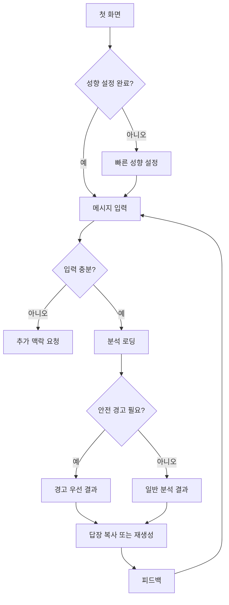

# 플러팅지옥 화면 흐름

## 목적

이 문서는 플러팅지옥 V1의 화면 구조와 사용자 흐름을 정의한다.

V1은 마케팅 랜딩 페이지가 아니라, 사용자가 바로 메시지를 붙여넣고 분석 결과를 받는 모바일 앱 경험으로 시작한다.

## 화면 원칙

- 첫 화면에서 바로 분석을 시작할 수 있어야 한다.
- 성향과 이상형 설정은 짧게 받고, 언제든 수정할 수 있어야 한다.
- 앱은 사용자의 선택을 대신하지 않고, 현실적 차이와 위험 신호를 안내한다.
- 결과 화면은 `분위기`, `내 스타일 적합도`, `내 말투 분석`, `답장 후보`, `위험한 말`, `다음 행동` 순서로 보여준다.
- 모든 주요 버튼은 모바일 기준 최소 44px 터치 영역을 가진다.
- 경고 문구는 겁주기보다 사용자의 판단을 돕는 톤으로 작성한다.

## 전체 흐름

## 1. 첫 화면

첫 화면은 앱의 홈이자 메시지 분석 시작 화면이다.

### 구성 요소

- 상단 브랜드: `플러팅지옥`
- 짧은 카피: `플러팅 무한루프 탈출. 지금 보낼 한마디를 찾다.`
- 관계 단계 선택
- 조언 수위 선택
- 말투 반영 선택
- 메시지 입력 영역
- 분석 시작 버튼
- 개인정보 삭제 안내

### 기본 상태

- 관계 단계 기본값: `썸`
- 조언 수위 기본값: `균형 조언`
- 답장 강도 기본값: `설렘맛`
- 말투 반영 기본값: `자동 분석`

### 주요 행동

- `분석 시작`: 메시지와 설정을 바탕으로 분석을 요청한다.
- `내 스타일 설정`: 빠른 성향 설정 화면을 연다.
- `내 말투 설정`: 자동 분석 결과를 확인하거나 직접 수정한다.
- `최근 설정 불러오기`: 이전에 저장한 이상형/연애 스타일을 적용한다.

## 2. 빠른 성향 설정

첫 사용자가 길게 입력하지 않아도 되도록 1분 안에 끝나는 선택형 화면으로 구성한다.

### 입력 항목

- 원하는 연애 스타일: `다정한`, `표현 많은`, `편안한`, `재밌는`, `깊은 대화`, `자유로운`
- 선호하는 상대 스타일: `상냥한`, `애교 있는`, `차분한`, `시크한`, `털털한`, `대화가 잘 통하는`
- 어려워하는 상대 스타일: `무뚝뚝한`, `연락이 느린`, `표현이 적은`, `너무 가벼운`, `감정 기복이 큰`
- 현재 끌림 이유: `외모`, `대화`, `분위기`, `배려`, `설렘`, `아직 모르겠음`

### 조언 수위

- `응원 위주`: 경고는 짧게, 선택 존중 중심
- `균형 조언`: 매력과 리스크를 함께 안내
- `현실 체크`: 놓치기 쉬운 피로감과 위험 신호를 더 분명히 안내

### 주요 행동

- `저장하고 분석하기`: 설정을 저장하고 메시지 입력으로 돌아간다.
- `이번만 건너뛰기`: 성향 분석 없이 대화 분위기와 답장만 분석한다.
- `나중에 수정`: 설정 화면에서 언제든 바꿀 수 있음을 보여준다.

## 3. 메시지 입력 화면

사용자가 카톡, DM, 문자 내용을 붙여넣는 화면이다.

### 입력 영역

- 큰 텍스트 영역
- 권장 입력량: 최근 대화 10~30줄
- 발화자 구분 안내: `나:`와 `상대:` 형식을 권장
- 개인정보 안내: 이름, 전화번호, 주소는 지우도록 안내

### 선택값

- 관계 단계
- 대화 목적
- 답장 강도
- 조언 수위
- 말투 반영 방식

### 입력 검증

- 너무 짧으면 추가 맥락을 요청한다.
- 발화자가 구분되지 않으면 구분을 요청한다.
- 전화번호, 주소처럼 보이는 값이 있으면 삭제 안내를 먼저 보여준다.

## 4. 분석 로딩 화면

분석 중 화면은 결과를 기다리는 불안을 줄이는 역할을 한다.

### 표시 요소

- 진행 문구: `대화 분위기를 읽는 중`
- 단계 표시: `상대 반응 확인`, `내 스타일과 비교`, `내 말투 분석`, `답장 후보 생성`
- 취소 버튼

### 원칙

- 로딩은 3단계 정도로 짧게 보여준다.
- 과한 연출보다 결과가 곧 나온다는 안정감을 준다.
- 오래 걸리면 재시도 안내를 보여준다.

## 5. 결과 화면

결과 화면은 사용자가 가장 많이 머무는 핵심 화면이다.

### 섹션 순서

1. 현재 분위기
2. 내 스타일과의 적합도
3. 내 말투 분석
4. 안전 경고
5. 지금 보내기 좋은 답장
6. 보내면 위험한 말
7. 다음 행동
8. 피드백

### 현재 분위기

표시값:

- `호감 있음`
- `애매함`
- `부담 가능성`
- `잠시 쉬어야 함`

구성:

- 상태 배지
- 한 줄 요약
- 판단 근거 2~3개
- 확신도

### 내 스타일과의 적합도

표시값:

- `잘 맞을 가능성 있음`
- `매력은 있지만 피로할 수 있음`
- `내 이상형과 차이가 큼`
- `더 확인 필요`

구성:

- 적합도 상태
- 잘 맞는 부분
- 어긋날 수 있는 부분
- 계속 만나고 싶을 때 확인할 질문
- 사용자의 선택을 존중하는 안내 문장

예시 톤:

`이 사람과 계속 보고 싶은 마음이 있다면, 지금 단정하지 않아도 괜찮아요. 다만 당신이 원하는 연애 스타일과 다른 부분은 천천히 확인해보는 게 좋아요.`

### 내 말투 분석

사용자의 메시지에서 추정한 말투와 답장 반영 방식을 보여준다.

구성:

- 말투 요약
- 문장 길이
- 존댓말과 반말
- 웃음 표현과 이모티콘 사용
- 답장에서 유지할 표현
- 답장에서 피할 표현

예시:

`평소처럼 짧고 장난스럽게 가되, 이번에는 호감 표현을 한 문장만 더해볼게요.`

### 안전 경고

안전 경고는 필요한 경우에만 답장 후보보다 먼저 보여준다.

경고 예시:

- 상대가 불편해하는 신호가 있음
- 사용자의 답장 강도가 현재 분위기보다 높음
- 사과나 쉬어가기가 필요한 상황

### 답장 후보

답장 후보는 3개를 보여준다.

- `순한맛`
- `설렘맛`
- `직진맛`

각 답장 카드 구성:

- 추천 문장
- 복사 버튼
- 이 답장이 좋은 이유
- 말투 반영 설명
- 부담도
- 다시 생성 버튼

### 보내면 위험한 말

구성:

- 피해야 할 문장
- 위험한 이유
- 대체 표현

이 섹션은 사용자를 비난하지 않고, 말이 어떻게 받아들여질 수 있는지 설명한다.

### 다음 행동

가능한 행동:

- `대화 이어가기`
- `약속 잡기`
- `한 템포 쉬기`
- `사과하기`
- `관심사 질문하기`

구성:

- 추천 행동
- 이유
- 추천 타이밍

## 6. 설정 화면

사용자가 자신의 이상형과 연애 스타일을 언제든 수정할 수 있는 화면이다.

### 구성 요소

- 내 연애 스타일
- 선호하는 상대 스타일
- 어려워하는 상대 스타일
- 현재 중요하게 보는 기준
- 조언 수위
- 답장 말투
- 내 말투 프로필

### 현재 중요하게 보는 기준

사용자는 지금 시점에서 무엇을 더 중요하게 보는지 바꿀 수 있다.

- 외모와 끌림
- 성격과 안정감
- 대화의 편안함
- 설렘과 텐션
- 장기적인 궁합

이 값은 결과 화면의 적합도 분석에 반영한다.

### 내 말투 프로필

사용자는 자동 분석된 말투를 확인하고 수정할 수 있다.

- 기본 말투: `반말`, `존댓말`, `섞어서`
- 문장 길이: `짧게`, `보통`, `길게`
- 분위기: `담백한`, `다정한`, `장난스러운`, `설레는`, `차분한`
- 표현 강도: `은근하게`, `보통`, `확실하게`
- 이모티콘 사용: `안 씀`, `가끔`, `자주`
- 웃음 표현: `안 씀`, `ㅋㅋ`, `ㅎㅎ`, `섞어서`

## 7. 오류와 빈 상태

### 대화가 너무 짧을 때

`대화가 짧아서 단정하기 어려워요. 최근 대화 10줄 정도를 더 붙여넣어 주세요.`

### 발화자가 구분되지 않을 때

`누가 보낸 말인지 구분이 필요해요. '나:'와 '상대:'로 나눠서 붙여넣어 주세요.`

### 개인정보가 포함된 것 같을 때

`전화번호나 주소처럼 보이는 정보가 있어요. 분석 전에 지우는 걸 추천해요.`

### 안전상 답장 추천이 어려울 때

`지금은 플러팅 답장보다 상대의 의사를 존중하는 답장이 필요해 보여요.`

## 하단 내비게이션

V1에서는 탭을 최소화한다.

- `분석`
- `히스토리`
- `설정`

히스토리는 유료 기능으로 확장할 수 있지만, V1 초기에는 최근 분석을 로컬 또는 짧은 기간만 보관하는 방식으로 시작한다.

## 다음 설계 항목

- 각 화면의 와이어프레임
- 결과 화면 컴포넌트 구조
- 온보딩 질문 문구
- 말투 프로필 설정 화면
- 개인정보 처리 방식
- 유료화 화면 흐름
