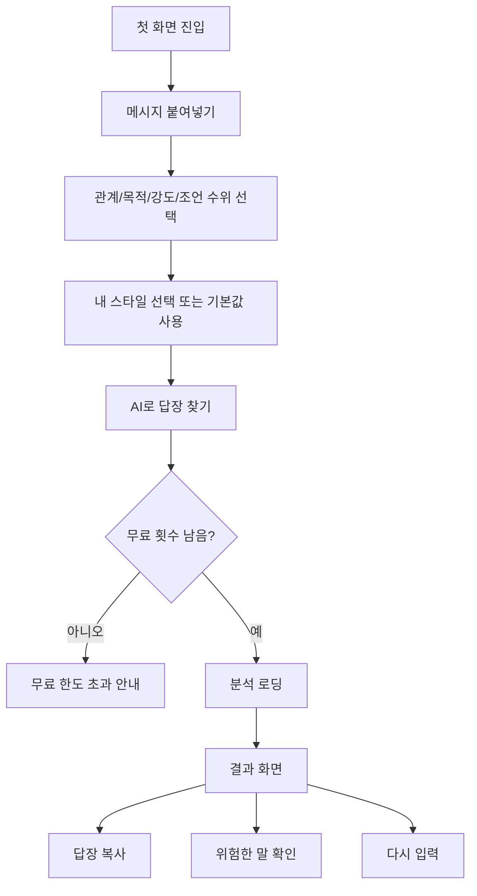

# 플러팅지옥 웹 UI 와이어프레임

## 목적

이 문서는 플러팅지옥 MVP의 웹 UI 화면 배치와 사용 흐름을 정의한다.

MVP는 모바일 웹/PWA 우선이다. 데스크톱에서도 동작하지만, 핵심 사용 상황은 사용자가 카톡/DM을 보다가 모바일에서 바로 붙여넣고 답장을 복사하는 흐름이다.

## UI 원칙

- 첫 화면에서 바로 분석을 시작할 수 있어야 한다.
- 온보딩은 길게 분리하지 않고, 분석 화면 안에서 필요한 설정만 받는다.
- 결과 화면은 판단보다 행동을 우선한다. 사용자는 결국 `지금 보낼 말`을 찾으러 온다.
- 경고는 겁주는 톤이 아니라 판단을 돕는 톤으로 표시한다.
- 모든 주요 터치 영역은 최소 44px 이상으로 설계한다.
- 원문 대화 저장 경계와 개인정보 삭제 안내는 입력 영역 근처에 둔다.

## 화면 목록

| 화면 | 목적 | MVP 포함 여부 |
|---|---|---|
| `AnalysisPage` | 메시지 입력, 설정, 결과 표시를 한 화면에서 처리 | 포함 |
| `StylePreferencePanel` | 이상형/연애 스타일 설정 | 포함 |
| `AnalysisResult` | AI 분석 결과와 답장 후보 표시 | 포함 |
| `LimitReachedNotice` | 무료 분석 3회 초과 안내 | 포함 |
| `BillingPage` | 분석권 구매 | Phase 5로 보류 |
| `HistoryPage` | 상대별 히스토리 | 보류 |
| `AdminDashboard` | 이벤트/지표 관리 | 보류 |

## 모바일 와이어프레임: 첫 화면/분석 입력

```text
┌────────────────────────────────────┐
│ FLIRTING HELL        무료 3/3회     │
│ 플러팅지옥                          │
│ 플러팅 무한루프 탈출.               │
│ 지금 보낼 한마디를 찾다.            │
├────────────────────────────────────┤
│ [카드] 대화 내용                    │
│ 최근 대화 10~30줄 권장              │
│ ┌────────────────────────────────┐ │
│ │ 나: 오늘 뭐해?                 │ │
│ │ 상대: 그냥 집에 있어 ㅋㅋ      │ │
│ │ ...                            │ │
│ └────────────────────────────────┘ │
│ 이름/전화번호/주소는 지우세요       │
├────────────────────────────────────┤
│ 관계 단계                           │
│ [처음 연락] [썸] [데이트 전]        │
│                                    │
│ 대화 목적                           │
│ [이어가기] [호감 표현] [약속 잡기] │
│                                    │
│ 답장 강도                           │
│ [순한맛] [설렘맛] [직진맛]          │
│                                    │
│ 조언 수위                           │
│ [응원 위주] [균형 조언] [현실 체크]│
│                                    │
│ 말투 반영                           │
│ [자동 분석] [직접 설정] [반영 안 함]│
├────────────────────────────────────┤
│ [ AI로 답장 찾기 ]                  │
└────────────────────────────────────┘
```

### 주요 컴포넌트

- `UsageBadge`
- `MessageInputCard`
- `PreferencePanel`
- `AnalysisForm`
- `StylePreferenceForm`

## 모바일 와이어프레임: 내 스타일 설정

```text
┌────────────────────────────────────┐
│ [카드] 내 연애 스타일               │
│ 이상형은 고정값이 아니라 경고등입니다│
│                                    │
│ 원하는 연애 스타일                  │
│ [다정한] [표현 많은] [편안한]       │
│ [재밌는] [깊은 대화] [자유로운]     │
│                                    │
│ 선호하는 상대 스타일                │
│ [상냥한] [애교 있는] [차분한]       │
│ [시크한] [털털한] [대화가 잘 통하는]│
│                                    │
│ 어려워하는 상대 스타일              │
│ [무뚝뚝한] [연락이 느린]            │
│ [표현이 적은] [감정 기복이 큰]      │
│                                    │
│ 지금 끌리는 이유                    │
│ [외모] [대화] [분위기] [배려]       │
└────────────────────────────────────┘
```

### 설계 의도

사용자의 이상형은 강제 필터가 아니다. 따라서 이 화면은 `이 사람은 안 된다`를 판단하기 위한 설문이 아니라, AI가 현실적인 차이를 설명하기 위한 기준값을 받는 화면이다.

## 모바일 와이어프레임: 분석 로딩

```text
┌────────────────────────────────────┐
│ [검은 카드] 분석 중                 │
│ 대화 분위기와 말투를 읽는 중입니다. │
│                                    │
│ 1. 상대 반응 확인                   │
│ 2. 내 스타일과 비교                 │
│ 3. 답장 후보 생성                   │
└────────────────────────────────────┘
```

### 설계 의도

로딩 화면은 사용자가 기다리는 동안 무엇을 하고 있는지 알려준다. 과한 애니메이션보다 명확한 진행 문구를 우선한다.

## 모바일 와이어프레임: 분석 결과

```text
┌────────────────────────────────────┐
│ [카드] 현재 분위기                  │
│ [애매함] 확신도 보통                │
│ 대화는 이어지지만 호감 신호는 약함  │
│ • 웃음 표현이 있음                  │
│ • 답장 강도는 낮게 시작 권장        │
├────────────────────────────────────┤
│ [카드] 내 스타일과의 적합도          │
│ 더 확인 필요                        │
│ 잘 맞는 부분                        │
│ • 대화가 끊기지는 않음              │
│ 확인할 부분                         │
│ • 다정한 표현은 아직 적음           │
│ 안내 문장                           │
│ 계속 보고 싶다면 천천히 확인하세요  │
├────────────────────────────────────┤
│ [카드] 내 말투 분석                 │
│ 짧고 자연스러운 말투                │
│ 말투: 반말 / 문장 길이: 짧게        │
│ 장난기: 중간 / 직진도: 낮음         │
├────────────────────────────────────┤
│ [카드] 지금 보내기 좋은 답장         │
│ [순한맛]                            │
│ “ㅋㅋ 그럼 오늘은 좀 쉬는 날이네”   │
│ 이유 / 상황 / 말투 설명             │
│ [복사하기]                          │
│                                    │
│ [설렘맛]                            │
│ “너랑 얘기하면 은근 편해 ㅋㅋ”      │
│ [복사하기]                          │
│                                    │
│ [직진맛]                            │
│ “이번 주에 얼굴 보고 얘기해보고 싶어”│
│ [복사하기]                          │
├────────────────────────────────────┤
│ [경고 카드] 보내면 위험한 말         │
│ “왜 답장이 늦어?”                   │
│ 추궁처럼 느껴질 수 있음             │
│ 대체: “바빴나 보다. 편할 때 답해줘” │
├────────────────────────────────────┤
│ [카드] 다음 행동                    │
│ 대화 이어가기                       │
│ 추천 타이밍: 지금 바로              │
└────────────────────────────────────┘
```

### 주요 컴포넌트

- `AnalysisResult`
- `ReplyOptionCard`
- `RiskyMessageCard`
- `ToneProfileCard`

## 모바일 와이어프레임: 무료 한도 초과

```text
┌────────────────────────────────────┐
│ [경고 카드] 오늘 무료 분석을 모두 사용│
│ MVP에서는 하루 3회까지 무료 분석 제공│
│                                    │
│ 다음 단계에서 분석권 패키지 결제를   │
│ 연결할 예정입니다.                  │
│                                    │
│ [내일 다시 사용하기]                │
│ [분석권 출시 알림 받기] Phase 5     │
└────────────────────────────────────┘
```

## 데스크톱 레이아웃

데스크톱은 모바일 화면을 넓게 늘리는 것이 아니라, 입력과 결과를 2열로 나눈다.

```text
┌──────────────────────────────┬──────────────────────────────┐
│ 좌측: 입력/설정               │ 우측: 결과                    │
│                              │                              │
│ 브랜드/카피                   │ 현재 분위기                   │
│ 메시지 입력                   │ 적합도                        │
│ 선택 옵션                     │ 말투 분석                     │
│ 내 스타일 설정                │ 답장 후보                     │
│ 분석 버튼                     │ 위험한 말 / 다음 행동         │
└──────────────────────────────┴──────────────────────────────┘
```

## 화면 흐름 시각화



## UI 상태 정의

| 상태 | 조건 | 표시 |
|---|---|---|
| Empty | 아직 분석 전 | 안내 카드 표시 |
| Editing | 메시지 입력 중 | 분석 버튼 활성/비활성 |
| Loading | 분석 요청 중 | 로딩 카드 표시 |
| Success | 분석 성공 | 결과 카드 표시 |
| LimitReached | 무료 횟수 초과 | 무료 한도 초과 카드 표시 |
| Error | API/AI 오류 | 오류 토스트 표시 |
| Copied | 답장 복사 성공 | 성공 토스트 표시 |

## 접근성 기준

- 본문 기본 글자 크기는 모바일 기준 16px 이상으로 한다.
- 버튼과 칩은 최소 44px 높이를 확보한다.
- 결과 카드의 상태 배지는 색상만으로 의미를 전달하지 않는다.
- 오류 메시지는 입력 영역 또는 관련 액션 근처에 표시한다.
- 키보드 포커스가 보이도록 한다.

## MVP에서 하지 않는 UI

- 복잡한 회원가입 화면
- 상대별 대화 히스토리 화면
- 관리자 대시보드
- 결제 화면
- 앱스토어 설치 유도 화면
- 채팅봇처럼 실시간 대화하는 UI

## 결정

플러팅지옥 MVP의 웹 UI는 `모바일 우선 단일 분석 화면`으로 시작한다. 입력, 설정, 결과를 한 흐름 안에 두고, 데스크톱에서는 입력과 결과를 2열로 배치한다.
