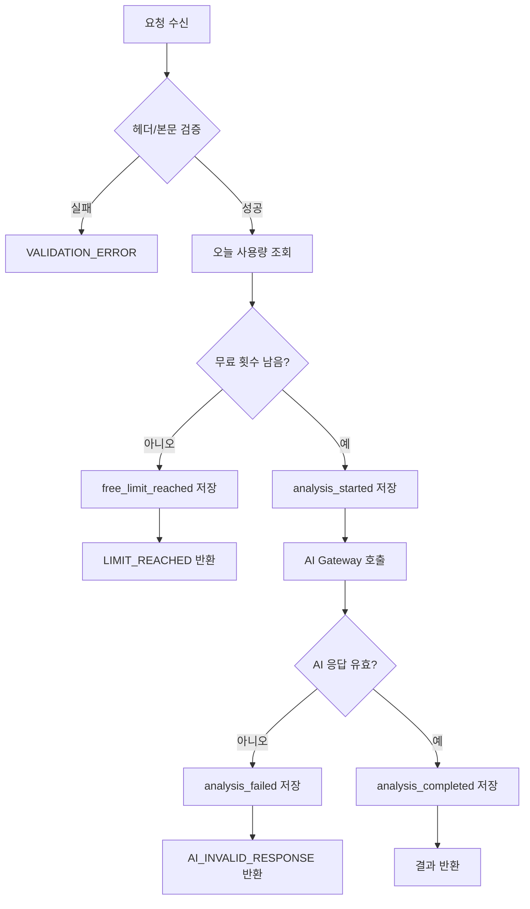

# 플러팅지옥 MVP API 명세

## 목적

이 문서는 플러팅지옥 MVP의 Workers API 경계를 정의한다.

MVP API는 `메시지 분석`, `무료 사용량 조회`, `이벤트 저장`, `상태 확인`만 포함한다. Polar 결제 API는 다음 단계로 미룬다.

## 공통 규칙

### Base URL

로컬 개발:

```text
http://localhost:8787
```

운영:

```text
https://api.flirting-hell.example.com
```

운영 도메인은 Cloudflare 배포 후 확정한다.

### 인증

MVP는 로그인 없이 시작한다.

프론트엔드는 브라우저에 익명 사용자 ID를 만들고, 모든 요청에 다음 헤더를 붙인다.

```http
X-Anonymous-User-Id: <uuid>
```

규칙:

- 값이 없으면 Worker가 `VALIDATION_ERROR`를 반환한다.
- 이 값은 보안 인증 수단이 아니라 무료 사용량 추적용 식별자다.
- 로그인 도입 후에는 `user_id`와 연결할 수 있게 남겨둔다.

### 공통 응답 형식

성공:

```json
{
  "ok": true,
  "data": {}
}
```

실패:

```json
{
  "ok": false,
  "error": {
    "code": "VALIDATION_ERROR",
    "message": "메시지를 10줄 정도 입력해 주세요."
  }
}
```

### 공통 오류 코드

| 코드 | 의미 |
|---|---|
| `VALIDATION_ERROR` | 요청값이 부족하거나 형식이 잘못됨 |
| `LIMIT_REACHED` | 무료 분석 횟수 초과 |
| `AI_TIMEOUT` | AI 응답 지연 |
| `AI_INVALID_RESPONSE` | AI 응답 구조 오류 |
| `UNSAFE_REQUEST` | 안전 정책상 처리 불가 |
| `SERVER_ERROR` | 서버 내부 오류 |

## `GET /api/health`

API 상태 확인용 엔드포인트다.

### Request

```http
GET /api/health
```

### Response

```json
{
  "ok": true,
  "data": {
    "status": "ok",
    "service": "flirting-hell-api",
    "version": "0.1.0"
  }
}
```

## `GET /api/usage`

무료 분석 잔여 횟수를 조회한다.

### Request

```http
GET /api/usage
X-Anonymous-User-Id: 2dd1d3ce-2afa-45d9-a1a5-99fbf11c2222
```

### Response

```json
{
  "ok": true,
  "data": {
    "date": "2026-04-24",
    "freeLimit": 3,
    "usedToday": 1,
    "remainingToday": 2,
    "creditBalance": 0
  }
}
```

### 처리 규칙

- 날짜 기준은 서버 기준 `Asia/Seoul` 날짜를 사용한다.
- MVP에서는 `creditBalance`를 항상 `0`으로 둘 수 있다.
- 결제 기능이 붙으면 분석권 잔액을 함께 반환한다.

## `POST /api/analyses`

메시지를 분석하고 AI 결과를 생성한다.

### Request

```http
POST /api/analyses
Content-Type: application/json
X-Anonymous-User-Id: 2dd1d3ce-2afa-45d9-a1a5-99fbf11c2222
```

```json
{
  "conversationText": "나: 오늘 뭐해?
상대: 그냥 집에 있어 ㅋㅋ",
  "relationshipStage": "썸",
  "conversationGoal": "대화 이어가기",
  "replyIntensity": "설렘맛",
  "guidanceMode": "균형 조언",
  "toneMode": "자동 분석",
  "userPreferences": {
    "datingStyles": ["다정한", "표현 많은"],
    "preferredPartnerStyles": ["상냥한", "대화가 잘 통하는"],
    "difficultPartnerStyles": ["무뚝뚝한", "표현이 적은"],
    "attractionReasons": ["외모", "분위기"]
  }
}
```

### Request 필드

| 필드 | 타입 | 필수 | 설명 |
|---|---|---:|---|
| `conversationText` | string | O | 최근 대화 10~30줄 권장 |
| `relationshipStage` | enum | O | 관계 단계 |
| `conversationGoal` | enum | O | 대화 목적 |
| `replyIntensity` | enum | O | 답장 강도 |
| `guidanceMode` | enum | O | 조언 수위 |
| `toneMode` | enum | O | 말투 반영 방식 |
| `userPreferences` | object | X | 이상형/연애 스타일 설정 |

### 허용 enum

```text
relationshipStage:
처음 연락, 썸, 데이트 전, 데이트 후, 관계 회복

conversationGoal:
대화 이어가기, 호감 표현, 약속 잡기, 실수 만회, 상대 마음 확인

replyIntensity:
순한맛, 설렘맛, 직진맛

guidanceMode:
응원 위주, 균형 조언, 현실 체크

toneMode:
자동 분석, 직접 설정, 이번엔 반영 안 함
```

### Response

```json
{
  "ok": true,
  "data": {
    "analysisId": "ana_01HXYZ",
    "usage": {
      "freeLimit": 3,
      "usedToday": 2,
      "remainingToday": 1,
      "creditBalance": 0
    },
    "result": {
      "mood": {
        "status": "애매함",
        "summary": "대화는 이어지지만 아직 호감 신호는 강하지 않습니다.",
        "confidence": "보통",
        "reasons": ["상대가 짧게 답했지만 웃음 표현이 있습니다."]
      },
      "styleFit": {
        "status": "더 확인 필요",
        "summary": "상대의 표현 방식은 아직 충분히 드러나지 않았습니다.",
        "matchingPoints": ["대화가 끊기지는 않았습니다."],
        "possibleGaps": ["다정한 표현은 아직 적습니다."],
        "checkQuestions": ["너는 연락 자주 하는 편이야?"],
        "guidanceMode": "균형 조언",
        "guidance": "지금 단정하지 말고 대화 속도를 천천히 확인해보세요."
      },
      "userToneProfile": {
        "summary": "짧고 가벼운 말투를 쓰는 편입니다.",
        "speechLevel": "반말",
        "sentenceLength": "짧게",
        "warmth": "중간",
        "playfulness": "중간",
        "directness": "낮음",
        "emojiUsage": "가끔",
        "laughStyle": "ㅋㅋ",
        "signaturePatterns": ["문장이 짧음"],
        "avoidPatterns": ["갑작스러운 장문 고백"],
        "confidence": "보통"
      },
      "replyOptions": [
        {
          "level": "순한맛",
          "text": "ㅋㅋ 집에서 쉬는 것도 좋지. 오늘은 완전 쉬는 날이야?",
          "reason": "부담 없이 대화를 이어갈 수 있습니다.",
          "bestFor": "상대 반응을 더 보고 싶을 때",
          "pressure": "낮음",
          "toneMatch": "짧고 가벼운 말투를 유지했습니다."
        }
      ],
      "riskyMessage": {
        "avoidText": "나랑 만나기 싫어?",
        "reason": "상대에게 압박처럼 느껴질 수 있습니다.",
        "alternative": "오늘은 푹 쉬고, 다음에 시간 맞으면 보자."
      },
      "nextAction": {
        "type": "대화 이어가기",
        "reason": "아직 약속보다 분위기 확인이 먼저입니다.",
        "suggestedTiming": "지금 바로"
      },
      "safety": {
        "needsToneDown": false,
        "warning": null,
        "blocked": false,
        "blockedReason": null
      },
      "feedbackPrompt": {
        "question": "이 답장이 도움이 됐나요?",
        "options": ["도움 됨", "별로임"]
      }
    }
  }
}
```

### 무료 제한 초과 Response

```json
{
  "ok": false,
  "error": {
    "code": "LIMIT_REACHED",
    "message": "오늘 무료 분석 3회를 모두 사용했어요. 내일 다시 이용하거나 분석권 구매를 기다려 주세요."
  }
}
```

### 처리 순서



## `POST /api/events`

답장 복사, 피드백 같은 사용자 행동을 저장한다.

### Request

```http
POST /api/events
Content-Type: application/json
X-Anonymous-User-Id: 2dd1d3ce-2afa-45d9-a1a5-99fbf11c2222
```

```json
{
  "eventName": "reply_copied",
  "analysisId": "ana_01HXYZ",
  "metadata": {
    "replyLevel": "설렘맛"
  }
}
```

### 허용 이벤트

```text
reply_copied
feedback_submitted
```

서버 내부 이벤트는 클라이언트에서 받을 수 없다.

```text
analysis_started
analysis_completed
analysis_failed
free_limit_reached
```

### Response

```json
{
  "ok": true,
  "data": {
    "eventId": "evt_01HXYZ"
  }
}
```

## 버전 관리

MVP에서는 URL에 버전을 넣지 않는다.

나중에 외부 앱 또는 네이티브 앱이 붙으면 `/api/v1/analyses` 형태로 버전을 고정한다.
