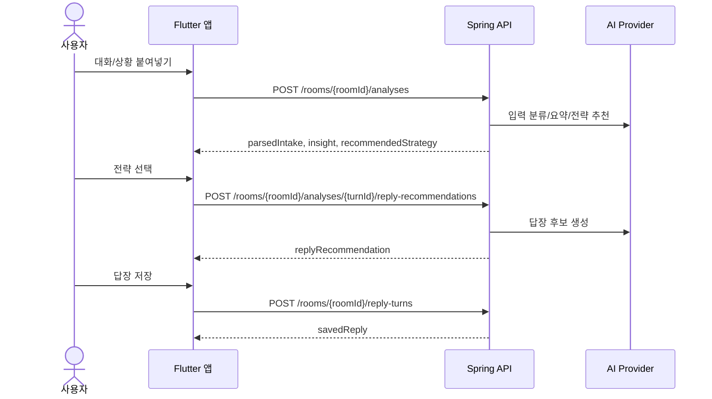

# 플러팅지옥 앱 API v2 명세

## 목적

이 문서는 Flutter 앱과 Spring Boot 백엔드 사이의 API 계약을 정의한다.

상위 문서:

- `docs/decisions/0005-native-app-spring-stack.md`
- `docs/technical/native-app-architecture.md`
- `docs/technical/flutter-app-tech-spec.md`
- `docs/technical/spring-backend-tech-spec.md`

기존 `docs/technical/api-spec.md`는 Cloudflare Workers 기반 웹/PWA MVP 명세다. 앱 전용 제품은 이 문서를 기준으로 한다.

## 범위

포함한다:

- Flutter 앱이 호출하는 Spring API
- RevenueCat webhook API
- 상담방 중심 분석 흐름
- 분석권 ledger와 리워드 광고 보상 흐름
- 공통 인증, 응답, 오류, idempotency 규칙

포함하지 않는다:

- React 웹 관리자 API 상세
- PostgreSQL 테이블 상세
- AI prompt 전문
- App Store / Google Play 상품 등록 절차
- Flutter 화면 구현 상세

## 기본 URL

로컬:

```text
http://localhost:8080/api
```

운영:

```text
https://api.flirting-hell.example.com/api
```

운영 도메인은 배포 문서에서 확정한다.

## 공통 규칙

### Content-Type

```http
Content-Type: application/json; charset=utf-8
Accept: application/json
```

### 시간

- API 시간 값은 ISO-8601 문자열을 사용한다.
- 서버 저장 기준은 UTC다.
- 사용자에게 표시할 날짜는 앱에서 `Asia/Seoul` 기준으로 변환한다.

예시:

```text
2026-05-02T12:30:00Z
```

### ID

ID는 서버가 생성한 string이다. 클라이언트는 ID format에 비즈니스 로직을 의존하지 않는다.

권장 prefix:

| 리소스 | 예시 |
|---|---|
| 사용자 | `usr_01HV...` |
| 상담방 | `room_01HV...` |
| 분석 턴 | `turn_01HV...` |
| 분석 시도 | `attempt_01HV...` |
| 저장 답장 | `reply_01HV...` |
| ledger entry | `ledger_01HV...` |
| 구매 이벤트 | `purchase_01HV...` |
| 리워드 이벤트 | `reward_01HV...` |

### 인증

보호 API는 Firebase ID Token을 사용한다.

```http
Authorization: Bearer <Firebase ID token>
```

인증이 필요 없는 API:

- `GET /health`
- `POST /auth/kakao/exchange`
- `POST /billing/revenuecat/webhook`

### 요청 추적

앱은 가능하면 요청마다 `X-Request-Id`를 보낸다. 없으면 서버가 생성한다.

```http
X-Request-Id: req_01HV...
```

### Idempotency

중복 실행되면 안 되는 mutation은 `Idempotency-Key`를 받는다.

```http
Idempotency-Key: client_generated_uuid
```

권장 대상:

- `POST /rooms`
- `POST /rooms/{roomId}/analyses`
- `POST /rooms/{roomId}/analyses/{turnId}/reply-recommendations`
- `POST /rooms/{roomId}/reply-turns`
- `POST /billing/revenuecat/sync`
- `POST /rewards/admob`

서버는 같은 사용자, 같은 endpoint, 같은 idempotency key 요청에 대해 같은 결과를 반환해야 한다.

## 공통 응답 형식

v2는 HTTP status code와 JSON body를 함께 사용한다. v1 Workers API의 `ok: true/false` 형태를 사용하지 않는다.

성공:

```json
{
  "data": {},
  "meta": {
    "requestId": "req_01HV..."
  }
}
```

실패:

```json
{
  "error": {
    "code": "VALIDATION_ERROR",
    "message": "대화 내용을 입력해 주세요.",
    "requestId": "req_01HV...",
    "details": {
      "field": "rawText"
    }
  }
}
```

## 공통 오류 코드

| HTTP | code | 의미 |
|---:|---|---|
| 400 | `VALIDATION_ERROR` | 요청 값 오류 |
| 401 | `UNAUTHENTICATED` | 로그인 필요 또는 토큰 만료 |
| 403 | `FORBIDDEN` | 접근 권한 없음 |
| 404 | `NOT_FOUND` | 리소스 없음 |
| 409 | `CONFLICT` | 중복 요청 또는 상태 충돌 |
| 402 | `CREDIT_REQUIRED` | 분석권 부족 |
| 429 | `RATE_LIMITED` | 요청 한도 초과 |
| 422 | `SAFETY_BLOCKED` | 안전 정책 차단 |
| 504 | `AI_TIMEOUT` | AI provider 지연 |
| 502 | `AI_INVALID_RESPONSE` | AI 응답 구조 오류 |
| 400 | `PAYMENT_EVENT_INVALID` | 결제 webhook 검증 실패 |
| 400 | `REWARD_EVENT_INVALID` | 광고 보상 검증 실패 |
| 500 | `SERVER_ERROR` | 서버 내부 오류 |

## 공통 enum

### `SourceType`

```text
KAKAO
DM
TELEGRAM
SMS
SITUATION
UNKNOWN
```

### `SpeakerRole`

```text
ME
THEM
UNKNOWN
NARRATION
```

### `RelationshipStage`

```text
FIRST_CONTACT
TALKING
BEFORE_DATE
AFTER_DATE
DATING
RECOVERY
UNKNOWN
```

### `StrategyId`

```text
DEVELOP_ROMANCE
CHECK_RELATIONSHIP_STATUS
MAKE_PLAN
MARRIAGE_VALUES
SLOW_DOWN
```

표시명:

| 값 | 표시명 |
|---|---|
| `DEVELOP_ROMANCE` | 연애로 발전 |
| `CHECK_RELATIONSHIP_STATUS` | 여친/남친 여부 확인 |
| `MAKE_PLAN` | 약속 잡기 |
| `MARRIAGE_VALUES` | 결혼 가치관 |
| `SLOW_DOWN` | 속도 조절 |

### `GuidanceLevel`

```text
SUPPORTIVE
BALANCED
REALITY_CHECK
```

### `ReplyTone`

```text
SOFT
WARM_FLIRT
PLAYFUL
DIRECT
CALM
```

## 공통 모델

### `UserProfile`

```json
{
  "nickname": "주혁",
  "speechStyle": "짧고 자연스럽게",
  "datingStyle": "천천히 확인하는 편",
  "guidanceLevel": "BALANCED",
  "preferredPartnerStyle": "말을 예쁘게 하고 다정한 사람",
  "avoidAdvice": "단정적인 판단은 피하기"
}
```

### `UsageSummary`

```json
{
  "creditBalance": 12,
  "freeAnalyses": {
    "date": "2026-05-02",
    "limit": 3,
    "used": 1,
    "remaining": 2
  },
  "rewardAds": {
    "date": "2026-05-02",
    "limit": 3,
    "used": 0,
    "remaining": 3
  }
}
```

### `RoomSummary`

```json
{
  "roomId": "room_01HV...",
  "alias": "지우",
  "relationshipStage": "TALKING",
  "currentConcern": "답장이 왔는데 호감인지 모르겠음",
  "lastTurnSummary": "상대가 집에 있다고 답했고 대화를 이어갈 여지가 있음",
  "lastActivityAt": "2026-05-02T12:30:00Z",
  "savedReplyCount": 3
}
```

### `RoomSettings`

```json
{
  "alias": "지우",
  "relationshipStage": "TALKING",
  "currentConcern": "상대 마음 확인",
  "cautionNotes": "너무 빠른 고백은 피하고 싶음",
  "preferredStrategyId": "DEVELOP_ROMANCE"
}
```

## API 흐름 요약



원본 전문은 분석 요청 처리 중에만 사용한다. 서버 DB에는 원문 전문을 장기 저장하지 않는다.

## Health

### `GET /health`

서버 상태 확인용이다.

Response `200`:

```json
{
  "data": {
    "status": "ok",
    "service": "flirting-hell-api",
    "version": "0.2.0"
  },
  "meta": {
    "requestId": "req_01HV..."
  }
}
```

## Auth

### `POST /auth/kakao/exchange`

Kakao access token을 Firebase custom token으로 교환한다.

Request:

```json
{
  "kakaoAccessToken": "kakao_access_token",
  "device": {
    "platform": "IOS",
    "appVersion": "0.1.0"
  }
}
```

Response `200`:

```json
{
  "data": {
    "firebaseCustomToken": "firebase_custom_token",
    "isNewUser": true
  },
  "meta": {
    "requestId": "req_01HV..."
  }
}
```

규칙:

- Kakao access token은 저장하지 않는다.
- 서버는 Kakao 사용자 ID와 내부 사용자 계정 연결 정보만 저장한다.
- Flutter는 응답받은 custom token으로 Firebase `signInWithCustomToken`을 호출한다.

## Me

### `GET /me/bootstrap`

앱 초기 진입에 필요한 사용자, 분석권, 최근 상담방 정보를 반환한다.

Response `200`:

```json
{
  "data": {
    "user": {
      "userId": "usr_01HV...",
      "onboardingCompleted": true,
      "profile": {
        "nickname": "주혁",
        "speechStyle": "짧고 자연스럽게",
        "datingStyle": "천천히 확인하는 편",
        "guidanceLevel": "BALANCED",
        "preferredPartnerStyle": "말을 예쁘게 하고 다정한 사람",
        "avoidAdvice": "단정적인 판단은 피하기"
      }
    },
    "usage": {
      "creditBalance": 12,
      "freeAnalyses": {
        "date": "2026-05-02",
        "limit": 3,
        "used": 1,
        "remaining": 2
      },
      "rewardAds": {
        "date": "2026-05-02",
        "limit": 3,
        "used": 0,
        "remaining": 3
      }
    },
    "recentRooms": [
      {
        "roomId": "room_01HV...",
        "alias": "지우",
        "relationshipStage": "TALKING",
        "currentConcern": "답장이 왔는데 호감인지 모르겠음",
        "lastTurnSummary": "상대가 집에 있다고 답했고 대화를 이어갈 여지가 있음",
        "lastActivityAt": "2026-05-02T12:30:00Z",
        "savedReplyCount": 3
      }
    ]
  },
  "meta": {
    "requestId": "req_01HV..."
  }
}
```

### `PATCH /me/profile`

전역 말투, 연애 스타일, 조언 수위를 수정한다.

Request:

```json
{
  "nickname": "주혁",
  "speechStyle": "장난스럽지만 부담스럽지 않게",
  "datingStyle": "대화를 이어가면서 천천히 확인",
  "guidanceLevel": "BALANCED",
  "preferredPartnerStyle": "다정하고 표현이 있는 사람",
  "avoidAdvice": "상대를 단정하지 말기"
}
```

Response `200`:

```json
{
  "data": {
    "profile": {
      "nickname": "주혁",
      "speechStyle": "장난스럽지만 부담스럽지 않게",
      "datingStyle": "대화를 이어가면서 천천히 확인",
      "guidanceLevel": "BALANCED",
      "preferredPartnerStyle": "다정하고 표현이 있는 사람",
      "avoidAdvice": "상대를 단정하지 말기"
    }
  },
  "meta": {
    "requestId": "req_01HV..."
  }
}
```

### `DELETE /me`

계정과 서버 저장 데이터를 삭제한다.

Request:

```json
{
  "confirmText": "삭제합니다"
}
```

Response `202`:

```json
{
  "data": {
    "status": "DELETE_REQUESTED",
    "localDataDeletionRequired": true,
    "message": "서버 데이터 삭제 요청이 접수되었습니다. 앱 로컬 데이터도 삭제해 주세요."
  },
  "meta": {
    "requestId": "req_01HV..."
  }
}
```

규칙:

- 서버 삭제와 Flutter 로컬 DB 삭제는 모두 필요하다.
- 삭제 후 Firebase 계정 삭제 또는 연결 해제 정책은 별도 계정 정책 문서에서 확정한다.

## Rooms

### `GET /rooms`

상담방 목록을 조회한다.

Query:

| 이름 | 필수 | 설명 |
|---|---:|---|
| `cursor` | X | 다음 페이지 cursor |
| `limit` | X | 기본 20, 최대 50 |

Response `200`:

```json
{
  "data": {
    "rooms": [
      {
        "roomId": "room_01HV...",
        "alias": "지우",
        "relationshipStage": "TALKING",
        "currentConcern": "답장이 왔는데 호감인지 모르겠음",
        "lastTurnSummary": "상대가 집에 있다고 답했고 대화를 이어갈 여지가 있음",
        "lastActivityAt": "2026-05-02T12:30:00Z",
        "savedReplyCount": 3
      }
    ],
    "nextCursor": null
  },
  "meta": {
    "requestId": "req_01HV..."
  }
}
```

### `POST /rooms`

상담방을 생성한다.

Request:

```json
{
  "alias": "지우",
  "relationshipStage": "TALKING",
  "currentConcern": "상대 마음 확인",
  "cautionNotes": "너무 빠른 고백은 피하고 싶음",
  "preferredStrategyId": "DEVELOP_ROMANCE"
}
```

Response `201`:

```json
{
  "data": {
    "room": {
      "roomId": "room_01HV...",
      "alias": "지우",
      "relationshipStage": "TALKING",
      "currentConcern": "상대 마음 확인",
      "cautionNotes": "너무 빠른 고백은 피하고 싶음",
      "preferredStrategyId": "DEVELOP_ROMANCE",
      "createdAt": "2026-05-02T12:30:00Z",
      "updatedAt": "2026-05-02T12:30:00Z"
    }
  },
  "meta": {
    "requestId": "req_01HV..."
  }
}
```

### `GET /rooms/{roomId}`

상담방 상세와 최근 분석 턴, 저장 답장을 조회한다.

Response `200`:

```json
{
  "data": {
    "room": {
      "roomId": "room_01HV...",
      "alias": "지우",
      "relationshipStage": "TALKING",
      "currentConcern": "상대 마음 확인",
      "cautionNotes": "너무 빠른 고백은 피하고 싶음",
      "preferredStrategyId": "DEVELOP_ROMANCE",
      "createdAt": "2026-05-02T12:30:00Z",
      "updatedAt": "2026-05-02T12:30:00Z"
    },
    "recentTurns": [
      {
        "turnId": "turn_01HV...",
        "summary": "상대가 집에 있다고 답했고 대화를 이어갈 여지가 있음",
        "currentState": "정보는 부족하지만 가볍게 이어갈 수 있음",
        "strategyId": "DEVELOP_ROMANCE",
        "createdAt": "2026-05-02T12:35:00Z"
      }
    ],
    "savedReplies": [
      {
        "savedReplyId": "reply_01HV...",
        "turnId": "turn_01HV...",
        "text": "ㅋㅋ 그럼 오늘은 완전 집콕 모드네. 뭐 보면서 쉬고 있어?",
        "strategyId": "DEVELOP_ROMANCE",
        "createdAt": "2026-05-02T12:40:00Z"
      }
    ]
  },
  "meta": {
    "requestId": "req_01HV..."
  }
}
```

### `PATCH /rooms/{roomId}`

상대별 설정을 수정한다.

Request:

```json
{
  "alias": "지우",
  "relationshipStage": "TALKING",
  "currentConcern": "대화를 더 이어가고 싶음",
  "cautionNotes": "부담스럽게 몰아붙이지 않기",
  "preferredStrategyId": "MAKE_PLAN"
}
```

Response `200`:

```json
{
  "data": {
    "room": {
      "roomId": "room_01HV...",
      "alias": "지우",
      "relationshipStage": "TALKING",
      "currentConcern": "대화를 더 이어가고 싶음",
      "cautionNotes": "부담스럽게 몰아붙이지 않기",
      "preferredStrategyId": "MAKE_PLAN",
      "updatedAt": "2026-05-02T12:45:00Z"
    }
  },
  "meta": {
    "requestId": "req_01HV..."
  }
}
```

## Analysis

### `POST /rooms/{roomId}/analyses`

대화/상황을 입력받아 자동 분류, 요약, 현재 상태, 추천 전략을 만든다.

이 API는 답장 후보를 최종 생성하지 않는다. 답장 후보는 사용자가 전략을 확인한 뒤 `POST /rooms/{roomId}/analyses/{turnId}/reply-recommendations`에서 생성한다.

Request:

```json
{
  "clientDraftId": "local_draft_001",
  "rawText": "나: 오늘 뭐해?\n상대: 그냥 집에 있어 ㅋㅋ\n나: 오 쉬는 날이네. 뭐하면서 쉬어?",
  "sourceHint": "KAKAO",
  "privacyConfirmed": true,
  "userGoal": "상대 마음이 있는지 알고 싶고 대화를 이어가고 싶음"
}
```

Request 필드:

| 필드 | 필수 | 설명 |
|---|---:|---|
| `clientDraftId` | X | Flutter 로컬 draft와 연결하기 위한 client ID |
| `rawText` | O | 카톡/DM/문자/상황 설명 원문 |
| `sourceHint` | X | 앱이 추정한 입력 종류 |
| `privacyConfirmed` | O | 개인정보 삭제 안내를 확인했는지 여부 |
| `userGoal` | X | 이번 입력에서 알고 싶은 것 |

Response `201`:

```json
{
  "data": {
    "turnId": "turn_01HV...",
    "attemptId": "attempt_01HV...",
    "parsedIntake": {
      "sourceType": "KAKAO",
      "confidence": "MEDIUM",
      "participants": [
        {
          "role": "ME",
          "displayName": "나",
          "text": "오늘 뭐해?"
        },
        {
          "role": "THEM",
          "displayName": "상대",
          "text": "그냥 집에 있어 ㅋㅋ"
        }
      ],
      "situationNotes": []
    },
    "insight": {
      "summary": "가벼운 일상 대화가 이어지고 있고 상대가 웃음 표현을 사용했다.",
      "currentState": "호감 가능성을 단정하긴 이르지만 대화는 자연스럽게 이어갈 수 있음",
      "recommendedStrategyId": "DEVELOP_ROMANCE",
      "availableStrategies": [
        "DEVELOP_ROMANCE",
        "CHECK_RELATIONSHIP_STATUS",
        "MAKE_PLAN",
        "MARRIAGE_VALUES",
        "SLOW_DOWN"
      ],
      "warnings": [
        {
          "type": "TOO_FAST_CONFESSION",
          "message": "지금은 고백보다 가볍게 대화를 이어가는 편이 안전합니다."
        }
      ],
      "privacyWarnings": [
        {
          "type": "POSSIBLE_NAME",
          "message": "실명이 포함되어 있다면 다음부터 별칭으로 바꿔 주세요."
        }
      ]
    },
    "usage": {
      "creditBalance": 11,
      "freeAnalyses": {
        "date": "2026-05-02",
        "limit": 3,
        "used": 2,
        "remaining": 1
      }
    },
    "nextRequiredAction": "SELECT_STRATEGY"
  },
  "meta": {
    "requestId": "req_01HV..."
  }
}
```

저장 규칙:

- `rawText`는 서버 DB에 장기 저장하지 않는다.
- `parsedIntake.participants.text`는 즉시 응답 표시용이다. 서버 저장 대상은 요약/상태/전략/주의 신호다.
- 분석권 차감은 서버 ledger 기준이다.
- AI provider 실패로 분석이 완료되지 않으면 차감분은 refund ledger로 복구한다.

### `POST /rooms/{roomId}/analyses/{turnId}/reply-recommendations`

사용자가 선택한 전략에 맞춰 답장 후보를 생성한다.

Request:

```json
{
  "strategyId": "DEVELOP_ROMANCE",
  "replyTone": "WARM_FLIRT",
  "guidanceLevel": "BALANCED",
  "toneInstruction": "내 말투처럼 짧고 장난스럽게"
}
```

Response `201`:

```json
{
  "data": {
    "turnId": "turn_01HV...",
    "strategyId": "DEVELOP_ROMANCE",
    "recommendation": {
      "primary": {
        "replyId": "candidate_1",
        "text": "ㅋㅋ 그럼 오늘은 완전 집콕 모드네. 뭐 보면서 쉬고 있어?",
        "tone": "WARM_FLIRT",
        "reason": "상대가 부담 없이 답하기 쉽고 대화를 자연스럽게 이어갈 수 있습니다."
      },
      "alternatives": [
        {
          "replyId": "candidate_2",
          "text": "집에서 쉬는 날 좋지 ㅋㅋ 오늘은 아무것도 안 하는 날이야?",
          "tone": "SOFT",
          "reason": "더 순한 톤으로 대화를 이어갑니다."
        },
        {
          "replyId": "candidate_3",
          "text": "그럼 지금 심심한 타이밍인가? ㅋㅋ",
          "tone": "PLAYFUL",
          "reason": "조금 더 장난스럽게 반응을 확인합니다."
        }
      ],
      "avoidMessages": [
        {
          "text": "나랑 만나기 싫어서 집에 있는 거야?",
          "reason": "상대에게 추궁처럼 느껴질 수 있습니다."
        }
      ],
      "nextAction": {
        "type": "KEEP_CONVERSATION",
        "message": "상대가 한 번 더 길게 답하면 약속 이야기로 넘어갈 수 있습니다."
      }
    }
  },
  "meta": {
    "requestId": "req_01HV..."
  }
}
```

규칙:

- `turnId`는 해당 `roomId`와 현재 사용자 소유여야 한다.
- 이미 답장 후보가 생성된 같은 `turnId + strategyId + replyTone` 요청은 idempotency 기준으로 같은 결과를 반환한다.
- 답장 후보는 상대를 속이거나 압박하는 방식이면 `SAFETY_BLOCKED` 또는 순화된 대안을 반환한다.

## Reply Turns

### `POST /rooms/{roomId}/reply-turns`

추천 답장을 상담방 히스토리에 저장한다.

Request:

```json
{
  "turnId": "turn_01HV...",
  "sourceReplyId": "candidate_1",
  "text": "ㅋㅋ 그럼 오늘은 완전 집콕 모드네. 뭐 보면서 쉬고 있어?",
  "strategyId": "DEVELOP_ROMANCE",
  "note": "1순위 답장 저장"
}
```

Response `201`:

```json
{
  "data": {
    "savedReply": {
      "savedReplyId": "reply_01HV...",
      "roomId": "room_01HV...",
      "turnId": "turn_01HV...",
      "text": "ㅋㅋ 그럼 오늘은 완전 집콕 모드네. 뭐 보면서 쉬고 있어?",
      "strategyId": "DEVELOP_ROMANCE",
      "note": "1순위 답장 저장",
      "createdAt": "2026-05-02T12:50:00Z"
    }
  },
  "meta": {
    "requestId": "req_01HV..."
  }
}
```

## Saved Replies

### `GET /saved-replies`

상담방별 저장 답장을 조회한다.

Query:

| 이름 | 필수 | 설명 |
|---|---:|---|
| `roomId` | X | 특정 상담방만 조회 |
| `cursor` | X | 다음 페이지 cursor |
| `limit` | X | 기본 20, 최대 50 |

Response `200`:

```json
{
  "data": {
    "groups": [
      {
        "roomId": "room_01HV...",
        "alias": "지우",
        "replies": [
          {
            "savedReplyId": "reply_01HV...",
            "turnId": "turn_01HV...",
            "text": "ㅋㅋ 그럼 오늘은 완전 집콕 모드네. 뭐 보면서 쉬고 있어?",
            "strategyId": "DEVELOP_ROMANCE",
            "createdAt": "2026-05-02T12:50:00Z"
          }
        ]
      }
    ],
    "nextCursor": null
  },
  "meta": {
    "requestId": "req_01HV..."
  }
}
```

## Billing

### `GET /billing/products`

앱에 표시할 분석권 상품 정보를 반환한다. 실제 구매는 RevenueCat SDK가 처리한다.

Response `200`:

```json
{
  "data": {
    "products": [
      {
        "productId": "analysis_10",
        "displayName": "분석권 10회",
        "creditAmount": 10,
        "recommended": false
      },
      {
        "productId": "analysis_30",
        "displayName": "분석권 30회",
        "creditAmount": 30,
        "recommended": true
      },
      {
        "productId": "analysis_100",
        "displayName": "분석권 100회",
        "creditAmount": 100,
        "recommended": false
      }
    ]
  },
  "meta": {
    "requestId": "req_01HV..."
  }
}
```

### `POST /billing/revenuecat/sync`

Flutter 앱이 RevenueCat `CustomerInfo` 갱신 후 서버 잔액 재동기화를 요청한다.

Request:

```json
{
  "appUserId": "revenuecat_app_user_id",
  "customerInfoUpdatedAt": "2026-05-02T12:55:00Z"
}
```

Response `200`:

```json
{
  "data": {
    "usage": {
      "creditBalance": 41,
      "freeAnalyses": {
        "date": "2026-05-02",
        "limit": 3,
        "used": 2,
        "remaining": 1
      }
    }
  },
  "meta": {
    "requestId": "req_01HV..."
  }
}
```

규칙:

- 최종 분석권 잔액은 RevenueCat SDK가 아니라 Spring `credit_ledger` 기준이다.
- sync는 webhook 지연 시 사용자 화면 갱신을 돕는 보조 API다.

### `POST /billing/revenuecat/webhook`

RevenueCat이 호출하는 서버 webhook이다. Flutter 앱은 호출하지 않는다.

Headers:

```http
Authorization: Bearer <REVENUECAT_WEBHOOK_SECRET>
```

Request 예시:

```json
{
  "event": {
    "id": "rc_event_001",
    "type": "INITIAL_PURCHASE",
    "app_user_id": "usr_01HV...",
    "product_id": "analysis_30",
    "purchased_at_ms": 1777712100000
  }
}
```

Response `200`:

```json
{
  "data": {
    "received": true,
    "credited": true
  },
  "meta": {
    "requestId": "req_01HV..."
  }
}
```

규칙:

- RevenueCat event id는 idempotency key다.
- 같은 event가 재전송되어도 중복 지급하지 않는다.
- `product_id`를 서버 상품 정책으로 mapping해 `credit_ledger`에 적립한다.

## Rewards

### `POST /rewards/admob`

리워드 광고 시청 완료 후 분석권 보상을 요청한다.

Request:

```json
{
  "rewardEventId": "admob_reward_001",
  "adUnitId": "ca-app-pub-xxx/rewarded",
  "rewardType": "ANALYSIS_CREDIT",
  "rewardAmount": 1,
  "completedAt": "2026-05-02T13:00:00Z"
}
```

Response `200`:

```json
{
  "data": {
    "credited": true,
    "creditDelta": 1,
    "usage": {
      "creditBalance": 42,
      "rewardAds": {
        "date": "2026-05-02",
        "limit": 3,
        "used": 1,
        "remaining": 2
      }
    }
  },
  "meta": {
    "requestId": "req_01HV..."
  }
}
```

규칙:

- 같은 `rewardEventId`는 한 번만 지급한다.
- 하루 리워드 한도를 넘으면 `RATE_LIMITED`를 반환한다.
- 광고가 완료되지 않았거나 검증 값이 틀리면 `REWARD_EVENT_INVALID`를 반환한다.

## Support

### `POST /channel/member-hash`

ChannelTalk boot에 필요한 memberHash를 발급한다.

Request:

```json
{
  "platform": "IOS",
  "appVersion": "0.1.0"
}
```

Response `200`:

```json
{
  "data": {
    "memberId": "usr_01HV...",
    "memberHash": "hmac_member_hash",
    "profile": {
      "joinedAt": "2026-05-02T12:00:00Z",
      "creditBalance": 42,
      "appVersion": "0.1.0"
    }
  },
  "meta": {
    "requestId": "req_01HV..."
  }
}
```

규칙:

- ChannelTalk profile에는 원문 대화나 민감한 연애 상담 내용을 넣지 않는다.
- `memberHash`는 서버 secret으로 HMAC 생성한다.

## API별 DDD context 매핑

| API | Bounded context |
|---|---|
| `/auth/kakao/exchange` | `identity` |
| `/me/bootstrap` | `identity`, `profile`, `consultation`, `credit` |
| `/me/profile` | `profile` |
| `/me` DELETE | `identity` |
| `/rooms*` | `consultation` |
| `/rooms/{roomId}/analyses*` | `analysis`, `consultation`, `credit` |
| `/rooms/{roomId}/reply-turns` | `consultation`, `analysis` |
| `/saved-replies` | `consultation` |
| `/billing*` | `credit` |
| `/rewards/admob` | `credit` |
| `/channel/member-hash` | `support` |

## MVP에서 명시적으로 제외

- 서버에 카톡/DM/문자 원문 전문 장기 저장
- 연락처 동기화
- 상대방 계정 추적
- 카카오톡 계정 직접 연동
- 메시지 자동 발송
- 상대의 동의 없는 위치/활동 추적
- 성적 압박, 조종, 기만 목적의 답장 생성

## 다음 문서

이 문서 다음에는 `docs/product/native-app-development-phases.md`를 작성한다.
