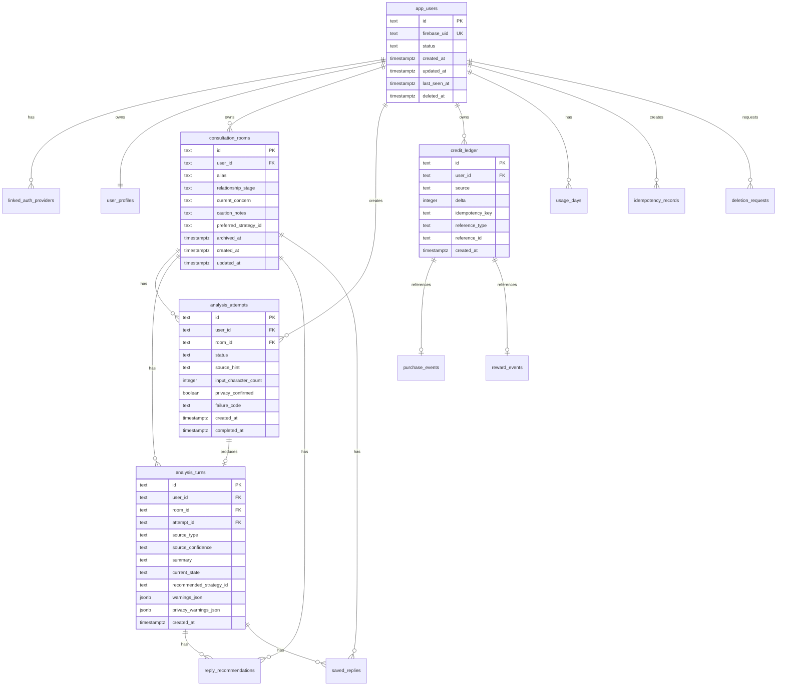

# 플러팅지옥 데이터 모델 v2

## 목적

이 문서는 Flutter 앱 + Spring Boot + PostgreSQL 기준의 서버 데이터 모델을 정의한다.

상위 문서:

- `docs/decisions/0005-native-app-spring-stack.md`
- `docs/technical/native-app-architecture.md`
- `docs/technical/spring-backend-tech-spec.md`
- `docs/technical/app-api-spec-v2.md`

기존 `docs/technical/data-model.md`는 Cloudflare D1 기반 웹/PWA MVP 명세다. 앱 전용 제품의 서버 저장소는 이 문서를 기준으로 한다.

## 모델링 원칙

- PostgreSQL을 사용한다.
- DB migration은 Flyway로 관리한다.
- ID는 서버 애플리케이션에서 생성한 prefix 있는 string을 사용한다.
- 서버 시간 저장은 UTC `timestamptz`를 사용한다.
- enum은 초기에는 `text` + 애플리케이션 검증을 기본으로 한다.
- 핵심 상태값은 필요하면 `check` constraint를 추가한다.
- 원본 카톡/DM/문자 전문은 서버 DB에 장기 저장하지 않는다.
- 결제, 광고 보상, 분석권 차감은 append-only ledger를 원천으로 한다.
- 중복 실행 방지는 idempotency(멱등성) 기록으로 처리한다.

## DDD context와 테이블 매핑

| Bounded context | 테이블 |
|---|---|
| `identity` | `app_users`, `linked_auth_providers`, `deletion_requests` |
| `profile` | `user_profiles` |
| `consultation` | `consultation_rooms`, `saved_replies` |
| `analysis` | `analysis_attempts`, `analysis_turns`, `reply_recommendations` |
| `credit` | `credit_ledger`, `purchase_events`, `reward_events`, `usage_days` |
| `support` | `support_member_events` |
| `shared` | `idempotency_records`, `audit_events` |

## 저장 금지 데이터

서버 DB에 저장하지 않는다:

- 카톡/DM/문자 원문 전문
- 상대방의 연락처
- 상대방의 주소
- 상대방의 실명 전체
- 상대방을 특정할 수 있는 민감 정보
- 사용자가 붙여넣은 원문 메시지 배열

분석 API 응답에 `parsedIntake.participants.text`가 포함될 수 있지만, 이는 즉시 화면 표시용이다. 서버 저장 대상은 요약, 상태, 전략, 주의 신호, 추천 답장이다.

## ERD



## 공통 컬럼 규칙

| 컬럼 | 규칙 |
|---|---|
| `id` | prefix 있는 string primary key |
| `created_at` | 생성 시각, `timestamptz not null` |
| `updated_at` | 수정 가능한 테이블에만 둔다 |
| `deleted_at` | soft delete가 필요한 테이블에만 둔다 |
| `user_id` | 사용자 소유 리소스에 필수 |
| `metadata_json` | 운영 이벤트용 redacted JSON만 허용 |
| `*_json` | 원문 전문이 아니라 구조화 결과만 저장 |

## Identity context

### `app_users`

앱 사용자의 서버 계정이다.

| 컬럼 | 타입 | 필수 | 설명 |
|---|---|---:|---|
| `id` | text | O | 내부 사용자 ID, 예: `usr_...` |
| `firebase_uid` | text | O | Firebase UID |
| `status` | text | O | `ACTIVE`, `DELETION_REQUESTED`, `DELETED`, `SUSPENDED` |
| `onboarding_completed` | boolean | O | 첫 설정 완료 여부 |
| `created_at` | timestamptz | O | 생성 시각 |
| `updated_at` | timestamptz | O | 수정 시각 |
| `last_seen_at` | timestamptz | X | 마지막 API 사용 시각 |
| `deleted_at` | timestamptz | X | 삭제 완료 시각 |

인덱스:

```sql
create unique index uq_app_users_firebase_uid on app_users (firebase_uid);
create index idx_app_users_status_created on app_users (status, created_at);
```

규칙:

- Firebase UID는 외부 인증 ID이고, 서버 내부 권한 판단은 `app_users.id` 기준으로 한다.
- 삭제 요청 이후에는 신규 분석 요청을 막는다.

### `linked_auth_providers`

소셜 로그인 provider와 내부 사용자를 연결한다.

| 컬럼 | 타입 | 필수 | 설명 |
|---|---|---:|---|
| `id` | text | O | 연결 ID |
| `user_id` | text | O | `app_users.id` |
| `provider` | text | O | `APPLE`, `GOOGLE`, `KAKAO` |
| `provider_user_id` | text | O | provider의 사용자 ID |
| `created_at` | timestamptz | O | 연결 시각 |

인덱스:

```sql
create unique index uq_auth_provider_user on linked_auth_providers (provider, provider_user_id);
create unique index uq_auth_user_provider on linked_auth_providers (user_id, provider);
```

규칙:

- Kakao access token은 저장하지 않는다.
- provider user id는 계정 연결 식별용으로만 사용한다.

### `deletion_requests`

계정 삭제 요청과 처리 상태를 기록한다.

| 컬럼 | 타입 | 필수 | 설명 |
|---|---|---:|---|
| `id` | text | O | 삭제 요청 ID |
| `user_id` | text | O | 요청 사용자 |
| `status` | text | O | `REQUESTED`, `PROCESSING`, `COMPLETED`, `FAILED` |
| `requested_at` | timestamptz | O | 요청 시각 |
| `processed_at` | timestamptz | X | 처리 완료 시각 |
| `failure_reason` | text | X | 실패 이유 |

규칙:

- 삭제 요청 후 서버 데이터 삭제와 Flutter 로컬 DB 삭제 안내가 모두 필요하다.
- 운영 감사 목적상 삭제 요청 기록은 최소 정보로 남길 수 있다.

## Profile context

### `user_profiles`

사용자 전역 말투, 연애 스타일, 조언 수위를 저장한다.

| 컬럼 | 타입 | 필수 | 설명 |
|---|---|---:|---|
| `user_id` | text | O | `app_users.id`, primary key |
| `nickname` | text | X | 앱 표시용 닉네임 |
| `speech_style` | text | X | 사용자가 원하는 답장 말투 |
| `dating_style` | text | X | 원하는 연애 스타일 |
| `guidance_level` | text | O | `SUPPORTIVE`, `BALANCED`, `REALITY_CHECK` |
| `preferred_partner_style` | text | X | 선호 상대 스타일 |
| `avoid_advice` | text | X | 피하고 싶은 조언 방식 |
| `created_at` | timestamptz | O | 생성 시각 |
| `updated_at` | timestamptz | O | 수정 시각 |

규칙:

- 사용자당 하나의 현재 profile만 둔다.
- 과거 profile 이력이 필요하면 MVP 이후 `user_profile_histories`를 추가한다.

## Consultation context

### `consultation_rooms`

상대별 상담방이다.

| 컬럼 | 타입 | 필수 | 설명 |
|---|---|---:|---|
| `id` | text | O | 상담방 ID |
| `user_id` | text | O | 소유 사용자 |
| `alias` | text | O | 상대 별칭 |
| `relationship_stage` | text | O | 관계 단계 |
| `current_concern` | text | X | 현재 고민 |
| `caution_notes` | text | X | 조심할 점 |
| `preferred_strategy_id` | text | X | 기본 선호 전략 |
| `archived_at` | timestamptz | X | 보관 처리 시각 |
| `created_at` | timestamptz | O | 생성 시각 |
| `updated_at` | timestamptz | O | 수정 시각 |

인덱스:

```sql
create index idx_rooms_user_updated on consultation_rooms (user_id, updated_at desc);
create index idx_rooms_user_archived on consultation_rooms (user_id, archived_at);
```

규칙:

- `alias`는 실명 대신 별칭 사용을 권장한다.
- 모든 room 조회는 `user_id` 소유권 조건을 포함한다.

### `saved_replies`

상담방별로 저장한 추천 답장이다.

| 컬럼 | 타입 | 필수 | 설명 |
|---|---|---:|---|
| `id` | text | O | 저장 답장 ID |
| `user_id` | text | O | 소유 사용자 |
| `room_id` | text | O | 상담방 ID |
| `turn_id` | text | X | 연결된 분석 턴 |
| `recommendation_id` | text | X | 연결된 답장 추천 |
| `source_reply_id` | text | X | 후보 ID, 예: `candidate_1` |
| `text` | text | O | 저장한 추천 답장 |
| `strategy_id` | text | X | 사용 전략 |
| `note` | text | X | 사용자 메모 |
| `created_at` | timestamptz | O | 저장 시각 |

인덱스:

```sql
create index idx_saved_replies_room_created on saved_replies (room_id, created_at desc);
create index idx_saved_replies_user_created on saved_replies (user_id, created_at desc);
```

규칙:

- 같은 답장 문장이라도 다른 턴에서 저장하면 별도 기록으로 둔다.
- 답장 텍스트는 앱 사용성을 위해 저장하지만, 원문 대화 전문과 결합 저장하지 않는다.

## Analysis context

### `analysis_attempts`

분석 요청 시도와 과금/실패 상태를 기록한다.

| 컬럼 | 타입 | 필수 | 설명 |
|---|---|---:|---|
| `id` | text | O | 분석 시도 ID |
| `user_id` | text | O | 사용자 |
| `room_id` | text | O | 상담방 |
| `client_draft_id` | text | X | Flutter 로컬 draft 연결 ID |
| `status` | text | O | `PENDING`, `SUCCEEDED`, `FAILED`, `SAFETY_BLOCKED`, `REFUNDED` |
| `source_hint` | text | X | 앱이 추정한 입력 종류 |
| `input_character_count` | integer | O | 원문 글자 수 |
| `privacy_confirmed` | boolean | O | 개인정보 안내 확인 여부 |
| `user_goal` | text | X | 이번 요청 목표 |
| `failure_code` | text | X | 실패 코드 |
| `failure_message` | text | X | 사용자 표시 가능한 실패 메시지 |
| `credit_ledger_id` | text | X | 분석권 차감 ledger |
| `created_at` | timestamptz | O | 시작 시각 |
| `completed_at` | timestamptz | X | 완료 시각 |

인덱스:

```sql
create index idx_attempts_room_created on analysis_attempts (room_id, created_at desc);
create index idx_attempts_user_status on analysis_attempts (user_id, status, created_at desc);
```

규칙:

- `raw_text` 컬럼은 만들지 않는다.
- 실패가 서버/AI 원인이면 refund ledger를 생성한다.
- `SAFETY_BLOCKED`는 분석권을 차감하지 않는다.

### `analysis_turns`

완료된 분석 턴의 요약과 전략 결과다.

| 컬럼 | 타입 | 필수 | 설명 |
|---|---|---:|---|
| `id` | text | O | 분석 턴 ID |
| `user_id` | text | O | 사용자 |
| `room_id` | text | O | 상담방 |
| `attempt_id` | text | O | 분석 시도 ID |
| `source_type` | text | O | `KAKAO`, `DM`, `SITUATION` 등 |
| `source_confidence` | text | O | `LOW`, `MEDIUM`, `HIGH` |
| `summary` | text | O | 대화/상황 요약 |
| `current_state` | text | O | 현재 상태 요약 |
| `recommended_strategy_id` | text | O | 추천 전략 |
| `available_strategy_ids_json` | jsonb | O | 선택 가능한 전략 목록 |
| `warnings_json` | jsonb | O | 부담/추궁/성급한 고백 경고 |
| `privacy_warnings_json` | jsonb | O | 개인정보 삭제 안내 |
| `created_at` | timestamptz | O | 생성 시각 |

인덱스:

```sql
create unique index uq_analysis_turn_attempt on analysis_turns (attempt_id);
create index idx_analysis_turns_room_created on analysis_turns (room_id, created_at desc);
```

규칙:

- 발화자별 원문 메시지는 저장하지 않는다.
- UI 히스토리에 필요한 것은 `summary`, `current_state`, `warnings_json`으로 충분해야 한다.
- AI가 상대 마음을 단정한 문장을 저장하지 않도록 후처리한다.

### `reply_recommendations`

전략 선택 후 생성된 답장 후보 묶음이다.

| 컬럼 | 타입 | 필수 | 설명 |
|---|---|---:|---|
| `id` | text | O | 추천 묶음 ID |
| `user_id` | text | O | 사용자 |
| `room_id` | text | O | 상담방 |
| `turn_id` | text | O | 분석 턴 |
| `strategy_id` | text | O | 선택 전략 |
| `reply_tone` | text | O | 답장 톤 |
| `guidance_level` | text | O | 조언 수위 |
| `tone_instruction` | text | X | 이번 요청 말투 지시 |
| `primary_text` | text | O | 1순위 답장 |
| `primary_reason` | text | O | 추천 이유 |
| `alternatives_json` | jsonb | O | 다른 톤 답장 |
| `avoid_messages_json` | jsonb | O | 피해야 할 말 |
| `next_action_type` | text | X | 다음 행동 유형 |
| `next_action_message` | text | X | 다음 행동 설명 |
| `created_at` | timestamptz | O | 생성 시각 |

인덱스:

```sql
create index idx_reply_recommendations_turn_created on reply_recommendations (turn_id, created_at desc);
create index idx_reply_recommendations_room_created on reply_recommendations (room_id, created_at desc);
```

규칙:

- 답장 후보는 저장 가능하다.
- 후보는 원문 대화 전문 없이도 이해 가능한 형태로 저장한다.
- 동일 `turn_id + strategy_id + reply_tone` 재요청은 idempotency로 처리한다.

## Credit context

### `credit_ledger`

분석권 잔액의 원천이다.

| 컬럼 | 타입 | 필수 | 설명 |
|---|---|---:|---|
| `id` | text | O | ledger entry ID |
| `user_id` | text | O | 사용자 |
| `source` | text | O | `PURCHASE`, `REWARD_AD`, `FREE_DAILY`, `ANALYSIS_USE`, `REFUND`, `ADMIN_GRANT` |
| `delta` | integer | O | 증가/차감 수량 |
| `idempotency_key` | text | O | 중복 방지 키 |
| `reference_type` | text | X | `PURCHASE_EVENT`, `REWARD_EVENT`, `ANALYSIS_ATTEMPT` 등 |
| `reference_id` | text | X | 참조 리소스 ID |
| `reason` | text | X | 운영 표시용 사유 |
| `created_at` | timestamptz | O | 생성 시각 |

인덱스:

```sql
create unique index uq_credit_ledger_idempotency
on credit_ledger (user_id, source, idempotency_key);

create index idx_credit_ledger_user_created
on credit_ledger (user_id, created_at desc);
```

규칙:

- 잔액은 `sum(delta)`로 계산한다.
- 잔액 snapshot이 필요해져도 ledger가 원천이다.
- `delta = 0` entry는 만들지 않는다.

### `purchase_events`

RevenueCat 구매 webhook 이벤트다.

| 컬럼 | 타입 | 필수 | 설명 |
|---|---|---:|---|
| `id` | text | O | 구매 이벤트 ID |
| `user_id` | text | O | 사용자 |
| `revenuecat_event_id` | text | O | RevenueCat event id |
| `revenuecat_app_user_id` | text | O | RevenueCat app user id |
| `event_type` | text | O | `INITIAL_PURCHASE`, `NON_RENEWING_PURCHASE` 등 |
| `product_id` | text | O | `analysis_10`, `analysis_30`, `analysis_100` |
| `credit_amount` | integer | O | 지급 분석권 |
| `purchased_at` | timestamptz | O | 구매 시각 |
| `credit_ledger_id` | text | X | 연결 ledger |
| `payload_redacted_json` | jsonb | X | 민감값 제거 webhook 일부 |
| `created_at` | timestamptz | O | 수신 시각 |

인덱스:

```sql
create unique index uq_purchase_events_revenuecat_event
on purchase_events (revenuecat_event_id);

create index idx_purchase_events_user_created
on purchase_events (user_id, created_at desc);
```

규칙:

- 같은 RevenueCat event id는 한 번만 적립한다.
- webhook payload 전체 저장은 피하고, 운영에 필요한 redacted JSON만 저장한다.

### `reward_events`

AdMob 리워드 광고 보상 이벤트다.

| 컬럼 | 타입 | 필수 | 설명 |
|---|---|---:|---|
| `id` | text | O | 보상 이벤트 ID |
| `user_id` | text | O | 사용자 |
| `reward_event_id` | text | O | 앱/광고 SDK에서 전달한 중복 방지 ID |
| `ad_unit_id` | text | O | 광고 단위 ID |
| `reward_type` | text | O | `ANALYSIS_CREDIT` |
| `reward_amount` | integer | O | 지급 분석권 |
| `completed_at` | timestamptz | O | 광고 완료 시각 |
| `credit_ledger_id` | text | X | 연결 ledger |
| `created_at` | timestamptz | O | 서버 처리 시각 |

인덱스:

```sql
create unique index uq_reward_events_reward_event
on reward_events (reward_event_id);

create index idx_reward_events_user_created
on reward_events (user_id, created_at desc);
```

규칙:

- 하루 리워드 한도는 `usage_days.reward_ad_used_count`와 함께 확인한다.
- 같은 reward event는 한 번만 지급한다.

### `usage_days`

일자별 무료 분석과 리워드 광고 사용량이다.

| 컬럼 | 타입 | 필수 | 설명 |
|---|---|---:|---|
| `id` | text | O | `user_id:usage_date` 기반 ID |
| `user_id` | text | O | 사용자 |
| `usage_date` | date | O | 사용자 기준 날짜, 기본 `Asia/Seoul` |
| `free_analysis_used_count` | integer | O | 무료 분석 사용량 |
| `reward_ad_used_count` | integer | O | 리워드 광고 지급 횟수 |
| `created_at` | timestamptz | O | 생성 시각 |
| `updated_at` | timestamptz | O | 수정 시각 |

인덱스:

```sql
create unique index uq_usage_days_user_date on usage_days (user_id, usage_date);
```

규칙:

- 유료 분석권 잔액은 `credit_ledger` 기준으로 계산한다.
- 무료 분석 횟수는 일자 counter와 ledger entry를 함께 남길 수 있다.

## Shared context

### `idempotency_records`

중복 요청 방지 기록이다.

| 컬럼 | 타입 | 필수 | 설명 |
|---|---|---:|---|
| `id` | text | O | 기록 ID |
| `user_id` | text | X | 사용자, webhook은 null 가능 |
| `method` | text | O | HTTP method |
| `path` | text | O | endpoint path |
| `idempotency_key` | text | O | 클라이언트 또는 외부 이벤트 key |
| `request_hash` | text | X | 원문 제외 요청 fingerprint |
| `response_status` | integer | X | 최초 처리 HTTP status |
| `resource_type` | text | X | 생성/처리 리소스 타입 |
| `resource_id` | text | X | 생성/처리 리소스 ID |
| `expires_at` | timestamptz | O | 만료 시각 |
| `created_at` | timestamptz | O | 생성 시각 |

인덱스:

```sql
create unique index uq_idempotency_records_key
on idempotency_records (coalesce(user_id, 'system'), method, path, idempotency_key);

create index idx_idempotency_records_expires on idempotency_records (expires_at);
```

규칙:

- 분석 요청의 `request_hash`는 `rawText`를 포함하지 않는다.
- webhook은 외부 이벤트 ID를 idempotency key로 사용한다.
- 만료된 기록은 배치로 삭제 가능하다.

### `audit_events`

운영 감사 이벤트다.

| 컬럼 | 타입 | 필수 | 설명 |
|---|---|---:|---|
| `id` | text | O | 이벤트 ID |
| `user_id` | text | X | 관련 사용자 |
| `actor_type` | text | O | `USER`, `SYSTEM`, `ADMIN`, `WEBHOOK` |
| `actor_id` | text | X | 행위자 ID |
| `event_type` | text | O | 이벤트명 |
| `metadata_json` | jsonb | X | 민감값 제거 메타데이터 |
| `created_at` | timestamptz | O | 생성 시각 |

인덱스:

```sql
create index idx_audit_events_user_created on audit_events (user_id, created_at desc);
create index idx_audit_events_type_created on audit_events (event_type, created_at desc);
```

규칙:

- 원문 대화, 전화번호, 주소, 실명은 `metadata_json`에 넣지 않는다.
- 결제/광고/삭제/관리자 작업은 감사 이벤트를 남긴다.

## Support context

### `support_member_events`

ChannelTalk memberHash 발급과 고객지원 진입 이벤트를 기록한다.

| 컬럼 | 타입 | 필수 | 설명 |
|---|---|---:|---|
| `id` | text | O | 이벤트 ID |
| `user_id` | text | O | 사용자 |
| `platform` | text | X | `IOS`, `ANDROID` |
| `app_version` | text | X | 앱 버전 |
| `event_type` | text | O | `MEMBER_HASH_ISSUED`, `SUPPORT_OPENED` |
| `created_at` | timestamptz | O | 생성 시각 |

규칙:

- `memberHash` 자체는 저장하지 않는다.
- ChannelTalk profile에 민감한 상담 내용을 넣지 않는다.

## 삭제 정책

계정 삭제 시 기본 삭제 대상:

| 테이블 | 처리 |
|---|---|
| `user_profiles` | 삭제 |
| `consultation_rooms` | 삭제 또는 익명화 후 삭제 |
| `analysis_attempts` | 삭제 |
| `analysis_turns` | 삭제 |
| `reply_recommendations` | 삭제 |
| `saved_replies` | 삭제 |
| `credit_ledger` | 법적/정산 필요성 검토 후 최소 보관 또는 익명화 |
| `purchase_events` | 결제 분쟁 대응 기간 동안 최소 보관 또는 익명화 |
| `reward_events` | 부정 사용 대응 기간 동안 최소 보관 또는 익명화 |
| `audit_events` | 민감값 없는 최소 이벤트만 보관 |
| `app_users` | `DELETED` 상태와 `deleted_at` 기록 |

구체적인 보관 기간은 개인정보처리방침과 결제 운영 정책에서 확정한다.

## 초기 Flyway migration 순서

```text
V1__create_identity_tables.sql
V2__create_profile_tables.sql
V3__create_consultation_tables.sql
V4__create_credit_tables.sql
V5__create_analysis_tables.sql
V6__create_shared_operational_tables.sql
V7__create_support_tables.sql
```

권장 이유:

- `app_users`가 모든 사용자 소유 테이블의 기준이다.
- `credit_ledger`는 `analysis_attempts`에서 참조될 수 있으므로 analysis보다 먼저 만든다.
- shared operational table은 다른 테이블 생성 후에도 독립적으로 추가 가능하다.

## 구현 전 검증 체크리스트

- `raw_text`, `conversation_text`, `messages`, `contacts`, `partners` 같은 원문/상대 식별 테이블이 없는지 확인한다.
- 모든 사용자 소유 테이블에 `user_id`와 소유권 조회 인덱스가 있는지 확인한다.
- 결제와 광고 보상 이벤트에 unique idempotency index가 있는지 확인한다.
- 분석권 차감과 환불이 ledger로 표현되는지 확인한다.
- 계정 삭제 시 삭제/익명화 대상이 명확한지 확인한다.
- API v2 응답에 필요한 조회 인덱스가 있는지 확인한다.

## 다음 문서

이 문서 다음에는 `docs/product/native-app-development-phases.md`를 작성한다.
