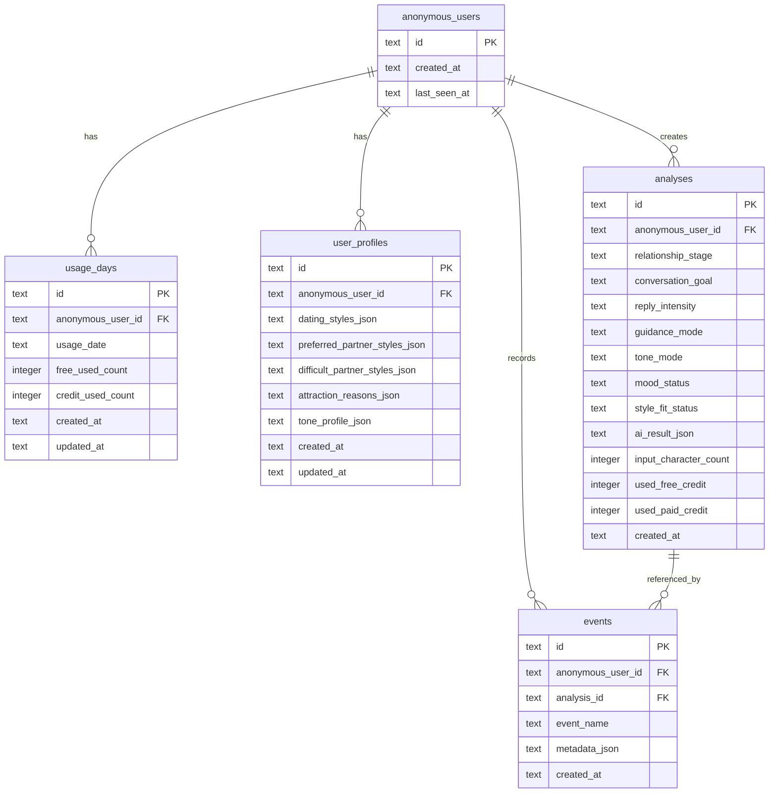

# 플러팅지옥 MVP 데이터 모델

## 목적

이 문서는 플러팅지옥 MVP에서 Cloudflare D1에 저장할 데이터를 정의한다.

MVP 목표는 무료 분석 3회 제한, 이벤트 로그, 사용자 설정, 분석 결과 요약을 저장하는 것이다. 원문 대화는 기본적으로 장기 저장하지 않는다.

## 저장 원칙

저장한다:

- 익명 사용자 ID
- 날짜별 무료 분석 사용량
- 이벤트 로그
- 사용자 연애 스타일/이상형 설정
- 말투 요약 프로필
- 분석 결과의 구조화 요약

저장하지 않는다:

- 카카오톡/DM 원문 전문
- 전화번호
- 주소
- 실명
- 상대방을 특정할 수 있는 민감 정보

## ERD



## 테이블: `anonymous_users`

익명 사용자를 저장한다.

브라우저에서 생성한 UUID를 그대로 사용한다.

| 컬럼 | 타입 | 필수 | 설명 |
|---|---|---:|---|
| `id` | text | O | 브라우저에서 생성한 익명 사용자 UUID |
| `created_at` | text | O | 최초 생성 시각, ISO 문자열 |
| `last_seen_at` | text | O | 마지막 요청 시각 |

## 테이블: `usage_days`

날짜별 무료/유료 분석 사용량을 저장한다.

| 컬럼 | 타입 | 필수 | 설명 |
|---|---|---:|---|
| `id` | text | O | `anonymous_user_id:usage_date` 조합 ID |
| `anonymous_user_id` | text | O | 익명 사용자 ID |
| `usage_date` | text | O | `YYYY-MM-DD`, Asia/Seoul 기준 |
| `free_used_count` | integer | O | 당일 무료 분석 사용량 |
| `credit_used_count` | integer | O | 당일 유료 분석권 사용량, MVP는 0 |
| `created_at` | text | O | 생성 시각 |
| `updated_at` | text | O | 수정 시각 |

인덱스:

```sql
create unique index idx_usage_days_user_date
on usage_days (anonymous_user_id, usage_date);
```

## 테이블: `user_profiles`

사용자의 연애 스타일, 이상형, 말투 요약을 저장한다.

| 컬럼 | 타입 | 필수 | 설명 |
|---|---|---:|---|
| `id` | text | O | 프로필 ID |
| `anonymous_user_id` | text | O | 익명 사용자 ID |
| `dating_styles_json` | text | X | 원하는 연애 스타일 배열 JSON |
| `preferred_partner_styles_json` | text | X | 선호 상대 스타일 배열 JSON |
| `difficult_partner_styles_json` | text | X | 어려워하는 상대 스타일 배열 JSON |
| `attraction_reasons_json` | text | X | 끌림 이유 배열 JSON |
| `tone_profile_json` | text | X | AI가 요약한 말투 프로필 JSON |
| `created_at` | text | O | 생성 시각 |
| `updated_at` | text | O | 수정 시각 |

규칙:

- 사용자당 현재 프로필은 하나만 둔다.
- 이상형이 바뀔 수 있으므로 언제든 덮어쓸 수 있게 한다.
- 원문 대화가 아니라 요약된 말투 프로필만 저장한다.

인덱스:

```sql
create unique index idx_user_profiles_user
on user_profiles (anonymous_user_id);
```

## 테이블: `analyses`

분석 요청과 결과 요약을 저장한다.

| 컬럼 | 타입 | 필수 | 설명 |
|---|---|---:|---|
| `id` | text | O | 분석 ID |
| `anonymous_user_id` | text | O | 익명 사용자 ID |
| `relationship_stage` | text | O | 관계 단계 |
| `conversation_goal` | text | O | 대화 목적 |
| `reply_intensity` | text | O | 답장 강도 |
| `guidance_mode` | text | O | 조언 수위 |
| `tone_mode` | text | O | 말투 반영 방식 |
| `mood_status` | text | X | AI가 판단한 분위기 상태 |
| `style_fit_status` | text | X | 이상형/연애 스타일 적합도 상태 |
| `ai_result_json` | text | X | 구조화된 AI 결과 JSON |
| `input_character_count` | integer | O | 입력 대화 글자 수 |
| `used_free_credit` | integer | O | 무료 분석 사용 여부, 0/1 |
| `used_paid_credit` | integer | O | 유료 분석권 사용 여부, MVP는 0 |
| `created_at` | text | O | 생성 시각 |

규칙:

- `ai_result_json`에는 원문 대화를 넣지 않는다.
- 실패한 분석은 `analysis_failed` 이벤트로 추적하고, 필요한 경우 `analyses`에는 저장하지 않을 수 있다.
- 답장 후보 텍스트는 사용성 검증을 위해 저장할 수 있지만, 원문 대화와 결합 저장하지 않는다.

인덱스:

```sql
create index idx_analyses_user_created
on analyses (anonymous_user_id, created_at);
```

## 테이블: `events`

사용자 행동과 시스템 이벤트를 저장한다.

| 컬럼 | 타입 | 필수 | 설명 |
|---|---|---:|---|
| `id` | text | O | 이벤트 ID |
| `anonymous_user_id` | text | O | 익명 사용자 ID |
| `analysis_id` | text | X | 연결된 분석 ID |
| `event_name` | text | O | 이벤트명 |
| `metadata_json` | text | X | 추가 정보 JSON |
| `created_at` | text | O | 생성 시각 |

초기 이벤트:

```text
analysis_started
analysis_completed
analysis_failed
free_limit_reached
reply_copied
feedback_submitted
```

인덱스:

```sql
create index idx_events_user_created
on events (anonymous_user_id, created_at);

create index idx_events_name_created
on events (event_name, created_at);
```

## 초기 D1 Migration

```sql
create table if not exists anonymous_users (
  id text primary key,
  created_at text not null,
  last_seen_at text not null
);

create table if not exists usage_days (
  id text primary key,
  anonymous_user_id text not null,
  usage_date text not null,
  free_used_count integer not null default 0,
  credit_used_count integer not null default 0,
  created_at text not null,
  updated_at text not null,
  foreign key (anonymous_user_id) references anonymous_users(id)
);

create unique index if not exists idx_usage_days_user_date
on usage_days (anonymous_user_id, usage_date);

create table if not exists user_profiles (
  id text primary key,
  anonymous_user_id text not null,
  dating_styles_json text,
  preferred_partner_styles_json text,
  difficult_partner_styles_json text,
  attraction_reasons_json text,
  tone_profile_json text,
  created_at text not null,
  updated_at text not null,
  foreign key (anonymous_user_id) references anonymous_users(id)
);

create unique index if not exists idx_user_profiles_user
on user_profiles (anonymous_user_id);

create table if not exists analyses (
  id text primary key,
  anonymous_user_id text not null,
  relationship_stage text not null,
  conversation_goal text not null,
  reply_intensity text not null,
  guidance_mode text not null,
  tone_mode text not null,
  mood_status text,
  style_fit_status text,
  ai_result_json text,
  input_character_count integer not null,
  used_free_credit integer not null default 1,
  used_paid_credit integer not null default 0,
  created_at text not null,
  foreign key (anonymous_user_id) references anonymous_users(id)
);

create index if not exists idx_analyses_user_created
on analyses (anonymous_user_id, created_at);

create table if not exists events (
  id text primary key,
  anonymous_user_id text not null,
  analysis_id text,
  event_name text not null,
  metadata_json text,
  created_at text not null,
  foreign key (anonymous_user_id) references anonymous_users(id),
  foreign key (analysis_id) references analyses(id)
);

create index if not exists idx_events_user_created
on events (anonymous_user_id, created_at);

create index if not exists idx_events_name_created
on events (event_name, created_at);
```

## 나중에 추가할 테이블

결제를 붙일 때 추가한다.

- `credit_balances`
- `credit_transactions`
- `orders`
- `webhook_events`

로그인을 붙일 때 추가한다.

- `users`
- `user_identities`
- `sessions`

## 결정

MVP에서는 익명 사용자 기반으로 무료 사용량을 제한한다. 데이터는 분석 품질과 사용 흐름 검증에 필요한 최소 정보만 저장한다. 원문 대화 장기 저장은 하지 않는다.
