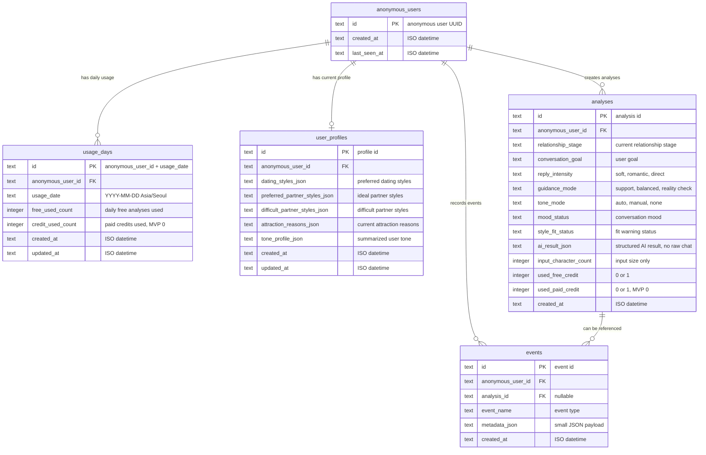
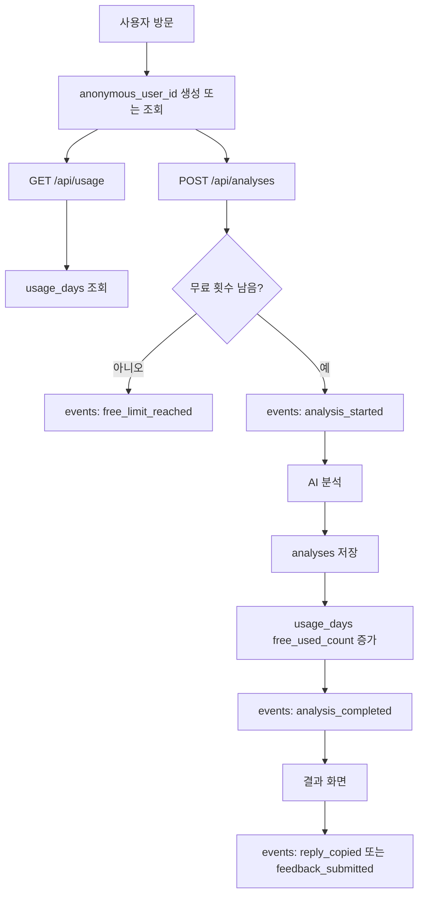
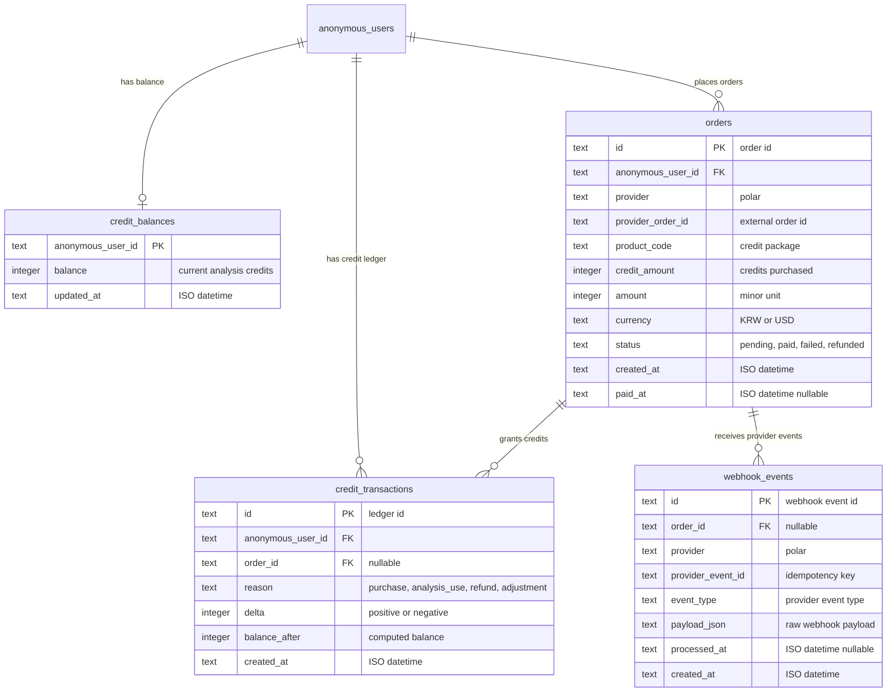
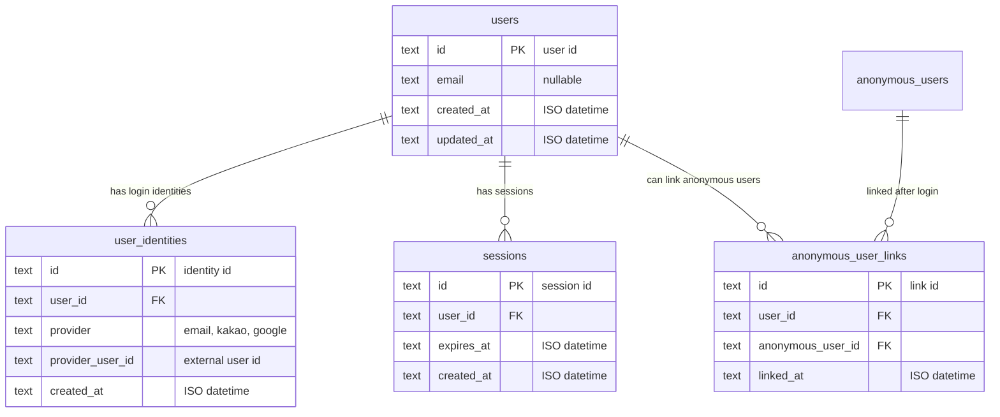

# 플러팅지옥 ERD

## 목적

이 문서는 플러팅지옥 MVP의 데이터 관계를 시각적으로 확정한다.

`docs/technical/data-model.md`가 테이블 컬럼과 migration 중심 문서라면, 이 문서는 엔티티 관계와 확장 방향을 보기 위한 ERD 문서다.

## MVP ERD

MVP는 로그인 없이 익명 사용자 기준으로 시작한다. 핵심 관계는 다음과 같다.

- 한 명의 익명 사용자는 날짜별 사용량을 여러 개 가진다.
- 한 명의 익명 사용자는 현재 프로필을 하나 가진다.
- 한 명의 익명 사용자는 여러 분석 결과를 만든다.
- 한 분석 결과에는 여러 이벤트가 연결될 수 있다.
- 이벤트는 분석과 무관한 행동도 기록할 수 있으므로 `analysis_id`는 선택값이다.



## MVP 테이블 역할

| 테이블 | 역할 | MVP에서 필요한 이유 |
|---|---|---|
| `anonymous_users` | 로그인 전 사용자를 구분 | 무료 3회 제한과 이벤트 추적 기준 |
| `usage_days` | 날짜별 분석 사용량 저장 | 하루 무료 3회 제한 구현 |
| `user_profiles` | 이상형/연애 스타일/말투 요약 저장 | 사용자 스타일 기반 분석과 답장 생성 |
| `analyses` | 분석 요청과 결과 요약 저장 | 결과 품질 검증, 피드백 연결, 재분석 추적 |
| `events` | 사용자 행동과 시스템 이벤트 저장 | 전환율, 복사율, 제한 도달률 측정 |

## 관계 상세

### `anonymous_users` → `usage_days`

관계: `1:N`

사용자 한 명은 날짜별 사용량 row를 여러 개 가진다.

예시:

```text
anonymous_user_id = user_1
2026-04-24 free_used_count = 3
2026-04-25 free_used_count = 1
```

무료 횟수 제한은 `anonymous_user_id + usage_date` unique index로 판단한다.

### `anonymous_users` → `user_profiles`

관계: `1:0..1`

MVP에서는 사용자당 현재 프로필 하나만 유지한다. 이상형과 원하는 연애 스타일은 바뀔 수 있으므로, history를 쌓지 않고 현재값을 덮어쓴다.

나중에 변화 이력을 분석할 필요가 생기면 `user_profile_versions`를 추가한다.

### `anonymous_users` → `analyses`

관계: `1:N`

사용자 한 명은 여러 분석을 만들 수 있다. 분석 row에는 원문 대화를 저장하지 않고, 다음 값만 저장한다.

- 입력 글자 수
- 사용자가 선택한 설정값
- AI 결과의 구조화 요약
- 분위기/적합도 상태값

### `analyses` → `events`

관계: `1:N`

분석 결과 이후의 행동을 연결한다.

예시:

- `reply_copied`
- `feedback_submitted`

단, `free_limit_reached`처럼 분석 ID가 없는 이벤트도 있으므로 `events.analysis_id`는 nullable이다.

## 이벤트 관점 데이터 흐름



## 개인정보 저장 경계

ERD에서 의도적으로 제외한 엔티티가 있다.

| 제외 대상 | 이유 |
|---|---|
| `raw_conversations` | 카톡/DM 원문 장기 저장은 개인정보 리스크가 큼 |
| `partners` | 상대방을 식별하는 구조는 MVP에서 불필요하고 민감함 |
| `messages` | 대화 단위 저장은 서비스 가치 검증 후 재검토 |
| `contacts` | 연락처/전화번호 저장은 MVP 범위를 넘음 |

MVP 원칙은 `원문은 처리에만 사용하고 저장하지 않는다`이다.

## V2 결제 확장 ERD

분석권 패키지 결제를 붙이면 아래 엔티티를 추가한다.



확장 원칙:

- `credit_balances`는 조회 속도를 위한 현재 잔액이다.
- `credit_transactions`가 실제 장부다.
- webhook은 중복 수신될 수 있으므로 `provider_event_id`를 unique 처리한다.
- 분석 1회 사용 시 `credit_transactions.delta = -1`로 기록한다.

## V2 로그인 확장 ERD

로그인을 붙이면 익명 사용자와 실제 계정을 연결한다.



확장 원칙:

- 로그인 전 사용량과 구매 이력을 버리지 않기 위해 `anonymous_user_links`를 둔다.
- 이메일 로그인부터 시작하고 카카오 로그인은 후순위로 둔다.
- 로그인 도입 후에도 개인정보 최소 저장 원칙은 유지한다.

## 최종 결정

MVP ERD는 `anonymous_users`, `usage_days`, `user_profiles`, `analyses`, `events` 5개 테이블로 시작한다.

결제와 로그인은 ERD에 확장 방향만 남기고, MVP 1차 구현과 배포 범위에서는 제외한다.
