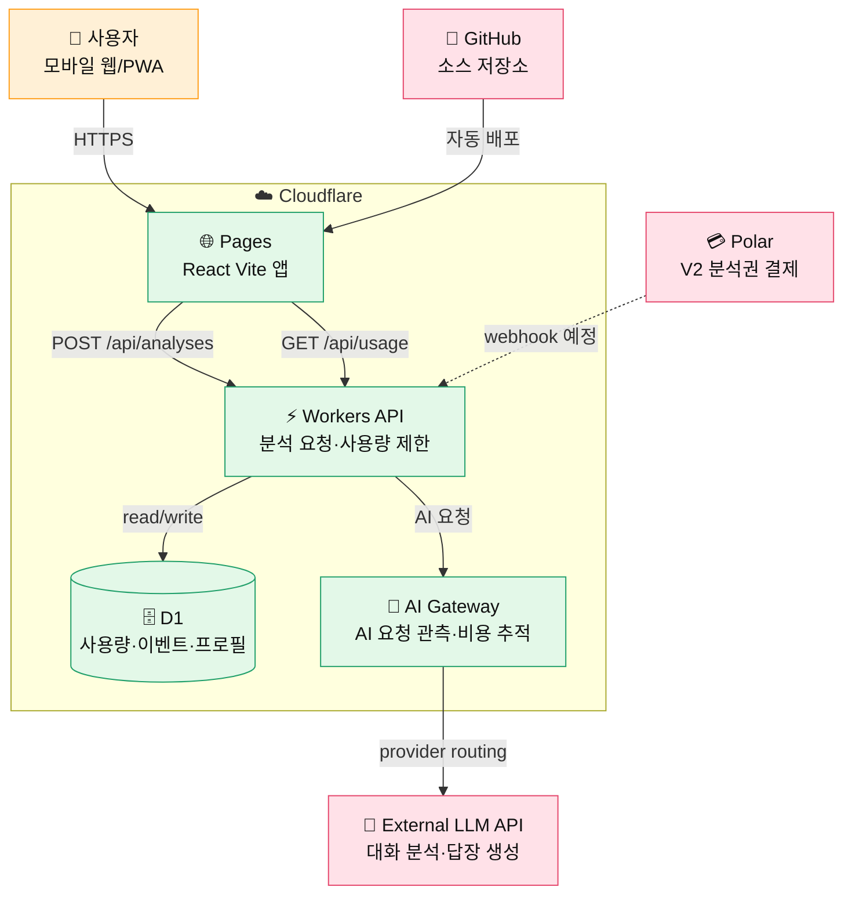
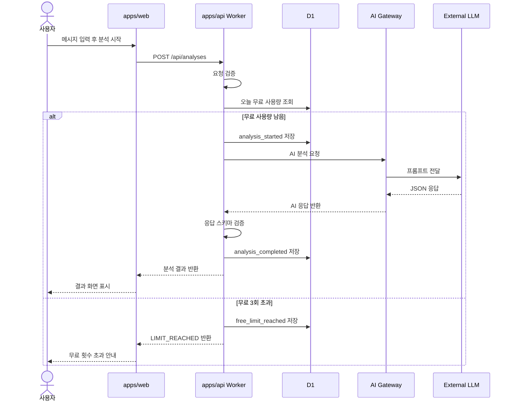
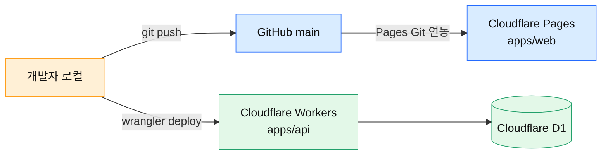

# 플러팅지옥 MVP 시스템 아키텍처

## 목적

이 문서는 플러팅지옥 MVP의 전체 시스템 구조를 정의한다.

MVP 목표는 사용자가 메시지를 붙여넣고, AI 분석 결과와 답장 후보를 받으며, 무료 분석 3회 제한을 검증하는 것이다. 결제는 바로 붙이지 않고, 나중에 Polar 분석권 결제를 연결할 수 있도록 데이터 구조만 열어둔다.

## 최종 선택

```text
Cloudflare Pages
React Vite
TypeScript
Tailwind CSS
Cloudflare Workers
Cloudflare D1
Cloudflare AI Gateway
External LLM API
```

## 시스템 경계



## 런타임 구성

### `apps/web`

프론트엔드 앱이다.

책임:

- 메시지 입력 화면 제공
- 관계 단계, 대화 목적, 답장 강도, 조언 수위 선택
- 사용자 말투/이상형 설정 입력
- 분석 결과 표시
- 답장 복사 이벤트 전송
- 무료 분석 잔여 횟수 표시

직접 하지 않는 것:

- AI API 직접 호출
- API 키 보관
- 무료 사용량 최종 판단
- 원문 대화 장기 저장

### `apps/api`

Cloudflare Workers API다.

책임:

- 요청 입력값 검증
- 익명 사용자 식별자 또는 로그인 전 임시 사용자 처리
- 무료 분석 3회 제한 확인
- D1 이벤트 로그 저장
- AI Gateway를 통한 LLM 호출
- AI 응답 스키마 검증
- 안전 정책 적용

### `packages/shared`

웹과 API가 함께 쓰는 타입/스키마 패키지다.

책임:

- 분석 요청 타입
- 분석 응답 타입
- AI 응답 스키마
- 선택지 enum
- 공통 오류 코드

## 요청 흐름



## MVP API 목록

| Method | Path | 목적 | 인증 |
|---|---|---|---|
| `POST` | `/api/analyses` | 메시지 분석 생성 | 익명 사용자 ID |
| `GET` | `/api/usage` | 무료 분석 잔여 횟수 조회 | 익명 사용자 ID |
| `POST` | `/api/events` | 복사/피드백 이벤트 저장 | 익명 사용자 ID |
| `GET` | `/api/health` | API 상태 확인 | 없음 |

결제 API는 MVP 1차 구현에 포함하지 않는다. 다만 나중에 다음 API를 추가할 수 있게 구조를 비워둔다.

| Method | Path | 목적 |
|---|---|---|
| `POST` | `/api/billing/checkout` | Polar Checkout 생성 |
| `POST` | `/api/webhooks/polar` | Polar 결제 완료 수신 |

## 데이터 저장 원칙

원문 대화는 기본적으로 장기 저장하지 않는다.

저장하는 것:

- 익명 사용자 ID
- 날짜별 무료 분석 사용량
- 이벤트 로그
- 말투 요약 프로필
- 이상형/연애 스타일 설정
- AI 응답 중 필요한 구조화 결과

저장하지 않는 것:

- 전화번호
- 주소
- 실명
- 카카오톡/DM 원문 전문
- 상대방을 특정할 수 있는 민감 정보

## 무료 분석 제한 정책

MVP 기준 무료 분석은 하루 3회다.

정책:

- 브라우저에 익명 사용자 ID를 발급한다.
- Worker는 D1에서 `user_id + 날짜` 기준 사용량을 확인한다.
- 3회 미만이면 분석을 허용한다.
- 3회 이상이면 `LIMIT_REACHED` 오류를 반환한다.
- VPN, 브라우저 삭제 등 우회 가능성은 MVP에서는 허용 가능한 리스크로 본다.

## 이벤트 로그

초기 이벤트:

- `analysis_started`
- `analysis_completed`
- `analysis_failed`
- `free_limit_reached`
- `reply_copied`
- `feedback_submitted`

각 이벤트는 최소한 다음 값을 가진다.

```text
event_id
anonymous_user_id
event_name
created_at
metadata_json
```

## 오류 처리

| 오류 코드 | 상황 | 화면 처리 |
|---|---|---|
| `VALIDATION_ERROR` | 입력값 부족/형식 오류 | 입력 보완 요청 |
| `LIMIT_REACHED` | 무료 3회 초과 | 분석권 안내 준비 화면 |
| `AI_TIMEOUT` | AI 응답 지연 | 재시도 안내 |
| `AI_INVALID_RESPONSE` | AI JSON 구조 오류 | 다시 시도 안내 |
| `UNSAFE_REQUEST` | 강압/조작/불법 요청 | 안전 안내 표시 |
| `SERVER_ERROR` | 기타 서버 오류 | 잠시 후 재시도 안내 |

## 보안과 개인정보

- AI API 키는 Worker 환경변수에만 저장한다.
- 브라우저에는 API 키를 노출하지 않는다.
- 원문 메시지는 분석 요청 처리에만 사용하고 장기 저장하지 않는다.
- 개인정보 삭제 안내를 입력창 근처에 항상 표시한다.
- 사용자가 원하면 설정/프로필 삭제가 가능하도록 V2에서 삭제 API를 추가한다.

## 배포 구조



## 구현 순서

1. 모노레포 기본 구조를 만든다.
2. `packages/shared`에 요청/응답 타입을 만든다.
3. `apps/api`에 `/api/health`, `/api/usage`, `/api/analyses`, `/api/events`를 만든다.
4. `apps/web`에 분석 화면과 결과 화면을 만든다.
5. D1 schema와 migration을 만든다.
6. AI 호출은 처음에는 mock 응답으로 연결하고, 구조가 안정되면 실제 LLM API를 붙인다.
7. Cloudflare Pages와 Workers 배포 설정을 연결한다.

## 비범위

이번 MVP 1차 구현에서 제외한다.

- Polar 결제
- 로그인
- 카카오 로그인
- 상대별 대화 히스토리
- 관리자 대시보드
- 네이티브 앱 패키징
- 푸시 알림

## 결정

플러팅지옥 MVP는 `Cloudflare Pages + React Vite` 프론트엔드와 `Cloudflare Workers + D1` API를 분리해서 만든다. 기능은 메시지 분석, 무료 분석 3회 제한, 이벤트 로그 저장까지 구현한다. 결제는 데이터 구조만 고려하고 실제 Polar 연동은 다음 단계로 미룬다.
