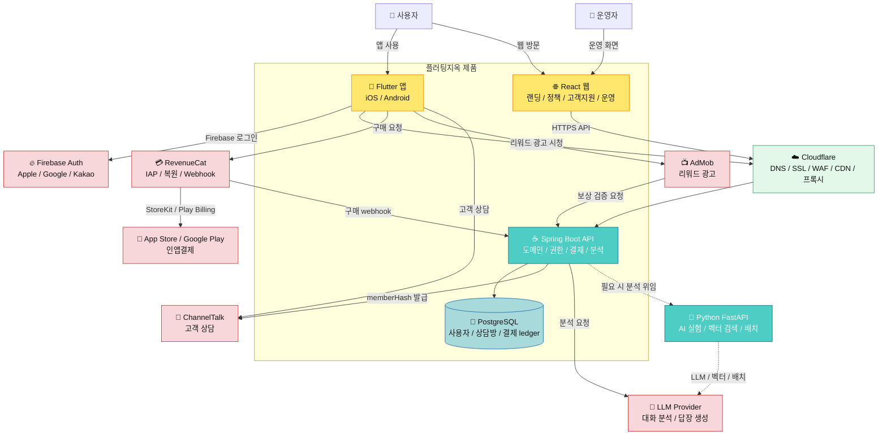
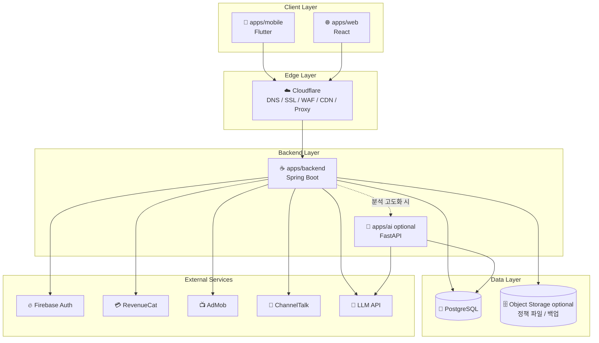
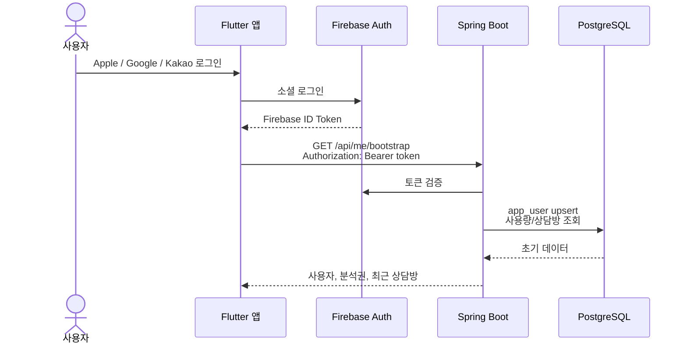
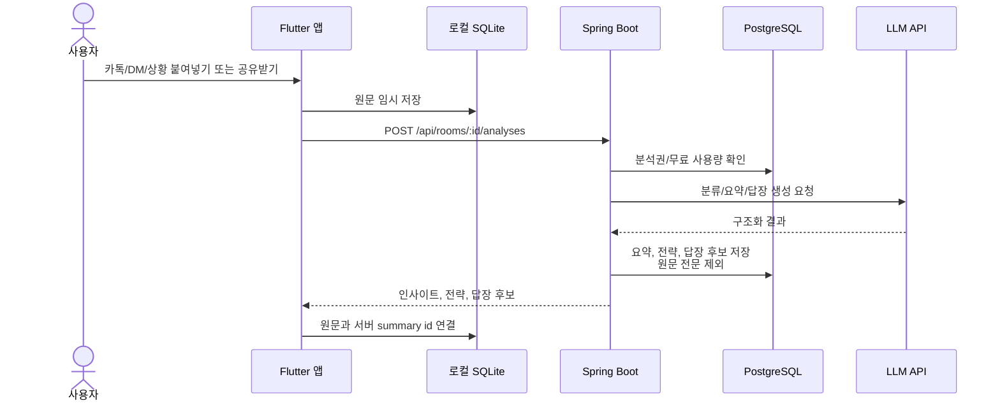
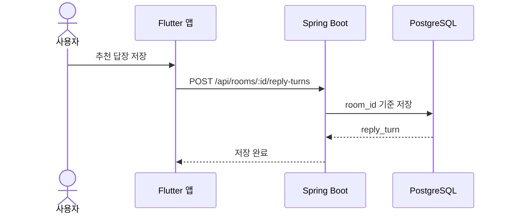
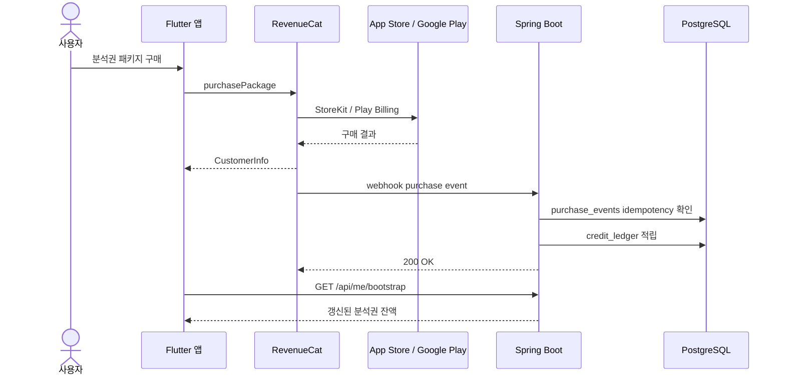
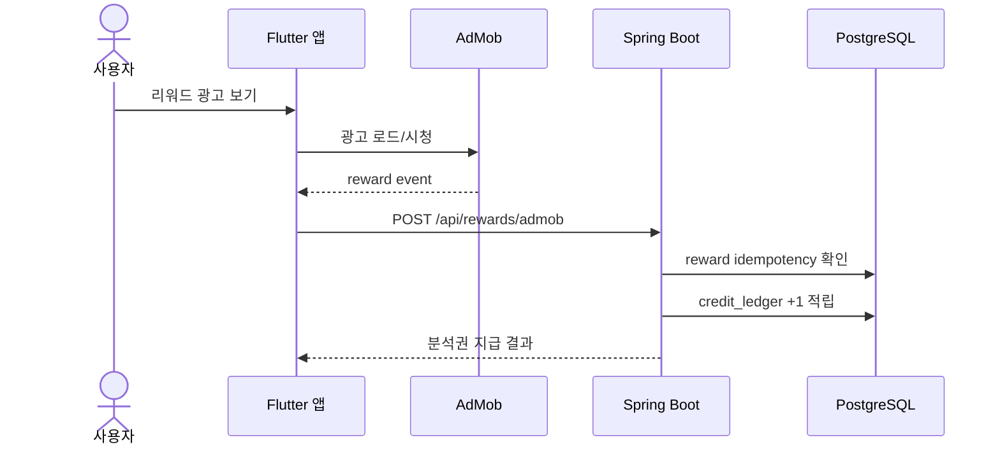
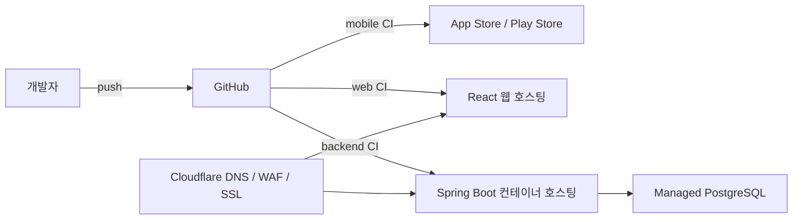

# 플러팅지옥 네이티브 앱 아키텍처

## 목적

이 문서는 플러팅지옥을 앱 전용 제품으로 전환할 때의 전체 시스템 구조를 정의한다.

기준 결정은 `docs/decisions/0005-native-app-spring-stack.md`다. 기존 `Cloudflare Pages + Workers + D1 + Polar` 문서는 웹/PWA MVP 레거시 기준으로 유지하고, 앱 전용 구현은 이 문서를 기준으로 한다.

## 최종 구조

```text
Flutter 앱
React 웹
Spring Boot API 서버
PostgreSQL
Firebase Auth
RevenueCat
AdMob
ChannelTalk
Python FastAPI optional
Cloudflare DNS / WAF / CDN / 프록시
```

## 시스템 컨텍스트



## 런타임 책임

| 런타임 | 책임 | 하지 않는 것 |
|---|---|---|
| Flutter 앱 | 상담방 UX, 공유받기, 붙여넣기, 로컬 원문 보관, 답장 복사, 인앱결제, 리워드 광고 | AI API 키 보관, 결제 권한 최종 판단, 서버 원문 장기 저장 |
| React 웹 | 랜딩, 약관, 개인정보처리방침, 고객지원, 운영/관리 화면 | 앱 핵심 상담 UX 대체 |
| Spring Boot | 인증 토큰 검증, 사용자/상담방/답장/분석권/광고 보상/이벤트 관리, AI 호출 중계 | 앱 UI 상태 관리, 원문 대화 장기 저장 |
| PostgreSQL | 정규화된 사용자 데이터, 상담방, 분석 턴, 저장 답장, 결제/광고 ledger | 카톡/DM 원문 전문 저장 |
| Firebase Auth | Apple/Google/Kakao 기반 사용자 식별 | 제품 데이터 저장, 결제 권한 관리 |
| RevenueCat | 스토어 인앱결제, 구매 복원, webhook 발송 | 분석권 ledger의 최종 원장 |
| AdMob | 리워드 광고 노출과 광고 SDK 이벤트 | 보상 중복 지급 판단 |
| Python FastAPI | 필요 시 AI 실험, 벡터 검색, 품질 평가, 배치 분석 | 계정/결제/상담방의 원천 서버 |

## 컨테이너 구조



## 핵심 사용자 흐름

### 1. 로그인과 부트스트랩



### 2. 대화/상황 분석



### 3. 답장 저장



### 4. 인앱결제와 분석권 적립



### 5. 리워드 광고 보상



## 데이터 경계

| 데이터 | Flutter 로컬 | Spring/PostgreSQL | 외부 서비스 |
|---|---:|---:|---:|
| 사용자가 붙여넣은 원문 | O | X | AI 요청 처리 중 일시 전달 |
| 입력 제목/요약 | O | O | X |
| 추천 답장/이유/주의할 말 | O | O | X |
| 상담방 별칭/관계 상태 | O | O | X |
| Firebase UID | O | O | Firebase |
| 결제 거래 ID | X | O | RevenueCat / Store |
| 리워드 광고 이벤트 ID | X | O | AdMob |
| ChannelTalk memberHash | O | 발급만 | ChannelTalk |

원칙:

- 서버는 원문 전문을 장기 저장하지 않는다.
- 서버 저장 단위는 `상담방`, `입력 요약`, `분석 턴`, `저장 답장`, `ledger`다.
- 분석권은 클라이언트 상태가 아니라 서버 `credit_ledger`를 기준으로 판단한다.
- 같은 답장 문장도 다른 분석 턴에서 저장하면 별도 `reply_turn`으로 저장한다.

## 배포 구조



운영 기본값:

- Spring Boot는 OCI 컨테이너로 빌드한다.
- 1차 배포 플랫폼은 별도 배포 문서에서 확정한다.
- Cloudflare Containers는 1차 메인 서버 배포 대상이 아니라 향후 후보로 둔다.
- Cloudflare는 우선 DNS, SSL, WAF, CDN, API 프록시 역할로 사용한다.

## 저장소 구조 목표

```text
flirting-hell/
  apps/mobile       Flutter 앱
  apps/web          React 웹
  apps/backend      Spring Boot API
  apps/ai           Python FastAPI optional
  docs              제품/기술/결정 문서
  contracts         OpenAPI 또는 공통 API 계약
```

초기에는 한 저장소 안에서 분리한다. 앱과 백엔드가 안정되면 필요할 때 별도 저장소로 나눌 수 있다.

## 아키텍처 원칙

- 앱 UX와 서버 도메인을 동시에 검증하기 위해 기능별 세로 슬라이스로 개발한다.
- 전체 디자인 시스템과 IA는 먼저 고정하되, 모든 화면을 끝까지 만든 뒤 백엔드를 붙이지 않는다.
- API 계약은 Flutter와 Spring 사이의 기준이다.
- 결제와 광고 보상은 무조건 서버 ledger를 원천으로 한다.
- AI 결과는 조언과 경고를 제공하되, 상대를 조종하거나 압박하는 기능을 만들지 않는다.

## 다음 문서

이 문서 다음에는 아래 순서로 세부 스펙을 작성한다.

1. `docs/technical/flutter-app-tech-spec.md`
2. `docs/technical/spring-backend-tech-spec.md`
3. `docs/technical/app-api-spec-v2.md`
4. `docs/technical/data-model-v2.md`
5. `docs/product/native-app-development-phases.md`
