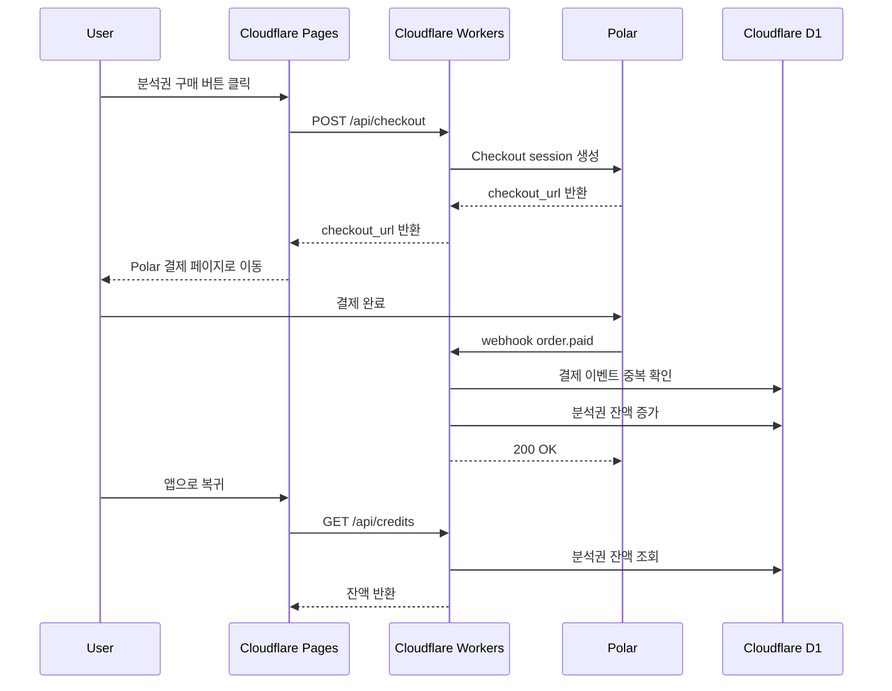

# Polar 분석권 결제 흐름

## 목적

플러팅지옥 V1은 월 구독이 아니라 분석권 패키지로 과금한다.

결제 제공자는 Polar를 사용하고, 결제 성공 후 Cloudflare Workers가 webhook을 받아 D1의 분석권 잔액을 증가시킨다.

## 결제 상품

초기 상품 후보:

- 분석권 30회: 3,900원
- 분석권 50회: 5,900원
- 분석권 100회: 9,900원

각 상품은 Polar의 one-time purchase 상품으로 생성한다.

## 전체 흐름



## Workers API

### POST /api/checkout

분석권 패키지 결제를 시작한다.

요청:

```json
{
  "packageId": "credits_30"
}
```

응답:

```json
{
  "checkoutUrl": "https://polar.sh/checkout/..."
}
```

처리:

- 로그인 사용자 확인
- 패키지 ID 검증
- Polar Checkout 세션 생성
- `external_customer_id` 또는 metadata에 내부 user id 저장
- checkout URL 반환

### POST /api/webhooks/polar

Polar webhook을 수신한다.

처리:

- webhook 서명 검증
- 이벤트 타입 확인
- `order.paid`만 분석권 지급 처리
- 이미 처리한 Polar event id인지 확인
- 결제 상품에 맞는 분석권 수량 계산
- D1의 사용자 분석권 잔액 증가
- 결제 이벤트 저장

### GET /api/credits

현재 사용자의 무료 분석 잔여 횟수와 구매 분석권 잔액을 반환한다.

응답:

```json
{
  "freeAnalysesRemainingToday": 2,
  "paidCredits": 30
}
```

## D1 테이블 초안

### credit_packages

- `id`
- `polar_product_id`
- `name`
- `credit_amount`
- `price_amount`
- `currency`
- `active`

### user_credits

- `user_id`
- `paid_credits`
- `updated_at`

### payment_events

- `id`
- `polar_event_id`
- `polar_order_id`
- `user_id`
- `package_id`
- `credit_amount`
- `status`
- `created_at`

## 중복 처리 원칙

Polar webhook은 같은 이벤트가 여러 번 올 수 있으므로 반드시 중복 처리를 막아야 한다.

원칙:

- `polar_event_id`는 unique로 저장한다.
- 이미 처리한 이벤트면 분석권을 다시 지급하지 않는다.
- 분석권 지급과 결제 이벤트 저장은 하나의 트랜잭션처럼 처리한다.

## 환경 변수

- `POLAR_ACCESS_TOKEN`
- `POLAR_WEBHOOK_SECRET`
- `POLAR_ENV`
- `POLAR_CREDITS_30_PRODUCT_ID`
- `POLAR_CREDITS_50_PRODUCT_ID`
- `POLAR_CREDITS_100_PRODUCT_ID`

## 보류 사항

- 환불 시 분석권 회수 정책
- 결제 실패 후 재시도 UX
- 미로그인 사용자의 결제 처리
- 원화 결제 지원과 실제 정산 통화 확인
