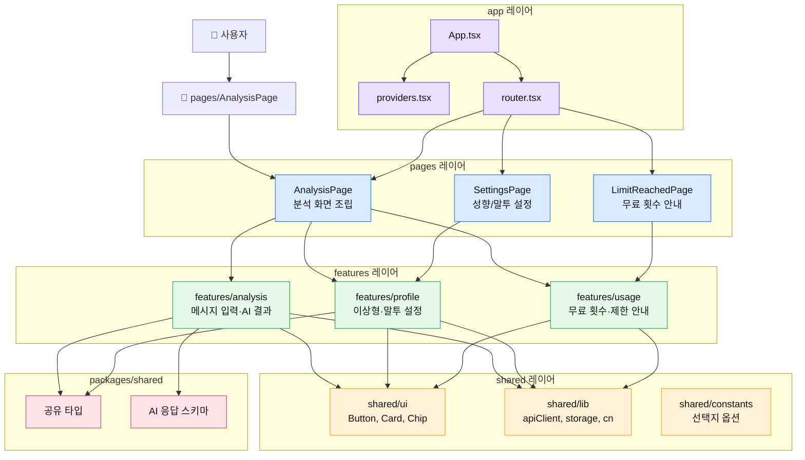
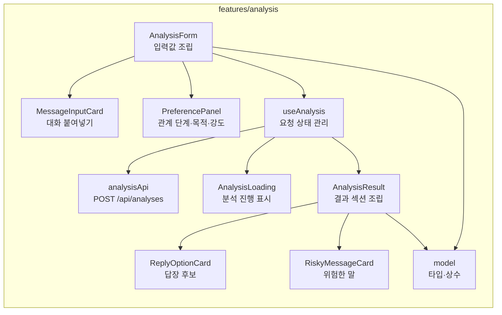
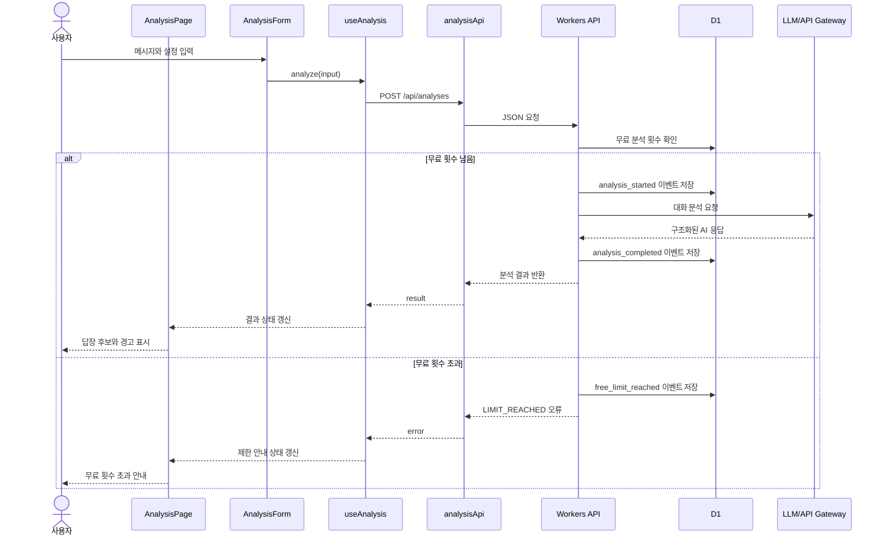

# React 컴포넌트 관리 아키텍처

## 목적

이 문서는 플러팅지옥 MVP의 React 프론트엔드 컴포넌트 구조를 정의한다.

목표는 빠르게 만들되, 기능이 늘어나도 화면/비즈니스 로직/API 호출이 뒤섞이지 않게 하는 것이다. MVP는 `React Vite + TypeScript + Tailwind CSS` 기준으로 시작하고, 상태 관리 라이브러리는 필요할 때만 추가한다.

## 결론

플러팅지옥 웹앱은 `기능 단위 Feature Slice` 구조로 관리한다.

핵심 원칙:

- 화면은 `pages`가 조립한다.
- 도메인 기능은 `features` 안에 모은다.
- 버튼, 카드, 입력창 같은 공통 UI는 `shared/ui`에 둔다.
- API 호출은 컴포넌트에서 직접 하지 않고 `feature/api` 또는 `feature/hooks`로 숨긴다.
- AI 응답 타입과 선택지 타입은 `packages/shared`에서 공유한다.
- 원문 메시지는 브라우저 상태에만 두고, 저장은 요약 프로필과 이벤트 중심으로 한다.

## 추천 폴더 구조

```text
apps/web/src/
├── app/
│   ├── App.tsx
│   ├── providers.tsx
│   └── router.tsx
├── pages/
│   ├── AnalysisPage.tsx
│   ├── SettingsPage.tsx
│   └── LimitReachedPage.tsx
├── features/
│   ├── analysis/
│   │   ├── api/
│   │   │   └── analysisApi.ts
│   │   ├── components/
│   │   │   ├── AnalysisForm.tsx
│   │   │   ├── MessageInputCard.tsx
│   │   │   ├── PreferencePanel.tsx
│   │   │   ├── AnalysisLoading.tsx
│   │   │   ├── AnalysisResult.tsx
│   │   │   ├── ReplyOptionCard.tsx
│   │   │   └── RiskyMessageCard.tsx
│   │   ├── hooks/
│   │   │   └── useAnalysis.ts
│   │   └── model/
│   │       ├── analysis.constants.ts
│   │       └── analysis.types.ts
│   ├── profile/
│   │   ├── components/
│   │   │   ├── StylePreferenceForm.tsx
│   │   │   └── ToneProfileCard.tsx
│   │   ├── hooks/
│   │   │   └── useProfileSettings.ts
│   │   └── model/
│   │       └── profile.types.ts
│   └── usage/
│       ├── components/
│       │   ├── UsageBadge.tsx
│       │   └── FreeLimitNotice.tsx
│       ├── hooks/
│       │   └── useUsageQuota.ts
│       └── model/
│           └── usage.types.ts
├── shared/
│   ├── ui/
│   │   ├── Button.tsx
│   │   ├── Card.tsx
│   │   ├── Chip.tsx
│   │   ├── Textarea.tsx
│   │   └── Toast.tsx
│   ├── lib/
│   │   ├── apiClient.ts
│   │   ├── cn.ts
│   │   └── storage.ts
│   └── constants/
│       └── appOptions.ts
└── main.tsx

packages/shared/src/
├── analysis.schema.ts
├── analysis.types.ts
├── profile.types.ts
└── usage.types.ts
```

## 시각화: 컴포넌트 레이어



## 시각화: 분석 기능 내부 구조



## 시각화: 상태와 데이터 흐름



## 컴포넌트 분류 기준

### 1. Page 컴포넌트

`pages`는 라우트 단위 화면이다. 직접 세부 UI를 많이 만들지 않고, feature 컴포넌트를 조립한다.

예시:

- `AnalysisPage`: 분석 폼, 사용량 배지, 결과 영역 조립
- `SettingsPage`: 성향 설정과 말투 설정 조립
- `LimitReachedPage`: 무료 횟수 초과 안내 조립

규칙:

- API 호출 로직을 직접 작성하지 않는다.
- 복잡한 상태 로직을 직접 들고 있지 않는다.
- 화면 배치와 사용자 흐름만 담당한다.

### 2. Feature 컴포넌트

`features`는 제품 기능 단위다. 플러팅지옥에서는 `analysis`, `profile`, `usage`가 첫 feature다.

규칙:

- 기능에 필요한 컴포넌트, hook, api, type을 같은 feature 안에 둔다.
- 다른 feature 내부 파일을 직접 import하지 않는다.
- 공유가 필요한 값은 `packages/shared` 또는 `shared`로 올린다.

### 3. Shared UI 컴포넌트

`shared/ui`는 도메인을 모르는 순수 UI다.

예시:

- `Button`
- `Card`
- `Chip`
- `Textarea`
- `Toast`

규칙:

- `analysis`, `profile`, `usage` 같은 도메인 단어를 몰라야 한다.
- API 호출을 하지 않는다.
- 비즈니스 판단을 하지 않는다.
- props로 받은 값만 표시한다.

### 4. Custom Hook

hook은 상태와 부수효과를 숨긴다.

예시:

- `useAnalysis`: 분석 요청, 로딩, 오류, 결과 상태 관리
- `useProfileSettings`: 이상형/연애 스타일 설정 저장과 불러오기
- `useUsageQuota`: 무료 횟수 조회와 제한 상태 관리

규칙:

- 컴포넌트는 hook의 반환값만 보고 화면을 그린다.
- API 요청은 hook 또는 feature api 파일에서만 수행한다.
- localStorage 접근은 `shared/lib/storage.ts`로 감싼다.

## 상태 관리 방침

MVP에서는 전역 상태 관리 라이브러리를 바로 도입하지 않는다.

초기 상태 관리:

- 입력 폼 상태: feature 내부 React state
- 분석 결과 상태: `useAnalysis`
- 사용자 설정: `useProfileSettings` + localStorage + 서버 저장 준비
- 무료 횟수: Workers API 조회 결과
- 공통 UI 상태: 필요한 경우 작은 Context만 사용

도입 보류:

- Redux: MVP에는 과하다.
- Zustand: 설정/결과 공유가 복잡해질 때 검토한다.
- TanStack Query: API 호출 수가 늘고 캐싱/재시도가 중요해질 때 검토한다.

## 의존성 규칙

허용되는 의존성 방향:

```text
pages → features → shared
pages → packages/shared
features → packages/shared
shared → 외부 라이브러리
```

금지되는 의존성 방향:

```text
shared → features
shared → pages
features/analysis → features/profile 내부 파일 직접 참조
components → Workers API 직접 fetch
```

기능 간 공유가 필요하면 내부 파일을 서로 import하지 말고, 다음 중 하나로 해결한다.

- 타입/상수는 `packages/shared`로 올린다.
- 순수 UI는 `shared/ui`로 올린다.
- 공통 유틸은 `shared/lib`로 올린다.
- 도메인 이벤트는 API 응답 또는 page 조립 단계에서 연결한다.

## 플러팅지옥 MVP 화면 매핑

| 화면/기능 | 담당 위치 | 주요 컴포넌트 |
|---|---|---|
| 메시지 입력 | `features/analysis` | `MessageInputCard`, `AnalysisForm` |
| 관계 단계/목적/강도 선택 | `features/analysis` | `PreferencePanel` |
| 이상형/연애 스타일 설정 | `features/profile` | `StylePreferenceForm` |
| 말투 분석 표시 | `features/profile` 또는 `features/analysis` | `ToneProfileCard` |
| 무료 횟수 표시 | `features/usage` | `UsageBadge` |
| 무료 횟수 초과 | `features/usage` | `FreeLimitNotice` |
| AI 결과 전체 | `features/analysis` | `AnalysisResult` |
| 답장 후보 카드 | `features/analysis` | `ReplyOptionCard` |
| 위험한 말 경고 | `features/analysis` | `RiskyMessageCard` |
| 공통 버튼/카드/칩 | `shared/ui` | `Button`, `Card`, `Chip` |

## 컴포넌트 작성 규칙

- 컴포넌트는 기본적으로 함수형 컴포넌트로 작성한다.
- props 타입은 컴포넌트 파일 안에 두되, 여러 곳에서 쓰이면 `model`로 분리한다.
- 하나의 컴포넌트가 너무 커지면 `입력`, `상태 표시`, `결과 카드` 단위로 나눈다.
- UI 컴포넌트는 `children`, `variant`, `size`, `disabled` 같은 일반 props를 우선 사용한다.
- 도메인 컴포넌트는 사용자의 실제 행동 단위 이름을 사용한다.
- `any`는 사용하지 않는다. 외부 API 응답은 공유 스키마로 검증한다.

## 초기 구현 순서

1. `shared/ui`에 최소 UI 컴포넌트를 만든다.
2. `packages/shared`에 분석 요청/응답 타입을 만든다.
3. `features/analysis`에 입력 폼과 결과 화면을 만든다.
4. `features/profile`에 성향 설정 저장 구조를 만든다.
5. `features/usage`에 무료 횟수 표시와 제한 안내를 만든다.
6. `pages/AnalysisPage`에서 세 feature를 조립한다.

## 나중에 바꿀 수 있는 지점

- API 호출이 많아지면 `TanStack Query`를 도입한다.
- 설정 상태가 여러 화면에 퍼지면 `Zustand`를 도입한다.
- 공통 UI가 많아지면 `shared/ui`를 내부 디자인 시스템으로 확장한다.
- 앱 패키징이 필요해지면 현재 `apps/web`을 기준으로 Capacitor를 붙인다.

## 결정 사항

MVP에서는 `Feature Slice + Shared UI + Shared Types` 구조를 사용한다.

이 구조는 초기 개발 속도를 유지하면서도, AI 분석, 사용자 프로필, 무료 사용량, 결제 기능이 추가될 때 파일 경계가 무너지지 않게 한다.
