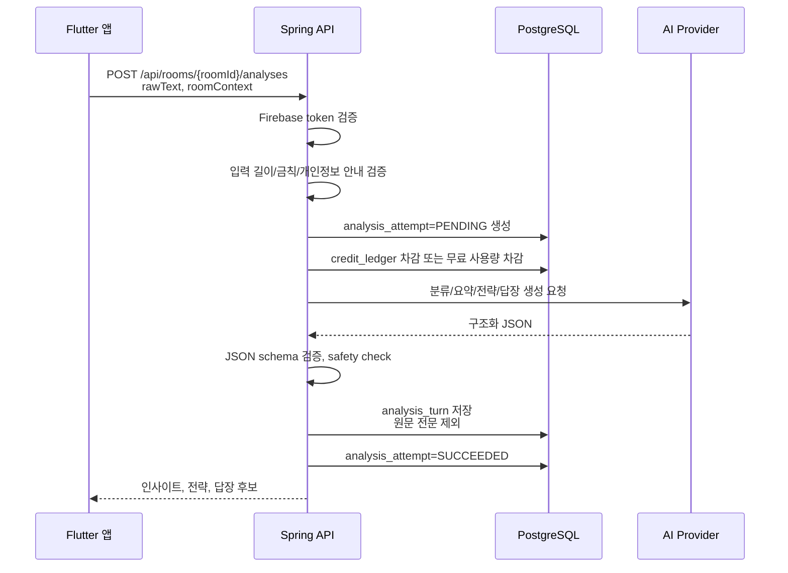

# 플러팅지옥 Spring 백엔드 기술 스펙

## 목적

이 문서는 플러팅지옥 앱 전용 제품의 메인 백엔드 구현 기준을 정의한다.

상위 결정:

- `docs/decisions/0005-native-app-spring-stack.md`
- `docs/technical/native-app-architecture.md`
- `docs/technical/flutter-app-tech-spec.md`

Spring Boot 서버는 계정, 상담방, 분석 요청, 추천 답장 저장, 분석권 ledger, 인앱결제 webhook, 리워드 광고 보상, 고객지원 연동의 원천이다.

## 백엔드 책임

Spring 백엔드가 담당한다:

- Firebase ID Token 검증
- Kakao 로그인 토큰 교환과 Firebase custom token 발급
- 사용자 bootstrap
- 상담방 생성, 조회, 수정
- 대화/상황 분석 요청 수신
- AI provider 호출 중계
- 분석 결과 정규화와 저장
- 추천 답장 저장
- 분석권 잔액 계산
- RevenueCat webhook 처리
- AdMob 리워드 보상 검증
- ChannelTalk memberHash 발급
- 계정 삭제와 서버 데이터 삭제
- 운영 이벤트와 감사 로그 기록

Spring 백엔드가 직접 하지 않는다:

- Flutter 화면 상태 관리
- 앱 로컬 원문 저장
- 카톡/DM/문자 원문 장기 저장
- StoreKit/Google Play Billing 직접 구현
- 리워드 광고 직접 노출
- AI API 키를 클라이언트에 전달
- 상대방을 조종하거나 압박하는 답장 생성

## 기술 스택

| 영역 | 선택 | 이유 |
|---|---|---|
| 언어 | Java 21 LTS | Spring 운영 안정성과 장기 지원 기준 |
| 프레임워크 | Spring Boot 3.x | 인증, API, 트랜잭션, 운영 도구 생태계 |
| 빌드 | Gradle | 멀티모듈 확장과 CI 구성 용이성 |
| API | Spring Web MVC | 일반적인 JSON API에 충분하고 운영 난이도 낮음 |
| 보안 | Spring Security | Firebase token filter, 권한 처리 |
| 검증 | Spring Validation | 요청 DTO 검증 |
| API DTO | Java record | request/response 계약은 불변 값으로 관리 |
| DB | PostgreSQL | 상담방, 분석 턴, ledger 관계형 데이터 관리 |
| DB 접근 | Spring Data JPA | MVP CRUD 생산성 우선, 복잡 쿼리는 추후 jOOQ 검토 |
| 마이그레이션 | Flyway | DB schema 변경 이력 관리 |
| API 문서 | springdoc-openapi | Flutter와 API 계약 공유 |
| 테스트 DB | Testcontainers | PostgreSQL 통합 테스트 재현성 |
| 외부 HTTP | RestClient 또는 WebClient | RevenueCat, Kakao, AI provider 호출 |
| 인증 연동 | Firebase Admin SDK | Firebase ID Token 검증과 custom token 발급 |
| 관측 | Actuator + structured logging | health, readiness, 운영 로그 |

기본값은 단일 Spring Boot 애플리케이션이다. 초기부터 마이크로서비스로 나누지 않는다.

## DDD 애플리케이션 구조

목표 위치:

```text
apps/backend/
  build.gradle
  settings.gradle
  src/main/java/com/flirtinghell/
    FlirtingHellApplication.java
    shared/
      api/
      error/
      security/
      time/
      idempotency/
      validation/
    identity/
      domain/
        model/
        repository/
        service/
      application/
        port/in/
        port/out/
        service/
      adapter/
        in/web/
        out/firebase/
        out/kakao/
        out/persistence/
    profile/
      domain/
      application/
      adapter/
    consultation/
      domain/
      application/
      adapter/
    analysis/
      domain/
      application/
      adapter/
        in/web/
        out/ai/
        out/persistence/
    credit/
      domain/
      application/
      adapter/
        in/web/
        in/webhook/
        out/persistence/
        out/revenuecat/
        out/admob/
    support/
      domain/
      application/
      adapter/
    operations/
      domain/
      application/
      adapter/
  src/main/resources/
    application.yml
    db/migration/
  src/test/java/com/flirtinghell/
```

구조 원칙:

- 최상위 패키지는 기술 계층이 아니라 bounded context 기준으로 나눈다.
- 각 bounded context 내부에서 `domain`, `application`, `adapter`를 나눈다.
- `domain`은 Spring MVC, Firebase, RevenueCat, AI provider, JPA 세부 구현을 모른다.
- `application`은 use case와 transaction 경계를 담당한다.
- `adapter`는 HTTP controller, persistence, webhook, 외부 API 호출처럼 바깥 세계와 연결한다.
- `shared`에는 모든 도메인이 써도 되는 순수 공통 요소만 둔다. 특정 도메인 규칙은 `shared`로 올리지 않는다.

Bounded context 책임:

| 패키지 | 책임 |
|---|---|
| `shared` | 공통 응답, 오류, 인증 context, 시간, idempotency, validation |
| `identity` | Firebase/Kakao 인증, 사용자 식별, 계정 생성/삭제 |
| `profile` | 내 말투, 연애 스타일, 조언 수위 같은 전역 개인화 설정 |
| `consultation` | 상담방, 상대별 설정, 입력 요약, 저장 답장, 상담방 히스토리 |
| `analysis` | 분석 요청, 인사이트, 전략, AI 결과, 안전 정책 |
| `credit` | 분석권 ledger, RevenueCat 구매, AdMob 리워드, 잔액 계산 |
| `support` | ChannelTalk memberHash, 고객지원 연결 |
| `operations` | 운영 이벤트, 감사 로그, MVP 이후 관리자 조회 |

## DDD 레이어 규칙

```text
adapter/in/web Controller
→ application UseCase
→ domain Aggregate / Domain Service / Policy
→ application port/out
→ adapter/out/*
```

규칙:

- Controller는 `adapter/in/web`에 두고 요청 검증과 응답 변환만 담당한다.
- Application Service는 `application/service`에 두고 use case와 transaction 경계를 가진다.
- Port interface는 `application/port/in`, `application/port/out`에 둔다.
- Aggregate, Value Object, Domain Service, Policy는 `domain`에 둔다.
- Repository interface는 도메인 언어가 중요하면 `domain/repository`에 두고, 외부 저장소 port 성격이면 `application/port/out`에 둔다.
- JPA Entity와 Spring Data Repository는 `adapter/out/persistence`에 둔다.
- 외부 adapter는 Firebase, Kakao, RevenueCat, AdMob, ChannelTalk, AI provider 호출만 담당한다.
- AI prompt와 safety rule은 `analysis` bounded context 밖으로 새지 않게 한다.

MVP에서는 모든 bounded context를 하나의 Spring Boot 프로세스에서 실행한다. DDD는 배포 단위를 쪼개기 위한 선택이 아니라, 도메인 규칙과 외부 연동을 분리하기 위한 패키지 기준이다.

## DTO 규칙

Spring Web adapter의 request/response DTO는 Java `record`를 사용한다.

```java
public record CreateRoomRequest(
    @NotBlank String alias,
    @NotNull RelationshipStage relationshipStage,
    String currentConcern,
    String cautionNotes,
    StrategyId preferredStrategyId
) {
}

public record CreateRoomResponse(
    RoomResponse room
) {
}
```

규칙:

- `adapter/in/web`의 request/response DTO는 `record`로 만든다.
- DTO 이름은 `*Request`, `*Response`를 기본으로 한다.
- nested DTO도 가능하면 `record`로 만든다.
- Bean Validation annotation은 record component에 붙인다.
- Controller는 DTO를 domain model로 바로 넘기지 않고 application command/query로 변환한다.
- domain aggregate는 lifecycle과 invariant가 있으므로 기본적으로 class로 둔다.
- JPA Entity는 proxy, lazy loading, persistence lifecycle 때문에 `record`로 만들지 않는다.
- 순수하고 작은 Value Object는 필요하면 `record`를 허용하되, JPA embeddable과 섞을 때는 별도 검토한다.

## 주요 Aggregate 초안

| Bounded context | Aggregate / 주요 모델 | 핵심 규칙 |
|---|---|---|
| `identity` | `AppUser`, `LinkedAuthProvider` | Firebase UID와 내부 사용자 ID를 안정적으로 연결한다. |
| `profile` | `UserProfile` | 말투/연애 스타일/조언 수위는 사용자 전역 기본값이다. |
| `consultation` | `ConsultationRoom`, `SavedReply` | 상담방별 상대 설정과 저장 답장은 사용자 소유권을 반드시 확인한다. |
| `analysis` | `AnalysisAttempt`, `AnalysisTurn` | 원문은 저장하지 않고 요약/전략/답장 결과만 저장한다. |
| `credit` | `CreditLedger`, `PurchaseEvent`, `RewardEvent` | 모든 지급/차감은 idempotency key가 있는 ledger entry로 처리한다. |
| `support` | `SupportMember` | ChannelTalk에는 민감한 대화 내용을 넘기지 않는다. |

## 인증과 사용자 식별

### 일반 API 인증

Flutter 앱은 모든 보호 API에 Firebase ID Token을 보낸다.

```http
Authorization: Bearer <Firebase ID token>
```

서버 처리:

1. Spring Security filter가 Bearer token을 추출한다.
2. Firebase Admin SDK로 token을 검증한다.
3. Firebase UID를 내부 `app_user`와 연결한다.
4. 없는 사용자는 bootstrap 시점에 생성한다.
5. Web adapter에서는 `CurrentUser`로 내부 사용자 ID를 받는다.

로컬 개발에서는 `firebase` 프로필이 없을 때 `Bearer dev:<firebaseUid>` 형식의 개발용 token을 사용한다. 실제 Firebase 검증은 `local,firebase` 프로필에서만 켠다.

### Kakao 로그인 교환

Kakao는 Flutter SDK에서 access token을 받은 뒤 서버에 교환한다.

```text
Flutter Kakao SDK
→ POST /api/auth/kakao/exchange
→ Spring이 Kakao token 검증
→ 내부 사용자 계정 확인 또는 생성
→ Firebase custom token 발급
→ Flutter signInWithCustomToken
```

Kakao access token은 DB에 저장하지 않는다. 필요한 경우 provider user id와 계정 연결 정보만 저장한다.

## 핵심 API 범위

초기 API는 `docs/technical/app-api-spec-v2.md`에서 request/response를 확정한다. 이 문서는 서버 책임 기준만 정의한다.

| API | 책임 |
|---|---|
| `POST /api/auth/kakao/exchange` | Kakao token 검증 후 Firebase custom token 반환 |
| `GET /api/me/bootstrap` | 사용자, 분석권 잔액, 최근 상담방, 설정 반환 |
| `PATCH /api/me/profile` | 내 말투, 연애 스타일, 조언 수위 수정 |
| `DELETE /api/me` | 계정 삭제와 서버 데이터 삭제 |
| `GET /api/rooms` | 상담방 목록 |
| `POST /api/rooms` | 상담방 생성 |
| `GET /api/rooms/{roomId}` | 상담방 상세, 최근 턴, 저장 답장 |
| `PATCH /api/rooms/{roomId}` | 상대별 설정 수정 |
| `POST /api/rooms/{roomId}/analyses` | 대화/상황 분석, 입력 분류, 요약, 전략 추천 |
| `POST /api/rooms/{roomId}/analyses/{turnId}/reply-recommendations` | 선택 전략 기준 답장 후보 생성 |
| `POST /api/rooms/{roomId}/reply-turns` | 추천 답장 저장 |
| `GET /api/saved-replies` | 상담방별 저장 답장 목록 |
| `GET /api/billing/products` | 앱 상품 표시용 서버 정책 |
| `POST /api/billing/revenuecat/webhook` | RevenueCat 구매 이벤트 수신 |
| `POST /api/billing/revenuecat/sync` | 앱 구매 상태와 서버 잔액 동기화 |
| `POST /api/rewards/admob` | 리워드 광고 보상 claim |
| `POST /api/channel/member-hash` | ChannelTalk memberHash 발급 |

## 데이터 저장 원칙

원칙:

- 원본 카톡/DM/문자 전문은 서버에 장기 저장하지 않는다.
- 분석 요청 처리 중에는 원문을 메모리에서만 사용한다.
- AI provider 요청 로그에도 원문을 남기지 않는다.
- 서버에는 상담방, 입력 요약, 분석 결과, 추천 답장, 저장 답장, 결제/광고 ledger만 저장한다.
- 원문을 저장해야 하는 기능은 별도 제품/개인정보 검토 없이는 만들지 않는다.

저장 대상:

| 데이터 | 서버 저장 | 이유 |
|---|---:|---|
| Firebase UID | O | 사용자 식별 |
| 전역 말투/연애 스타일/조언 수위 | O | 개인화 |
| 상담방 별칭/관계/조심할 점 | O | 상대별 분석 기준 |
| 붙여넣은 원문 전문 | X | 개인정보 위험 |
| 입력 종류 | O | 카톡/DM/상황 설명 분류 결과 |
| 입력 요약 | O | 히스토리 확인 |
| 현재 상태/전략/주의 신호 | O | 상담방 히스토리 |
| 추천 답장/다른 톤/피해야 할 말 | O | 저장 답장과 재조회 |
| 결제/광고 이벤트 ID | O | 중복 지급 방지 |
| 분석권 ledger | O | 과금 원장 |

## 분석 요청 처리



AI provider 호출이 서버 오류나 timeout으로 실패하면:

1. `analysis_attempt=FAILED`로 남긴다.
2. 이미 차감한 분석권은 `credit_ledger`에 refund entry를 추가한다.
3. 클라이언트에는 재시도 가능한 오류를 반환한다.

사용자 입력이 안전 정책에 막히는 경우는 분석권을 차감하지 않는다.

## 분석권 ledger

분석권은 단순 숫자 컬럼이 아니라 ledger로 관리한다.

이유:

- 결제 webhook은 재전송될 수 있다.
- 광고 보상은 중복 claim이 들어올 수 있다.
- AI 오류 시 환불 entry가 필요하다.
- 고객지원에서 지급 이력을 추적해야 한다.

ledger 예시:

| source | delta | idempotency key |
|---|---:|---|
| `PURCHASE` | +10 | RevenueCat event id |
| `REWARD_AD` | +1 | AdMob reward event id |
| `ADMIN_GRANT` | +N | admin action id |
| `ANALYSIS_USE` | -1 | analysis attempt id |
| `REFUND` | +1 | failed attempt id |

잔액은 `SUM(delta)` 기준이다. 성능이 필요해지면 user별 balance snapshot을 추가하되, ledger가 원천이다.

## RevenueCat webhook

서버 처리:

1. webhook secret 또는 signature를 검증한다.
2. RevenueCat event id로 idempotency를 확인한다.
3. 상품 ID를 분석권 수량으로 mapping한다.
4. `purchase_event`를 저장한다.
5. `credit_ledger`에 적립 entry를 추가한다.
6. 같은 event가 다시 오면 같은 결과로 200을 반환한다.

상품 초안:

| product id | 지급 |
|---|---:|
| `analysis_10` | 10회 |
| `analysis_30` | 30회 |
| `analysis_100` | 100회 |

앱의 RevenueCat `CustomerInfo`는 UX 표시용이다. 최종 잔액은 서버 ledger 기준이다.

## AdMob 리워드 보상

서버 처리:

1. Flutter 앱이 reward claim 요청을 보낸다.
2. 서버는 사용자, 광고 단위, reward event id, 시각을 검증한다.
3. 동일 reward event id가 이미 지급되었는지 확인한다.
4. 일일 보상 한도를 확인한다.
5. `reward_event`를 저장한다.
6. `credit_ledger`에 +1 entry를 추가한다.

정책:

- 같은 광고 이벤트는 한 번만 지급한다.
- 서버 오류로 지급 여부가 애매하면 idempotency key로 재시도 가능해야 한다.
- 배너/전면 광고는 MVP에서 제외한다.

## AI provider adapter

AI 호출은 `analysis` bounded context의 adapter 뒤에 숨긴다.

```text
AnalysisService
→ AiAnalysisGateway
→ Provider Adapter
→ LLM API
```

adapter 책임:

- prompt version 관리
- request schema 생성
- response JSON schema 검증
- timeout/retry 정책
- provider 오류 mapping
- safety rule 후처리
- 원문 로그 금지

초기 AI 결과 구조:

- 입력 종류
- 나/상대/상황 설명 분류
- 대화 요약
- 현재 상태
- 추천 전략
- 주의 신호
- 1순위 답장
- 다른 톤 2개
- 왜 이 답장이 맞는지
- 피해야 할 말
- 다음 행동

AI는 상대방의 마음을 단정하지 않는다. 가능성, 근거, 정보 부족, 주의점을 분리해서 말한다.

## 오류 코드

공통 오류 응답은 `code`, `message`, `requestId`, `details`를 가진다.

| 코드 | 의미 |
|---|---|
| `UNAUTHENTICATED` | 로그인 필요 또는 토큰 만료 |
| `FORBIDDEN` | 접근 권한 없음 |
| `VALIDATION_ERROR` | 요청 값 오류 |
| `NOT_FOUND` | 리소스 없음 |
| `CONFLICT` | 중복 요청 또는 상태 충돌 |
| `CREDIT_REQUIRED` | 분석권 부족 |
| `RATE_LIMITED` | 요청 한도 초과 |
| `SAFETY_BLOCKED` | 안전 정책 차단 |
| `AI_TIMEOUT` | AI provider 지연 |
| `AI_INVALID_RESPONSE` | AI 응답 구조 오류 |
| `PAYMENT_EVENT_INVALID` | 결제 webhook 검증 실패 |
| `REWARD_EVENT_INVALID` | 광고 보상 검증 실패 |
| `SERVER_ERROR` | 서버 내부 오류 |

Flutter는 오류 코드를 기준으로 구매 CTA, 광고 CTA, 재시도, 고객지원 진입을 결정한다.

## 보안과 개인정보

필수 정책:

- raw text를 application log에 남기지 않는다.
- request/response logging은 기본 비활성화한다.
- 분석 요청 body size limit을 둔다.
- 사용자별 rate limit을 둔다.
- webhook endpoint는 secret 또는 signature를 검증한다.
- 관리자 API는 별도 role을 요구한다.
- 계정 삭제는 서버 데이터 삭제와 로컬 삭제 안내를 함께 제공한다.
- DB migration은 PR에서 검토 가능해야 한다.
- AI prompt에는 상대를 속이거나 압박하는 요청을 거부하는 안전 문구를 포함한다.

환경 변수:

```text
SPRING_PROFILES_ACTIVE
DATABASE_URL
FIREBASE_PROJECT_ID
FIREBASE_SERVICE_ACCOUNT_JSON
KAKAO_REST_API_KEY
REVENUECAT_WEBHOOK_SECRET
ADMOB_REWARD_SECRET
CHANNELTALK_PLUGIN_KEY
CHANNELTALK_SECRET_KEY
AI_PROVIDER_API_KEY
AI_PROVIDER_BASE_URL
```

환경 변수 값은 문서, 로그, 커밋에 남기지 않는다.

## 관측과 운영

필수 운영 endpoint:

- `GET /actuator/health`
- `GET /actuator/health/readiness`
- `GET /actuator/health/liveness`

로그 원칙:

- `requestId`, `userId`, `roomId`, `turnId`, `eventType` 중심으로 기록한다.
- 원문 대화, 전화번호, 주소, 실명은 기록하지 않는다.
- AI provider latency, timeout, invalid response 수를 측정한다.
- 결제/광고 ledger 변경은 감사 로그를 남긴다.

초기 지표:

- 일간 분석 요청 수
- AI 성공/실패율
- 평균 AI 응답 시간
- 분석권 부족 도달 수
- 구매 전환 수
- 리워드 광고 지급 수
- 상담방 생성 수
- 답장 저장 수
- 계정 삭제 수

## 테스트 전략

Unit test:

- 분석권 ledger delta 계산
- idempotency key 중복 처리
- 상품 ID → 분석권 수량 mapping
- 안전 정책 차단
- AI response schema validation
- 상담방 소유권 검사

Web adapter slice test:

- 인증 없는 요청 401
- 다른 사용자 상담방 접근 403/404
- request validation 오류
- 공통 오류 응답 구조

Integration test:

- Testcontainers PostgreSQL + Flyway migration
- bootstrap user upsert
- 상담방 생성/조회/수정
- 분석 요청 성공 시 ledger 차감과 turn 저장
- AI 실패 시 refund ledger 생성
- RevenueCat webhook 중복 이벤트
- AdMob reward 중복 claim
- 계정 삭제 후 사용자 데이터 삭제

보안/개인정보 테스트:

- 원문 전문이 DB에 저장되지 않는지 확인
- 로그에 raw text가 출력되지 않는지 확인
- webhook secret 없는 요청 차단
- rate limit 초과 처리

## 개발 순서

1. Spring Boot scaffold와 Gradle 설정
2. 공통 오류 응답, requestId, health endpoint
3. Firebase 인증 filter와 `CurrentUser`
4. 사용자 bootstrap
5. 상담방 CRUD
6. 분석권 ledger 기본 모델
7. mock AI adapter 기반 분석 요청
8. 추천 답장 저장
9. RevenueCat webhook
10. AdMob reward claim
11. 실제 AI provider adapter
12. ChannelTalk memberHash
13. 계정 삭제
14. OpenAPI 문서와 Flutter client 계약 고정
15. 배포/운영 설정

## 다음 문서

이 문서 다음에는 `docs/technical/data-model-v2.md`를 작성한다.
